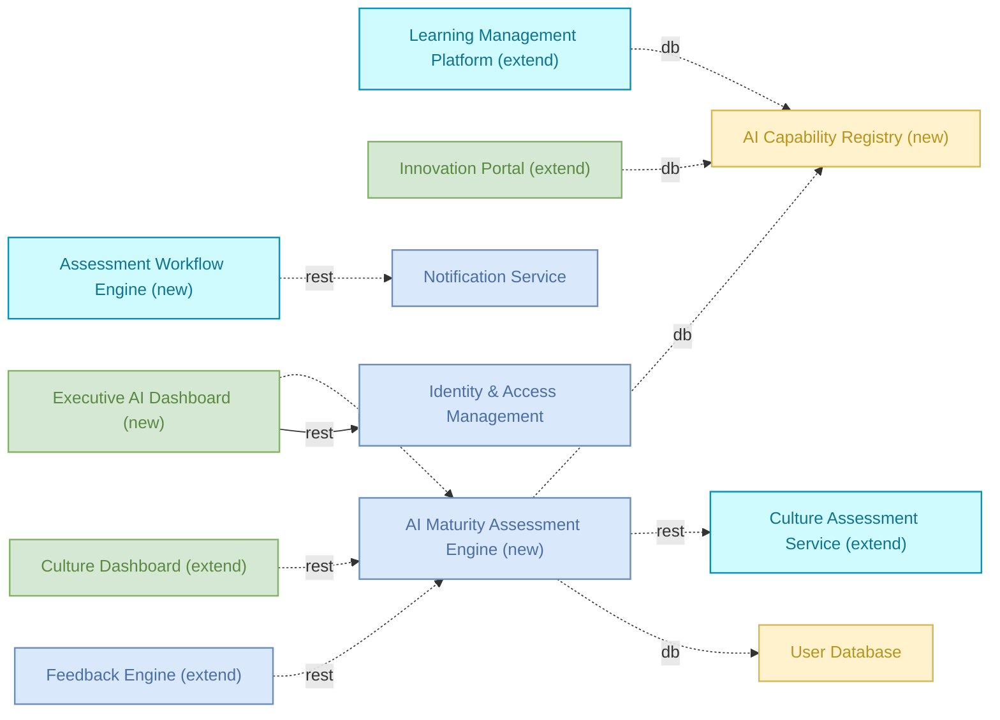

# AI maturity — Detailed Solution Description

## Table of Contents
- 1. Version History
- 2. Executive Summary
- 3. Business Context
- 4. Scope
- 5. Solution Architecture
- 6. Capability Mapping
- 7. Process Sequences
- 8. Dependencies
- 9. Non-Functional Requirements
- 10. Risks & Assumptions
- 11. Business Rules
- 12. Implementation Roadmap

## 1. Version History
| Version | Date | Author | Changes |
|---------|------|--------|---------|
| 1.0 | 2026-06-14 | Auto-generated (agent team) | Initial version |

## 2. Executive Summary

The AI maturity solution assesses and improves organizational AI adoption across strategic, operational and technical dimensions. It evaluates current AI capabilities, identifies gaps, and provides actionable recommendations to accelerate AI transformation.

The solution serves leadership and AI teams who need to benchmark progress, prioritize investments, and make data-driven decisions about AI initiatives. It integrates with existing culture and learning systems while providing dedicated assessment tools and executive dashboards.

## 3. Business Context

Organizations need to measure their current AI capabilities against industry standards and best practices. This provides leadership with clear visibility into strengths and weaknesses across their AI program.

The solution enables executives to align AI investments with business objectives through data-driven strategic planning. Teams can prioritize initiatives based on assessed maturity levels and organizational readiness.

Capability gap analysis identifies specific areas where the organization lacks AI skills or infrastructure. This drives targeted hiring, training, and technology decisions to close critical gaps.

AI transformation roadmapping creates actionable plans for advancing maturity over time. Organizations can sequence their AI initiatives based on dependencies, resource constraints, and business impact.

## 4. Scope

In scope: 12 total components: 5 extend, 3 reuse, 4 new. Culture Assessment Service, Culture Dashboard, Learning Management Platform, Feedback Engine, Innovation Portal, Notification Service, Identity & Access Management, User Database, AI Maturity Assessment Engine, AI Capability Registry, Executive AI Dashboard, and Assessment Workflow Engine.

The solution covers maturity assessment workflows, strategic planning capabilities, gap analysis tools, and transformation roadmapping features. It includes integration with organizational culture evaluation and learning management systems.

Anything not listed above is out of scope.

## 5. Solution Architecture

| Component | Type | Disposition | Role in solution | Status | Owner |
|---|---|---|---|---|---|
| Culture Assessment Service | service | extend | Provides organizational culture evaluation framework for readiness assessment | draft | - |
| Culture Dashboard | frontend | extend | Displays culture metrics and readiness indicators to leadership | draft | - |
| Learning Management Platform | service | extend | Delivers training programs and tracks skill development progress | draft | - |
| Feedback Engine | microservice | extend | Collects continuous feedback on AI initiatives and training effectiveness | draft | - |
| Innovation Portal | frontend | extend | Showcases use cases and enables collaboration on AI initiatives | draft | - |
| Notification Service | microservice | reuse | Sends assessment reminders and progress notifications to stakeholders | production | platform-team |
| Identity & Access Management | microservice | reuse | Manages user authentication and role-based access to assessment tools | production | security-team |
| User Database | database | reuse | Stores user profiles, assessment responses, and maturity scores | production | dba-team |
| AI Maturity Assessment Engine | microservice | new | Core processing component coordinating assessment activities and maturity calculations | draft | - |
| AI Capability Registry | database | new | Stores capability definitions and organizational maturity data | draft | - |
| Executive AI Dashboard | frontend | new | Primary leadership interface for maturity insights and strategic planning | draft | - |
| Assessment Workflow Engine | service | new | Orchestrates assessment processes and manages workflow coordination | draft | - |

The AI Maturity Assessment Engine serves as the core processing component that coordinates assessment activities and connects to both new and existing components. The Executive AI Dashboard provides the primary interface for leadership while the Assessment Workflow Engine orchestrates the assessment processes. Existing platform components handle authentication, notifications, and user data storage.

## 6. Capability Mapping

- Capability "AI Maturity Assessment" → AI Maturity Assessment Engine (new), AI Capability Registry (new), Executive AI Dashboard (new), Assessment Workflow Engine (new)
- Capability "Strategic AI Planning" → AI Maturity Assessment Engine (new), AI Capability Registry (new), Executive AI Dashboard (new), Assessment Workflow Engine (new)
- Capability "Capability Gap Analysis" → AI Maturity Assessment Engine (new), AI Capability Registry (new), Executive AI Dashboard (new), Assessment Workflow Engine (new)
- Capability "AI Transformation Roadmapping" → AI Maturity Assessment Engine (new), AI Capability Registry (new), Executive AI Dashboard (new), Assessment Workflow Engine (new)

All four capabilities require new components. GAP: AI Maturity Assessment Engine, AI Capability Registry, Executive AI Dashboard, and Assessment Workflow Engine need to be built.

## 7. Process Sequences

### AI Maturity Assessment Process
- Participants: AI Maturity Assessment Engine (owner), Assessment Workflow Engine (participant), Leadership Team (trigger), Employees (participant)
1. [Leadership Team] Initiates maturity assessment
2. [Employees] Submits assessment responses

[Process incomplete - additional steps TBD]

## 8. Dependencies

### Internal Dependencies
- Executive AI Dashboard → AI Maturity Assessment Engine — calls/rest (proposed)
- AI Maturity Assessment Engine → AI Capability Registry — reads-from/db (proposed)
- AI Maturity Assessment Engine → Culture Assessment Service — calls/rest (proposed)
- Culture Dashboard → AI Maturity Assessment Engine — calls/rest (proposed)
- Assessment Workflow Engine → Notification Service — calls/rest (proposed)
- Feedback Engine → AI Maturity Assessment Engine — serves/rest (proposed)
- Learning Management Platform → AI Capability Registry — writes-to/db (proposed)
- AI Maturity Assessment Engine → User Database — writes-to/db (proposed)
- Executive AI Dashboard → Identity & Access Management — calls/rest (existing)
- Innovation Portal → AI Capability Registry — reads-from/db (proposed)

### External Dependencies
- Notification Service → Enterprise Event Bus (calls/async) — external to this solution
- Notification Service → sendgrid-api (calls/rest) — external to this solution
- Notification Service → Redis Cache Cluster (calls/db) — external to this solution
- Notification Service → Order Management Service (serves/async) — external to this solution
- Notification Service → notification-db (calls/db) — external to this solution
- Notification Service → End-of-Day Reconciliation (calls/rest) — external to this solution
- Notification Service → AML Screening Job (serves/rest) — external to this solution
- Notification Service → End-of-Day Reconciliation (serves/rest) — external to this solution
- Identity & Access Management → Redis Cache Cluster (calls/db) — external to this solution
- Identity & Access Management → API Gateway (serves/rest) — external to this solution
- Identity & Access Management → Advisor Dashboard (serves/rest) — external to this solution
- Identity & Access Management → Customer Portal (serves/rest) — external to this solution
- Identity & Access Management → Fraud Detection Service (serves/rest) — external to this solution
- Identity & Access Management → Internal Zone (part-of) — external to this solution
- User Database → Customer Data Pipeline (serves/async) — external to this solution
- User Database → Authentication Service (serves/db) — external to this solution
- User Database → Enterprise Data Lake (serves/db) — external to this solution
- User Database → Fraud Detection Service (serves/db) — external to this solution
- User Database → Credit Scoring Module (writes-to/db) — external to this solution
- User Database → Customer Data Pipeline (writes-to/async) — external to this solution
- User Database → Enterprise Data Lake (writes-to/db) — external to this solution

## 9. Non-Functional Requirements

Data classification: Requirements to be determined. Classification criteria needed for assessment data, organizational culture metrics, and maturity scores.

Performance targets: Requirements to be determined. Response time targets needed for assessment workflows and dashboard queries.

Availability targets: Requirements to be determined. Uptime requirements needed for assessment periods and executive reporting.

Scalability requirements: Requirements to be determined. Capacity planning needed for organization-wide assessment participation.

Security requirements: Identity & Access Management integration provides authentication and role-based access. Additional security requirements to be determined for assessment data protection.

Compliance requirements: GDPR compliance required for notification preferences, PII encryption, audit logging, and right to erasure based on inherited components.

Recovery targets: RPO < 1 hour for User Database based on existing component requirements. Recovery targets for new components to be determined.

## 10. Risks & Assumptions

### Risks

**Notification Service risks:**
- Spam protection misconfiguration can cause mass sending
- Email deliverability depends on domain reputation and SPF/DKIM configuration  
- GDPR compliance required for customer opt-out preferences

**Identity & Access Management risks:**
- Service compromise endangers entire system - requires regular security audit
- Identity provider migration is high-risk and complex
- GDPR compliance required for PII storage with encryption at-rest and audit logging

**User Database risks:**
- Data loss is catastrophic - RPO must be < 1 hour
- GDPR right to erasure requires cascading deletion across dependent tables
- Database migrations on large tables can cause lock contention

### Assumptions

**Assumption:** New components (AI Maturity Assessment Engine, AI Capability Registry, Executive AI Dashboard, Assessment Workflow Engine) will inherit the same operational rigor as existing production components.

**Assumption:** Extended components maintain their current service levels during integration with new assessment functionality.

**Assumption:** External dependencies remain stable and maintain existing SLA commitments.

## 11. Business Rules

None captured yet.

## 12. Implementation Roadmap

**Reuse as-is:**
- Notification Service (production, owned by platform-team)
- Identity & Access Management (production, owned by security-team)
- User Database (production, owned by dba-team)

**Extend:**
- Culture Assessment Service (draft)
- Culture Dashboard (draft)
- Learning Management Platform (draft)
- Feedback Engine (draft)
- Innovation Portal (draft)

**New to build:**
- AI Maturity Assessment Engine (draft)
- AI Capability Registry (draft)
- Executive AI Dashboard (draft)
- Assessment Workflow Engine (draft)

All extend and new components are in draft status with no assigned owners. Production components from existing systems can be integrated immediately. Delivery sequence requires definition of dependency analysis, resource allocation, and business priority criteria.
