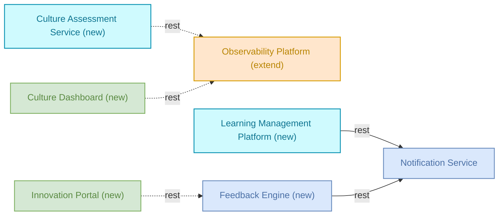

# Culture — Detailed Solution Description

## Table of Contents

1. Version History
2. Executive Summary
3. Business Context
4. Scope
5. Solution Architecture
6. Capability & Process Mapping
7. Non-Functional Requirements
8. Dependencies
9. Risks & Assumptions
10. Business Rules
11. Implementation Roadmap

## 1. Version History

| Version | Date | Author | Changes |
|---------|------|--------|---------|
| 1.0 | 2024-12-19 | Auto-generated | Initial version |

## 2. Executive Summary

The Culture solution transforms organizational culture to support agile collaboration, transparency and innovation. This comprehensive initiative implements agile principles across teams, improves communication patterns, and creates an innovation mindset through behavioral and process changes.

The solution targets leadership, middle management, and individual contributors to drive sustainable cultural change. It focuses on creating a more engaged, empowered workforce through systematic culture transformation.

## 3. Business Context

The solution delivers three core capabilities: Culture Transformation enables systematic organizational change through assessment and improvement programs. Team Collaboration improves communication patterns and agile working methods across all levels. Innovation Management creates structured approaches for idea generation and implementation.

These capabilities support three key processes: Cultural Assessment provides data-driven insights into current culture state. Agile Transformation implements agile principles across teams. Innovation Pipeline manages idea flow from submission to implementation.

The Culture Transformation Process follows this sequence: Employee completes culture assessment survey → Manager assigns culture training modules → Employee submits improvement ideas → Employee participates in retrospectives. This process creates a continuous cycle of assessment, learning, innovation, and feedback.

## 4. Scope

**In scope:**
- Culture Assessment Service
- Innovation Portal
- Learning Management Platform
- Feedback Engine
- Culture Dashboard
- Observability Platform (extension)
- Notification Service (reuse)

Anything not listed above is out of scope.

## 5. Solution Architecture

| Component | Type | Disposition | Role in solution | Status | Owner |
|---|---|---|---|---|---|
| Observability Platform | platform | extend | tracks culture transformation metrics and employee engagement KPIs | production | sre-team |
| Notification Service | microservice | reuse | sends culture program updates and recognition notifications | production | platform-team |
| Culture Assessment Service | service | new | - | draft | - |
| Innovation Portal | frontend | new | - | draft | - |
| Learning Management Platform | service | new | - | draft | - |
| Feedback Engine | microservice | new | - | draft | - |
| Culture Dashboard | frontend | new | - | draft | - |

The solution extends existing observability infrastructure to track culture metrics while building new services for assessment, learning, and feedback. The Innovation Portal and Culture Dashboard provide user interfaces for employees and managers.

## 6. Capability & Process Mapping

**Culture Transformation** → Culture Assessment Service, Innovation Portal, Learning Management Platform, Feedback Engine, Culture Dashboard

**Team Collaboration** → Culture Assessment Service, Innovation Portal, Learning Management Platform, Feedback Engine, Culture Dashboard

**Innovation Management** → Culture Assessment Service, Innovation Portal, Learning Management Platform, Feedback Engine, Culture Dashboard

**Cultural Assessment Process** → Culture Assessment Service, Innovation Portal, Learning Management Platform, Feedback Engine, Culture Dashboard

**Agile Transformation Process** → Culture Assessment Service, Innovation Portal, Learning Management Platform, Feedback Engine, Culture Dashboard

**Innovation Pipeline Process** → Culture Assessment Service, Innovation Portal, Learning Management Platform, Feedback Engine, Culture Dashboard

All capabilities and processes require the full set of new components to deliver complete functionality.

## 7. Non-Functional Requirements

None captured yet.

## 8. Dependencies

**Observability Platform external dependencies:**
- pagerduty-api (calls/rest)
- Trade Settlement Queue (serves/rest)
- Bloomberg Market Data (serves/rest)
- Enterprise Data Lake (serves/rest)
- Fraud Detection Service (serves/rest)
- Regulatory Calculation Library (serves/rest)
- SWIFT Gateway (serves/rest)
- Transaction Ledger (serves/rest)
- Enterprise Data Lake (calls/rest)

**Notification Service external dependencies:**
- Enterprise Event Bus (calls/async)
- sendgrid-api (calls/rest)
- Redis Cache Cluster (calls/db)
- Identity & Access Management (serves/async)
- Order Management Service (serves/async)
- notification-db (calls/db)
- End-of-Day Reconciliation (calls/rest)
- AML Screening Job (serves/rest)
- End-of-Day Reconciliation (serves/rest)

## 9. Risks & Assumptions

**Observability Platform risks:**
- Monitoring outage means other outages go undetected
- High log volume can cause cost explosion on Elasticsearch cluster
- Alert fatigue from poorly configured thresholds reduces team response time

**Notification Service risks:**
- Spam protection - misconfiguration can cause mass sending
- Email deliverability depends on domain reputation and SPF/DKIM configuration
- GDPR - must respect customer opt-out preferences

## 10. Business Rules

None captured yet.

## 11. Implementation Roadmap

**Phase 1: Reuse existing components**
- Notification Service (production ready)

**Phase 2: Extend existing platforms**
- Observability Platform extension for culture metrics tracking

**Phase 3: Build new components**
- Culture Assessment Service (draft)
- Innovation Portal (draft)  
- Learning Management Platform (draft)
- Feedback Engine (draft)
- Culture Dashboard (draft)

All new components are in draft status and require full development. The roadmap sequencing above represents a logical approach but should be validated against business priorities and technical dependencies.
