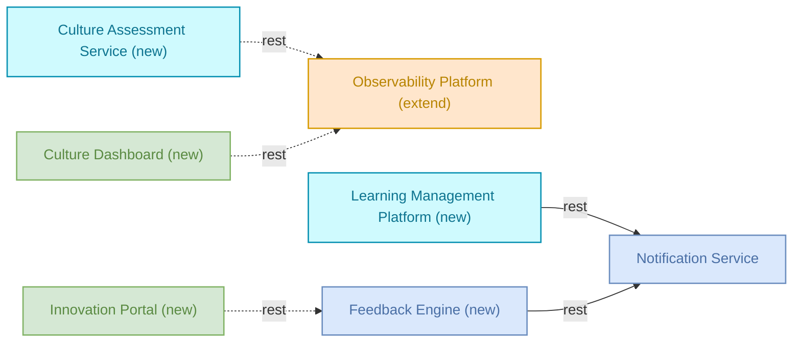

# Culture — Detailed Solution Description

## Table of Contents
- 1. Version History
- 2. Executive Summary
- 3. Business Context
- 4. Scope
- 5. Solution Architecture
- 6. Capability Mapping
- 7. Process Sequences
- 8. Dependencies
- 9. Non-Functional Requirements
- 10. Risks & Assumptions
- 11. Business Rules
- 12. Implementation Roadmap

## 1. Version History
| Version | Date | Author | Changes |
|---------|------|--------|---------|
| 1.0 | 2026-06-14 | Auto-generated (agent team) | Initial version |

## 2. Executive Summary

The Culture solution transforms organizational culture to support agile collaboration, transparency and innovation. It implements agile principles across teams, improves communication patterns, and creates structured feedback mechanisms through behavioral and process changes.

The solution targets leadership, middle management, and individual contributors. It tracks culture transformation metrics and employee engagement KPIs through the Observability Platform. The Notification Service sends culture program updates and recognition notifications.

## 3. Business Context

Organizations need systematic approaches to culture transformation, team collaboration, and innovation management. Current manual processes lack measurement capabilities and structured feedback mechanisms.

Culture Transformation requires assessment tools, training delivery, and feedback collection to drive behavioral change. Team Collaboration needs structured processes for communication and retrospectives. Innovation Management demands systematic capture and tracking of employee ideas.

These capabilities operate across departments and require measurement systems to track progress and engagement over time.

## 4. Scope

In scope: Culture Assessment Service, Innovation Portal, Learning Management Platform, Feedback Engine, Culture Dashboard, Observability Platform (extended for culture metrics), and Notification Service (reused for culture program communications).

The solution covers culture assessment surveys, training module assignment, idea submission processes, retrospective participation, culture transformation metrics tracking, and program notifications.

Anything not listed above is out of scope.

## 5. Solution Architecture

| Component | Type | Disposition | Role in solution | Status | Owner |
|---|---|---|---|---|---|
| Observability Platform | platform | extend | tracks culture transformation metrics and employee engagement KPIs | production | sre-team |
| Notification Service | microservice | reuse | sends culture program updates and recognition notifications | production | platform-team |
| Culture Assessment Service | service | new | conducts employee culture surveys and writes assessment data to monitoring platform | draft | - |
| Innovation Portal | frontend | new | provides user interface for submitting ideas and calls feedback engine for processing | draft | - |
| Learning Management Platform | service | new | delivers culture training modules and sends completion notifications | draft | - |
| Feedback Engine | microservice | new | processes employee feedback and improvement ideas, triggers notifications | draft | - |
| Culture Dashboard | frontend | new | displays culture metrics and transformation progress by reading from monitoring platform | draft | - |

The solution extends existing monitoring capabilities and reuses notification infrastructure. Five new components handle culture assessment, learning delivery, innovation management, feedback collection, and dashboard visualization.

## 6. Capability Mapping

- Capability "Culture Transformation" → Culture Assessment Service (new), Innovation Portal (new), Learning Management Platform (new), Feedback Engine (new), Culture Dashboard (new)
- Capability "Team Collaboration" → Culture Assessment Service (new), Innovation Portal (new), Learning Management Platform (new), Feedback Engine (new), Culture Dashboard (new)
- Capability "Innovation Management" → Culture Assessment Service (new), Innovation Portal (new), Learning Management Platform (new), Feedback Engine (new), Culture Dashboard (new)

## 7. Process Sequences

### Culture Transformation Process
- Participants: Employee, Manager, Culture Assessment Service, Innovation Portal, Learning Management Platform, Feedback Engine
1. [Employee] completes culture assessment survey
2. [Manager] assigns culture training modules
3. [Employee] submits improvement ideas
4. [Employee] participates in retrospectives

## 8. Dependencies

### Internal Solution Flows
- Culture Assessment Service → Observability Platform (writes-to/rest)
- Innovation Portal → Feedback Engine (calls/rest)
- Learning Management Platform → Notification Service (calls/rest)
- Culture Dashboard → Observability Platform (reads-from/rest)
- Feedback Engine → Notification Service (calls/rest)

### External Dependencies
- Observability Platform → pagerduty-api (calls/rest) — external to this solution
- Observability Platform → Trade Settlement Queue (serves/rest) — external to this solution
- Observability Platform → Bloomberg Market Data (serves/rest) — external to this solution
- Observability Platform → Enterprise Data Lake (serves/rest) — external to this solution
- Observability Platform → Fraud Detection Service (serves/rest) — external to this solution
- Observability Platform → Regulatory Calculation Library (serves/rest) — external to this solution
- Observability Platform → SWIFT Gateway (serves/rest) — external to this solution
- Observability Platform → Transaction Ledger (serves/rest) — external to this solution
- Observability Platform → Enterprise Data Lake (calls/rest) — external to this solution
- Notification Service → Enterprise Event Bus (calls/async) — external to this solution
- Notification Service → sendgrid-api (calls/rest) — external to this solution
- Notification Service → Redis Cache Cluster (calls/db) — external to this solution
- Notification Service → Identity & Access Management (serves/async) — external to this solution
- Notification Service → Order Management Service (serves/async) — external to this solution
- Notification Service → notification-db (calls/db) — external to this solution
- Notification Service → End-of-Day Reconciliation (calls/rest) — external to this solution
- Notification Service → AML Screening Job (serves/rest) — external to this solution
- Notification Service → End-of-Day Reconciliation (serves/rest) — external to this solution

## 9. Non-Functional Requirements

NFR targets are TBD - requires definition during detailed design. Data classification levels are TBD - requires definition during detailed design.

The solution relies on existing NFRs from the Observability Platform and Notification Service, both currently in production status. New components (Culture Assessment Service, Innovation Portal, Learning Management Platform, Feedback Engine, Culture Dashboard) require NFR definition during detailed design.

## 10. Risks & Assumptions

**Risks from existing components:**
- Observability Platform: Monitoring outage means other outages go undetected
- Observability Platform: High log volume can cause cost explosion on Elasticsearch cluster  
- Observability Platform: Alert fatigue from poorly configured thresholds reduces team response time
- Notification Service: Spam protection - misconfiguration can cause mass sending
- Notification Service: Email deliverability depends on domain reputation and SPF/DKIM configuration
- Notification Service: GDPR - must respect customer opt-out preferences

**Assumptions:**
- Culture transformation metrics can be effectively measured and tracked through technical systems
- Employee participation in culture assessments and feedback will be voluntary and sustained
- Existing Observability Platform capacity can handle additional culture metrics without performance impact
- Notification Service rate limits accommodate culture program communication volume
- New components will integrate successfully with existing production systems

## 11. Business Rules

**Culture Assessment Completion:**
- Employees must complete culture assessment survey before accessing training modules
- Assessment results determine personalized training recommendations

**Training Assignment:**
- Managers assign culture training modules based on assessment outcomes
- Training completion required before participating in improvement idea submissions

**Idea Submission Process:**
- Employees submit improvement ideas through Innovation Portal
- Ideas require manager review before publication to broader team

**Retrospective Participation:**
- Employee participation in retrospectives follows completion of training modules
- Retrospective feedback feeds back into culture assessment metrics

## 12. Implementation Roadmap

**Reuse as-is:**
- Notification Service (production, owned by platform-team)

**Extend:**
- Observability Platform (production, owned by sre-team) - add culture transformation metrics and employee engagement KPIs tracking

**New to build:**
- Culture Assessment Service (draft, no owner assigned)
- Innovation Portal (draft, no owner assigned)
- Learning Management Platform (draft, no owner assigned)
- Feedback Engine (draft, no owner assigned)
- Culture Dashboard (draft, no owner assigned)

**Readiness:** Five new components are still in draft status with no owners assigned.

**Sequencing:** The proposed flows suggest Culture Assessment Service and Learning Management Platform should be built first to generate data, followed by Feedback Engine and Innovation Portal for user interaction, then Culture Dashboard for visualization. This sequencing is based on data dependencies shown in the architecture flows.
