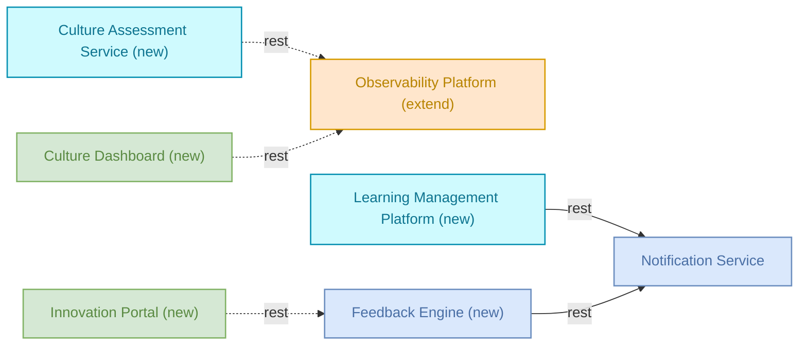
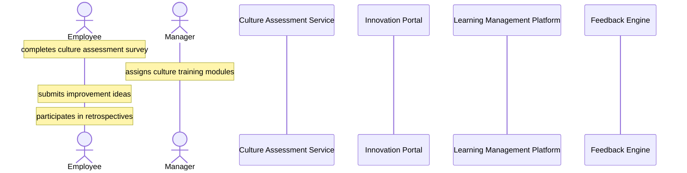
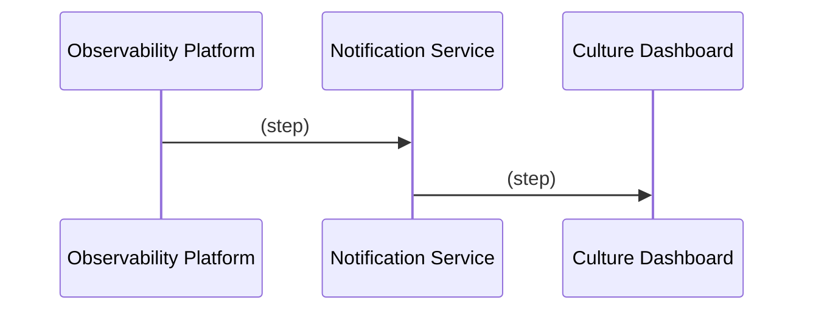

# Culture — Detailed Solution Description

## Table of Contents
- 1. Document History
- 2. Document Purpose
- 3. Solution Context
- 4. Scope
- 5. Solution Architecture
- 6. Capability Mapping
- 7. Requirements & Traceability Matrix
- 8. Functional Requirements
- 9. Runtime Process Flow
- 10. Data Structures
- 11. Non-Functional Requirements
- 12. Business Rules
- 13. Risks & Assumptions
- 14. Implementation Roadmap
- 15. Appendix & References

## 1. Document History
| Version | Date | Changes applied | Author(s) | Contributor(s) |
|---------|------|-----------------|-----------|----------------|
| 1.0 | 2026-09-21 | Initial version | Analyst (Team Repository) | AI agent team |

## 2. Document Purpose

This document is written for developers who will build or maintain the components of the Culture solution, for testers who need to derive test cases from defined behaviour, and for reviewers or auditors who need to verify that the solution matches approved requirements.

It describes what the Culture solution does: it defines the components, flows, and process sequences that support organizational culture transformation, covering the Culture Transformation Process (survey, training assignment, idea submission, retrospectives) and the observability-to-dashboard notification sequence (Process 2). It also describes what the solution does not do: it does not define data formats, fields, validation rules, or payload content for any of the steps or messages described; it does not include any component, flow, or capability beyond the seven members listed in the component inventory.

The solution is in draft status overall. Five of its seven components (Culture Assessment Service, Innovation Portal, Learning Management Platform, Feedback Engine, Culture Dashboard) are new and in draft status, meaning this document covers a planned, target (to-be) state for those parts. Two components (Observability Platform, Notification Service) are already in production and are described here only with respect to their extended or reused role in this solution.

This document introduces no scope beyond the source requirements. It does not add components, flows, or behaviour not present in the requirement seeds and referenced source material.

**Reference documentation & data model**

Source requirement docs and data model: to be linked. No specific source requirement documents or data model artifacts were provided in the verified facts beyond the requirement seeds and process definitions used in this document. Any such references, once identified, are versioned separately from this document. Changes to those references must be re-assessed against this document before this document is considered current.

## 3. Solution Context

**Upstream**

Two inputs feed this solution from within its own component set: Employee and Manager act as external actors who initiate the Culture Transformation Process by completing surveys, assigning training, submitting ideas, and participating in retrospectives. Observability Platform, already in production, is also an upstream source in Process 2, initiating the sequence toward Notification Service and Culture Dashboard. No other upstream systems are defined in the facts as feeding this solution.

**Downstream**

Within the solution, Observability Platform is a downstream recipient of writes from Culture Assessment Service and of reads from Culture Dashboard. Notification Service is a downstream recipient of calls from Learning Management Platform and Feedback Engine, and, in Process 2, forwards on to Culture Dashboard. Outside the solution's boundary, Observability Platform and Notification Service each serve and call a number of external systems (for example pagerduty-api, Enterprise Data Lake, sendgrid-api, notification-db, and others listed in external dependencies). These external systems are not part of the Culture solution; they are pre-existing integration points of the two production components that this solution extends or reuses.

**Responsibility Boundaries**

This solution is responsible for: the four-step Culture Transformation Process (survey completion, training assignment, idea submission, retrospective participation) and the components that support it; the two-step notification sequence from Observability Platform through Notification Service to Culture Dashboard (Process 2); and the five new draft components required to realize the Culture Transformation, Team Collaboration, and Innovation Management capabilities.

This solution is explicitly not responsible for: the internal implementation or operation of Observability Platform and Notification Service beyond the specific roles and flows listed here (they are production components owned by sre-team and platform-team respectively, extended or reused by this solution); any external systems connected to Observability Platform or Notification Service (pagerduty-api, Trade Settlement Queue, Bloomberg Market Data, Enterprise Data Lake, Fraud Detection Service, Regulatory Calculation Library, SWIFT Gateway, Transaction Ledger, Enterprise Event Bus, sendgrid-api, Redis Cache Cluster, Identity & Access Management, Order Management Service, notification-db, End-of-Day Reconciliation, AML Screening Job); data formats, validation rules, or payload definitions for any message, survey, training module, idea, or feedback item, since none are defined in the available facts; and reconciling the discrepancy between the Process 2 sequence (Observability Platform → Notification Service → Culture Dashboard) and the architecture flow list (Culture Dashboard reads directly from Observability Platform) — both are recorded as given, unresolved.

## 4. Scope

**In scope**

The solution consists of exactly seven members:

- **Observability Platform** (platform, extend, production, owned by sre-team) — tracks culture transformation metrics and employee engagement KPIs.
- **Notification Service** (microservice, reuse, production, owned by platform-team) — sends culture program updates and recognition notifications.
- **Culture Assessment Service** (service, new, draft) — supports the survey step of the Culture Transformation Process.
- **Innovation Portal** (frontend, new, draft) — supports the idea-submission step.
- **Learning Management Platform** (service, new, draft) — supports the training-assignment step.
- **Feedback Engine** (microservice, new, draft) — supports the retrospective-input step.
- **Culture Dashboard** (frontend, new, draft) — receives observability signals via the Process 2 sequence and via the proposed direct read flow.

These seven components cover three capabilities: Culture Transformation, Team Collaboration, and Innovation Management. Each capability maps to the same five new components: Culture Assessment Service, Innovation Portal, Learning Management Platform, Feedback Engine, and Culture Dashboard.

In scope also are the five flows connecting these members (Culture Assessment Service → Observability Platform; Innovation Portal → Feedback Engine; Learning Management Platform → Notification Service; Culture Dashboard → Observability Platform; Feedback Engine → Notification Service) and the two process sequences: the Culture Transformation Process and Process 2.

**Out of scope**

Anything not listed as a member, flow, capability mapping, or process sequence in the facts above is out of scope for this solution. This includes all external dependencies of Observability Platform and Notification Service (pagerduty-api, Trade Settlement Queue, Bloomberg Market Data, Enterprise Data Lake, Fraud Detection Service, Regulatory Calculation Library, SWIFT Gateway, Transaction Ledger, Enterprise Event Bus,

## 5. Solution Architecture

| Component | Type | Disposition | Role in solution | Status | Owner |
|---|---|---|---|---|---|
| Observability Platform | platform | extend | tracks culture transformation metrics and employee engagement KPIs | production | sre-team |
| Notification Service | microservice | reuse | sends culture program updates and recognition notifications | production | platform-team |
| Culture Assessment Service | service | new | - | draft | - |
| Innovation Portal | frontend | new | - | draft | - |
| Learning Management Platform | service | new | - | draft | - |
| Feedback Engine | microservice | new | - | draft | - |
| Culture Dashboard | frontend | new | - | draft | - |

The solution combines two production components already running elsewhere in the platform — Observability Platform and Notification Service — with five new, draft-status components built specifically for the Culture solution. The new components handle the culture-specific work (assessment, idea intake, training, feedback, dashboarding), while the two production components provide metrics tracking and outbound notification as supporting infrastructure. Data moves from the new components toward the production components (writes and calls), and Culture Dashboard reads metrics back out of Observability Platform.

## 6. Capability Mapping

| Capability | Mapped components |
|---|---|
| Culture Transformation | Culture Assessment Service (new), Innovation Portal (new), Learning Management Platform (new), Feedback Engine (new), Culture Dashboard (new) |
| Team Collaboration | Culture Assessment Service (new), Innovation Portal (new), Learning Management Platform (new), Feedback Engine (new), Culture Dashboard (new) |
| Innovation Management | Culture Assessment Service (new), Innovation Portal (new), Learning Management Platform (new), Feedback Engine (new), Culture Dashboard (new) |

All three capabilities map to the same set of five components, and all five are new and in draft status. No production-ready component currently covers any of the three capabilities.

**GAP:** Culture Transformation, Team Collaboration, and Innovation Management have zero production-ready coverage today. Every component required to deliver these capabilities — Culture Assessment Service, Innovation Portal, Learning Management Platform, Feedback Engine, Culture Dashboard — still needs to be built. This is not a mapping gap (each capability has components assigned) but a readiness gap: the capabilities cannot be considered delivered until all five draft components reach production. Observability Platform and Notification Service, though production-ready, are not mapped to any of the three capabilities directly; they only support the new components through flows (writes-to, calls, reads-from).

## 7. Requirements & Traceability Matrix

_(not generated)_

## 8. Functional Requirements

The functional requirements below are derived from the requirement seeds and the attached source material; each cites its source.

### FR-01 — System supports the Culture Transformation Process from survey completion through retrospectives

**Status:** To be implemented (all process participants except Employee/Manager are draft-status new components)

**Participants:** Employee, Manager, Culture Assessment Service, Innovation Portal, Learning Management Platform, Feedback Engine

**Behaviour / steps:**
1. Employee completes a culture assessment survey via Culture Assessment Service.
2. Manager assigns culture training modules (via Learning Management Platform) based on survey outcomes or manager judgment.
3. Employee submits improvement ideas via Innovation Portal.
4. Employee participates in retrospectives, with input captured via Feedback Engine.

**Constraints:**
- Culture Assessment Service, Innovation Portal, Learning Management Platform, and Feedback Engine are all new components, currently in draft status. None are production-ready.
- The sequence is fixed as listed: assessment precedes training assignment; idea submission and retrospective participation follow as separate, employee-driven steps.
- No data formats, fields, or validation rules for the survey, training modules, ideas, or retrospective input are defined in the available facts.
- Underlying flows supporting this process (e.g. Culture Assessment Service writing to Observability Platform, Innovation Portal calling Feedback Engine) are proposed, not yet built.

**AS-IS vs TO-BE:**
- AS-IS: No dedicated culture-transformation process exists. Employees and managers have no system-supported survey, training-assignment, idea-submission, or retrospective flow.
- TO-BE: Employee and Manager interact with four new components (Culture Assessment Service, Innovation Portal, Learning Management Platform, Feedback Engine) to execute the four-step process described above.

**Source:** Process "Culture Transformation Process" (participants: Employee, Manager, Culture Assessment Service, Innovation Portal, Learning Management Platform, Feedback Engine; steps: complete survey → assign training → submit ideas → participate in retrospectives).

---

### FR-02 — System propagates observability signals to Culture Dashboard via Notification Service

**Status:** To be implemented (Culture Dashboard is draft/new; Observability Platform and Notification Service are in production)

**Participants:** Observability Platform, Notification Service, Culture Dashboard

**Behaviour / steps:**
1. Observability Platform sends a synchronous message to Notification Service.
2. Notification Service sends a synchronous message to Culture Dashboard.

**Constraints:**
- Both steps are synchronous calls; the process defines no payload content, trigger condition, or timing beyond the two-step sequence.
- Notification Service is a reuse component (production, owned by platform-team); Observability Platform is an extend component (production, owned by sre-team). Culture Dashboard is a new, draft-status frontend component with no owner assigned.
- This process sequence (Observability Platform → Notification Service → Culture Dashboard) is not the same as the directly-mapped architecture flow, which shows Culture Dashboard reading directly from Observability Platform (reads-from/rest, proposed). The two representations differ: the process sequence routes through Notification Service, while the flow list has Culture Dashboard reading from Observability Platform directly. Both are given in the facts and are recorded here as-is, without reconciliation, since no additional fact resolves the discrepancy.
- Notification Service carries known risks that apply to this path: misconfiguration can cause mass sending, email deliverability depends on domain/SPF/DKIM setup, and GDPR opt-out preferences must be respected if any notification content reaches employees via this channel.

**AS-IS vs TO-BE:**
- AS-IS: Observability Platform and Notification Service operate in production for their existing roles (culture metrics tracking; culture program update and recognition notifications respectively). No Culture Dashboard exists to receive data.
- TO-BE: Observability Platform triggers Notification Service, which in turn notifies/updates Culture Dashboard, once Culture Dashboard is built.

**Source:** Process "Process 2" (participants: Observability Platform, Notification Service, Culture Dashboard; step 1: Observability Platform → Notification Service, sync; step 2: Notification Service → Culture Dashboard, sync).

## 9. Runtime Process Flow

1. **Employee** — completes culture assessment survey
2. **Manager** — assigns culture training modules
3. **Employee** — submits improvement ideas
4. **Employee** — participates in retrospectives

### Process 2

1. **Observability Platform → Notification Service** _(sync)_ — 
2. **Notification Service → Culture Dashboard** _(sync)_ —

## 10. Data Structures

No data model is linked to this solution yet. The facts provide a component inventory, flows, and risk notes, but no field-level schema, table definitions, or data dictionaries for any component. The entities below are the known data-relevant components in the solution. Detailed schemas will be added once a data model or source system is connected for each.

## 11. Non-Functional Requirements

_(not generated)_

## 12. Business Rules

None captured yet. The available facts define components, flows, process sequences and risks, but no explicit business rules (validation rules, calculation formulas, eligibility conditions, or policy statements) are attached to any component or process.

## 13. Risks & Assumptions

## 14. Implementation Roadmap

Sequencing below is not stated in the facts. It reflects a plain reading of disposition and status (production vs. draft) and is called out explicitly as analyst sequencing, not a documented plan.

## 15. Appendix & References

_(not generated)_
