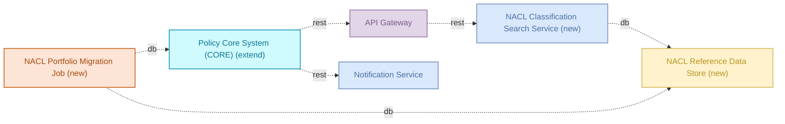
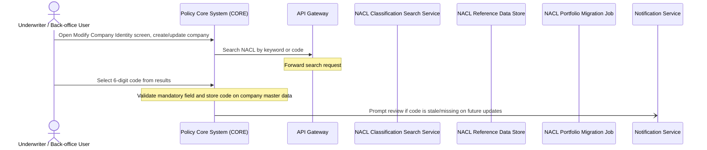

# Industry Classification Code — Detailed Solution Description

## Table of Contents
- 1. Document History
- 2. Document Purpose
- 3. Solution Context
- 4. Scope
- 5. Solution Architecture
- 6. Capability Mapping
- 7. Requirements & Traceability Matrix
- 8. Functional Requirements
- 9. Runtime Process Flow
- 10. Data Structures
- 11. Non-Functional Requirements
- 12. Business Rules
- 13. Risks & Assumptions
- 14. Implementation Roadmap
- 15. Appendix & References

## 1. Document History
| Version | Date | Changes applied | Author(s) | Contributor(s) |
|---------|------|-----------------|-----------|----------------|
| 1.0 | 2026-10-08 | Initial version | Analyst (Team Repository) | AI agent team |

## 2. Document Purpose

This document is written for three audiences: developers who build and maintain the Industry Classification Code solution, testers who derive test cases from its requirements, and reviewers or auditors who need to verify what the solution does and does not do.

It describes the target state of the solution as currently specified: a draft solution that introduces NACL industry-classification search, selection, storage, bulk pre-population, and periodic review inside CORE. It describes what the system does — hierarchical NACL search and selection, mandatory-field validation on company master data, initial bulk pre-population from the existing portfolio, and review prompts on subsequent updates — and what it does not do — it does not change any product, it does not operate at policy level, and it does not support multiple codes or secondary activities per partner. Status across members ranges from draft to production depending on component; CORE, the NACL Reference Data Store, the NACL Classification Search Service, and the NACL Portfolio Migration Job are draft. API Gateway and Notification Service are production components being reused, not changed, by this solution.

This document introduces no scope beyond the source requirements. Every component, flow, and requirement traced here comes from the verified facts and the source requirement document; nothing is added beyond what those sources state.

### Reference documentation & data model

This document aligns to the following source requirement document:

- "bnr-example-2-industry-classification-code.md" — Business Needs & Requirements: Implement NACL industry-classification code integration in CORE for all Commercial V2 and V3 products.

The data model referenced is the one described in that document: a partner/company-level attribute holding exactly one 6-digit NACL code per partner, plus a separate mapping table holding the code hierarchy (Section, Division, Group, Class, Category → 6-digit code) and descriptions, linked onward to downstream tables such as the policy table.

Both the requirement document and the data model are versioned separately from this specification. Any change to either must be re-assessed against this document before implementation proceeds.

## 3. Solution Context

### Upstream

CORE receives the trigger for this solution from an Underwriter or Back-office User who opens the "Modify Company > Identity" screen to create or update a company record. The authoritative NACL classification list, provided by the national statistics authority, is the upstream data source loaded into the NACL Reference Data Store. The existing portfolio's confirmed classification assignments are the upstream input to the NACL Portfolio Migration Job.

### Downstream

CORE's search requests flow downstream through the API Gateway to the NACL Classification Search Service, which reads from the NACL Reference Data Store and returns matching 6-digit codes with their hierarchy position. CORE writes the selected code back onto the company master data record. On later master data, contract, or renewal changes, CORE calls the Notification Service downstream to prompt the user to review a stale or missing code. The API Gateway also depends on external services outside this solution — Identity & Access Management, Authentication Service, Redis Cache Cluster, Session Cache, config-db, and others — to perform authentication, caching, and session handling for requests it routes, including the NACL search requests from CORE. The Notification Service depends on external services outside this solution — Enterprise Event Bus, sendgrid-api, Redis Cache Cluster, notification-db — to deliver its prompts.

### Responsibility Boundaries

This solution is responsible for: capturing, searching, selecting, validating, and storing a mandatory 6-digit NACL code on the company master data record in CORE; exposing hierarchical search and autocomplete over the NACL classification list via the NACL Classification Search Service and NACL Reference Data Store; bulk pre-population of confirmed NACL codes for the existing portfolio via the NACL Portfolio Migration Job; and triggering review prompts through the Notification Service on subsequent master data, contract, or renewal changes.

This solution is explicitly not responsible for: authentication, session management, rate limiting, or routing logic inside the API Gateway (reused as-is); message delivery mechanics, spam protection, or opt-out handling inside the Notification Service (reused as-is); any product-level change — the source requirement document states there are no changes to products, the change applies exclusively at partner level; and any policy-level or claims-level processing. Risks such as API Gateway single-point-of-failure, routing-rule complexity, Notification Service spam protection, email deliverability, and GDPR opt-out handling belong to those reused components, not to this solution.

## 4. Scope

### In scope

- **Policy Core System (CORE)** — extended to host the NACL field on the "Modify Company > Identity" screen, enforce mandatory-field validation, and trigger code-review prompts on master data, contract, or renewal changes.
- **API Gateway** — reused, unchanged, to route CORE's classification search and autocomplete requests to the NACL Classification Search Service.
- **Notification Service** — reused, unchanged, to deliver the "review NACL code" prompt to users.
- **NACL Reference Data Store** — new database holding the official NACL classification list and its hierarchy (Section, Division, Group, Class, Category → 6-digit code).
- **NACL Classification Search Service** — new microservice providing keyword and code search with autocomplete over the reference data store.
- **NACL Portfolio Migration Job** — new batch job that performs initial bulk pre-population of confirmed NACL codes for the existing portfolio into CORE.

These six components cover the five mapped capabilities: industry activity classification (NACL) search and selection, hierarchical browsing of the classification taxonomy, mandatory field validation on company master data, initial bulk pre-population from existing portfolio classifications, and periodic code plausibility review prompts.

### Out of scope

Anything not listed in the member inventory above is out of scope for this solution. In particular, and as stated explicitly in the source requirement document:

- No changes to any product; the change applies exclusively at partner/company level, not at policy or product level.
- No support for multiple NACL codes, secondary activities, or parallel/outdated codes per partner — exactly one current code per partner is permitted.
- No historization of superseded codes at partner level — the partner table holds only the current code.
- External dependencies of the API Gateway and Notification Service (Identity & Access Management, Authentication Service, Redis Cache Cluster, Session Cache, config-db, Enterprise Event Bus, sendgrid-api, notification-db, and others listed as external) are out of scope for this solution; they are consumed as-is.
- Any reporting or analytics functionality built on top of the stored code (e.g., partner-per-code or policy-per-code counts) is described in the source requirement document as an objective of the coding but is not part of this solution's member inventory and is therefore out of scope here.

## 5. Solution Architecture

The solution adds three new components to the existing landscape and reuses two production components already in place.

| Component | Type | Disposition | Role in solution | Status | Owner |
|---|---|---|---|---|---|
| Policy Core System (CORE) | service | extend | Hosts the 'Modify Company' Identity screen; adds the NACL field, mandatory-field validation, and code-review prompts on master data/contract/renewal changes | draft | - |
| API Gateway | gateway | reuse | Routes CORE's classification search/autocomplete requests to the new NACL search service | production | platform-team |
| Notification Service | microservice | reuse | Delivers the 'review NACL code' prompt to users during master data/contract/renewal updates | production | platform-team |
| NACL Reference Data Store | database | new | - | draft | - |
| NACL Classification Search Service | microservice | new | - | draft | - |
| NACL Portfolio Migration Job | batch-job | new | - | draft | - |

CORE stays the system of record for the company master data record and is extended, not replaced. It delegates all search and hierarchy-lookup work to the new NACL Classification Search Service through the existing API Gateway, so no new ingress point is introduced. The NACL Reference Data Store holds the official classification list and its hierarchy, read by both the search service (for live lookups) and the migration job (for initial pre-population of existing portfolio data into CORE). The Notification Service, already in production use elsewhere, is reused unchanged to deliver the review prompts.

## 6. Capability Mapping

| Capability | Mapped components |
|---|---|
| Industry activity classification (NACL) search and selection | NACL Reference Data Store (new), NACL Classification Search Service (new), NACL Portfolio Migration Job (new) |
| Hierarchical browsing of classification taxonomy | NACL Reference Data Store (new), NACL Classification Search Service (new), NACL Portfolio Migration Job (new) |
| Mandatory field validation on company master data | NACL Reference Data Store (new), NACL Classification Search Service (new), NACL Portfolio Migration Job (new) |
| Initial bulk pre-population from existing portfolio classifications | NACL Reference Data Store (new), NACL Classification Search Service (new), NACL Portfolio Migration Job (new) |
| Periodic code plausibility review prompts | NACL Reference Data Store (new), NACL Classification Search Service (new), NACL Portfolio Migration Job (new) |

All five capabilities map to the same set of three new components, none of which exist in the landscape today. There is no mapping gap in the sense of a missing component type — every capability the solution needs is covered by a planned build.

One point to flag as a **GAP**, however: the mandatory field validation itself (rejecting a company record if no code is selected) is logically owned by CORE, since CORE is the system that stores the record and enforces the "Modify Company" screen constraints. The capability mapping lists the three new components against this capability, but none of them performs validation on the CORE record directly — the Classification Search Service only returns candidate codes, and the Reference Data Store only holds reference data. CORE's own "extend" scope (per the component inventory) is where the validation and review-prompt logic actually has to live. This is not a missing component, but a mapping precision issue to carry into design: validation enforcement sits in CORE, not in the new NACL components.

## 7. Requirements & Traceability Matrix

| FR id | Satisfies (capability / process / BRD section) | Status |
|---|---|---|
| FR-01 | [API Gateway] Auto-route by policy version — business rules catalog | Implemented |
| FR-02 | [API Gateway] No anonymous policy access — business rules catalog | Implemented |
| FR-03 | [API Gateway] Per-tier rate limit — business rules catalog | Implemented |
| FR-04 | [API Gateway] PII data residency — business rules catalog, GDPR Article 44 | Implemented |
| FR-05 | [API Gateway] Request priority score — business rules catalog | Implemented |
| FR-06 | [API Gateway] Throttle policy-holders under fraud review — business rules catalog | Implemented |
| FR-07 | Process "NACL Code Selection and Maintenance"; Capability "Industry activity classification (NACL) search and selection"; Capability "Hierarchical browsing of classification taxonomy"; Capability "Mandatory field validation on company master data"; BRD §1.2.1 Target state: desired mapping of the NACL code in CORE | Draft |
| FR-08 | Capability "Initial bulk pre-population from existing portfolio classifications"; BRD §1.2.1, "Mandatory field logic — Existing portfolio"; process step: NACL Portfolio Migration Job reads NACL Reference Data Store and writes to CORE | Draft |
| FR-09 | Capability "Periodic code plausibility review prompts"; BRD §1.2.1, "Mandatory field logic" (prompt on master data/contract/renewal update); process step 6, NACL Code Selection and Maintenance | Draft |

## 8. Functional Requirements

The functional requirements below are derived from the requirement seeds and the attached source material; each cites its source.

### FR-01 — API Gateway auto-routes requests by policy version

The API Gateway inspects the authenticated caller's primary policy creation date and rewrites the request path accordingly.

**Given:** an authenticated request to `/api/policies` or `/api/claims`
**When:** the caller's primary policy was created on or after 2024-01-01
**Then:** the gateway rewrites the path to its `/v2` equivalent and forwards it to `claims-service-v2` instead of the legacy v1 service.

Policies created before 2024-01-01 are left on the v1 path and routed to the legacy service, unchanged. The rewrite is transparent to the caller — no separate client-side logic is needed to pick a version.

**Constraints:**
- Applies only to `/api/policies` and `/api/claims` paths.
- Routing decision is based solely on the primary policy's creation date.

**Status:** Implemented.

**Source:** [API Gateway] Auto-route by policy version (rule), business rules catalog.

---

### FR-02 — API Gateway blocks anonymous access to policy endpoints

Every request to any `/api/policies/*` endpoint must carry a valid authenticated session. The gateway rejects requests that lack one.

**Behaviour:**
- Request arrives at `/api/policies/*`.
- Gateway checks for an authenticated session (via Authentication Service / Identity & Access Management, both external dependencies of the gateway).
- If no valid session is present, the request is rejected before reaching any backend service.
- If a valid session is present, the request proceeds through normal routing (including FR-01 version routing where applicable).

**Constraints:**
- This is a hard constraint: no anonymous or unauthenticated call to `/api/policies/*` is permitted, with no exceptions listed.

**Status:** Implemented.

**Source:** [API Gateway] No anonymous policy access (constraint), business rules catalog.

---

### FR-03 — API Gateway computes per-tier rate limit

The gateway computes the allowed requests-per-second (RPS) for each tenant from a base rate and a multiplier tied to the tenant's commercial tier.

**Formula:** `allowed_rps = base_rps * tier_multiplier`

**Behaviour:**
- Gateway determines the tenant's commercial tier.
- Gateway applies the tier multiplier to the configured base RPS to get the allowed RPS for that tenant.
- Requests beyond the computed allowed RPS are subject to rate limiting.

**Worked example:**

| base_rps | tier_multiplier | allowed_rps |
|---|---|---|
| 10 | 1.0 (standard tier) | 10 |
| 10 | 2.0 (premium tier) | 20 |
| 10 | 0.5 (basic tier) | 5 |

**Constraints:**
- Both `base_rps` and `tier_multiplier` are configuration values; exact tier-to-multiplier mapping is not specified beyond the formula itself.

**Status:** Implemented.

**Source:** [API Gateway] Per-tier rate limit (formula), business rules catalog.

---

### FR-04 — API Gateway enforces EU-only processing of PII requests

Requests that carry customer PII must be processed only in EU regions.

**Behaviour:**
- Gateway identifies requests carrying customer PII.
- Such requests are processed only by EU-region infrastructure; processing outside the EU is not permitted.

**Rationale:** GDPR Article 44 (restrictions on transfer of personal data outside the EU).

**Constraints:**
- This is a hard data-residency constraint, not a routing preference.
- Applies specifically to requests carrying customer PII; non-PII requests are not subject to this constraint.

**Status:** Implemented.

**Source:** [API Gateway] PII data residency (constraint), business rules catalog, citing GDPR Article 44.

---

### FR-05 — API Gateway computes request priority score during overload

During overload conditions, the gateway computes a priority score per request to decide which requests are served first.

**Formula:** `priority = tier_weight + claim_urgency_factor - rate_used_ratio`

**Behaviour:**
- For each incoming request under overload conditions, the gateway computes `tier_weight` (from the caller's commercial tier), `claim_urgency_factor` (reflecting urgency of the underlying claim, where applicable), and `rate_used_ratio` (how much of the caller's quota is already consumed).
- Requests with a higher computed priority score are served ahead of requests with a lower score.

**Worked example:**

| tier_weight | claim_urgency_factor | rate_used_ratio | priority |
|---|---|---|---|
| 5 | 3 | 0.2 | 7.8 |
| 2 | 1 | 0.8 | 2.2 |

(Row 1 is served before row 2, as it has the higher priority score.)

**Constraints:**
- Applies specifically during overload; outside overload conditions requests are not reprioritized by this formula.
- Exact scales/ranges for `tier_weight` and `claim_urgency_factor` are not specified beyond the formula.

**Status:** Implemented.

**Source:** [API Gateway] Request priority score (formula), business rules catalog.

---

### FR-06 — API Gateway throttles claim requests for customers under fraud review

Customers with an open fraud investigation get a stricter rate limit specifically on claim endpoints.

**Given:** the customer has an open fraud investigation flag in identity-service
**When:** the request targets any `/api/claims/*` endpoint
**Then:** the gateway applies a 50% rate-limit reduction for that customer on claim endpoints; if the reduced quota is exceeded, the gateway returns HTTP 429 with header `X-Reason=review-pending`.

**Behaviour:**
- Gateway checks the fraud investigation flag for the customer (sourced from identity-service) on each `/api/claims/*` request.
- If the flag is set, the normal allowed RPS for that customer (per FR-03) is reduced by 50% for claim endpoints only.
- Requests exceeding this reduced quota are rejected with HTTP 429 and the `X-Reason=review-pending` header.

**Worked example:**

| allowed_rps (FR-03) | fraud flag | effective_rps on /api/claims/* | over-quota response |
|---|---|---|---|
| 20 | open | 10 | HTTP 429, X-Reason=review-pending |
| 20 | none | 20 | n/a |

**Constraints:**
- Applies only to `/api/claims/*` endpoints; other endpoints are unaffected by the fraud flag.

**Status:** Implemented.

**Source:** [API Gateway] Throttle policy-holders under fraud review (rule), business rules catalog.

---

### FR-07 — NACL code selection and maintenance in CORE

The system lets underwriters and back-office users search, select, store, and periodically revalidate a mandatory 6-digit NACL industry-classification code on a company's master data record.

**Participants:** Underwriter / Back-office User (trigger), Policy Core System (CORE) (owner), API Gateway, NACL Classification Search Service, NACL Reference Data Store, NACL Portfolio Migration Job, Notification Service (listener).

**Steps:**
1. The user opens the "Modify Company > Identity" screen in CORE and creates or updates a company record.
2. CORE sends a search request (by keyword or code) to the API Gateway.
3. The API Gateway forwards the search request to the NACL Classification Search Service.
4. The NACL Classification Search Service reads from the NACL Reference Data Store and returns matching 6-digit codes together with their position in the full hierarchy (Section, Division, Group, Class, Category → 6-digit code).
5. The user selects one 6-digit code from the results with a single click.
6. CORE validates that the code field is populated (mandatory field) and stores the selected code on the company master data record.
7. On subsequent master data, contract, or renewal changes, CORE calls the Notification Service asynchronously to prompt the user to review the code if it is stale or missing.

**Behaviour detail (from BRD):**
- The search bar supports keyword search (e.g. "restaurant", "IT", "carpentry") and code search (full or partial, e.g. a 4-digit class).
- An autocomplete/suggestion list returns matching codes with descriptions as the user types.
- The results table shows NACL Code (6 digits) and NACL Description only — no risk number, product, or traffic-light colour columns, since NACL carries no risk classes or product attributes.
- Only the 6-digit Category-level code is selectable and storable; the Section/Division/Group/Class levels are shown for orientation only, not for selection.
- The field replaces the existing "Type of Company" field and is positioned in CORE under "Modify Company > Identity".

**Mandatory field logic (from BRD):**
- Mandatory when creating a new company.
- Mandatory for master data changes if activities have changed.
- Mandatory for contract changes — the system shows an error message if no code is selected.

**Initial pre-population (from BRD):**
- The NACL Portfolio Migration Job reads confirmed codes from the existing portfolio list and writes them into CORE for existing corporate clients, where available, without requiring manual re-entry.

**Ongoing revalidation (from BRD):**
- On the next master data change, contract change, or renewal, CORE checks whether a code is present and still plausible.
- If no code is stored, the field is enforced as mandatory before the change can proceed.
- If the code may need updating, CORE triggers a Notification Service prompt asking the user to review and adjust the code if necessary; this does not block the ongoing process.

**Constraints:**
- Exactly one 6-digit code per partner/company; no multiple assignments or secondary activities.
- The code describes the company's primary economic activity and is captured at company level, not at product level.
- The hierarchical mapping table (Section/Division/Group/Class/Category + description) is maintained separately from the partner record, in the NACL Reference Data Store, to avoid redundancy and to support hierarchical aggregation for reporting.

**Status:** To be implemented.

Current situation (AS-IS): CORE has no standardized industry classification field. Only internal, product- and underwriting-driven risk labels are recorded at company level; there is no searchable code list, no hierarchy view, and no mandatory-field validation tied to an official classification.

Target situation (TO-BE): CORE provides a search-and-select NACL control (analogous to the existing "Type of Employment / Occupation" control) backed by the new NACL Classification Search Service and NACL Reference Data Store, routed through the API Gateway; an initial bulk load via the NACL Portfolio Migration Job pre-populates confirmed codes for the existing portfolio; and Notification Service prompts drive ongoing review on master data, contract, and renewal changes.

**Source:** Process "NACL Code Selection and Maintenance" (catalog); BRD section 1.2.1 "Target state: desired mapping of the NACL code in CORE" — "We would like to integrate a search and selection functionality for the NACL code... via a search field with a list of results and a structured display of relevant information," including the mandatory-field logic ("Mandatory when creating a new company... Mandatory for master data changes if activities have changed... Mandatory for contract changes → error message if no code is selected") and the pre-population/review requirement ("an initial pre-population of the code should be loaded into CORE from the existing portfolio list... the system should automatically check whether a code is present and whether it is still plausible").

## 9. Runtime Process Flow

1. **Underwriter / Back-office User → Policy Core System (CORE)** _(sync)_ — Open Modify Company > Identity screen, create/update company
2. **Policy Core System (CORE) → API Gateway** _(sync)_ — Search NACL by keyword or code
3. **API Gateway** — Forward search request
4. **Underwriter / Back-office User → Policy Core System (CORE)** _(sync)_ — Select 6-digit code from results
5. **Policy Core System (CORE)** — Validate mandatory field and store code on company master data
6. **Policy Core System (CORE) → Notification Service** _(async)_ — Prompt review if code is stale/missing on future updates

## 10. Data Structures

The data model for this solution is not fully connected yet; only the NACL Reference Data Store and the NACL Portfolio Migration Job are new, and their internal schemas are still in draft. The tables below capture the data entities described in the source requirement document. Detailed field-level schema (column types, constraints, indexes) will be added once the data model for the NACL Reference Data Store and the migration source file are linked.

## 11. Non-Functional Requirements

Non-functional values below come from the API Gateway component specification (reused in this solution, owned by platform-team) and from data-integrity statements in the source requirement document. The highest data classification across all members of this solution is **public**.

### Security & data protection

1. **NFR-01** — Data classification. Highest classification across solution members: public.
2. **NFR-08** — PII-bearing requests must be processed only in EU-region infrastructure, per GDPR Article 44 (enforced via FR-04 at the API Gateway). Target: no processing of PII outside the EU. Status: implemented.

### Performance & scalability

3. **NFR-02** — Availability target for the API Gateway: 99.99%.
4. **NFR-03** — Maximum latency target for the API Gateway: 200 ms.
5. **NFR-04** — Throughput target for the API Gateway: 12 requests/second.
6. **NFR-05** — Scaling approach for the API Gateway: vertical.
7. **NFR-06** — Recovery Time Objective (RTO) for the API Gateway: 4 (unit not specified in facts).

### Data integrity

8. **NFR-07** — Recovery Point Objective (RPO) for the API Gateway: 10 minutes maximum data loss window.
9. **NFR-09** — Exactly one current NACL code is held per partner; multiple or secondary-activity assignments are excluded, and no parallel or outdated codes are maintained at partner level (per source requirement document, section 1.2.2).

### Audit & governance

No audit or governance-specific non-functional targets are stated in the verified facts for this solution. None are invented here; this category will be completed once such requirements are captured.

## 12. Business Rules

All captured business rules originate from the API Gateway and are already implemented in production. They are not specific to this solution but apply to any request passing through the gateway, including the NACL search/autocomplete calls this solution adds (FR-07 step 2–3).

| Rule | Kind | Summary |
|---|---|---|
| Auto-route by policy version | rule | Requests to `/api/policies` or `/api/claims` are rewritten to `/v2` and sent to `claims-service-v2` when the caller's primary policy was created on or after 2024-01-01; older policies stay on the legacy v1 path. See FR-01. |
| No anonymous policy access | constraint | Every `/api/policies/*` request must carry a valid authenticated session, checked against Authentication Service / Identity & Access Management. No exceptions. See FR-02. |
| Per-tier rate limit | formula | `allowed_rps = base_rps * tier_multiplier`. Converts a tenant's commercial tier into an allowed requests-per-second value. See FR-03. |
| Request priority score | formula | `priority = tier_weight + claim_urgency_factor - rate_used_ratio`. Used only during overload to decide which requests are served first. See FR-05. |
| PII data residency | constraint | Requests carrying customer PII are processed only in EU regions, per GDPR Article 44. See FR-04. |
| Throttle policy-holders under fraud review | rule | Customers flagged with an open fraud investigation in identity-service get a 50% rate-limit cut on `/api/claims/*`; over-quota calls return HTTP 429 with `X-Reason=review-pending`. See FR-06. |

No business rules specific to NACL code selection (mandatory-field logic, uniqueness of the code per partner, review triggers) are captured in the verified facts as formal rule entries; this behaviour is described only in the process sequence and the source BRD (section 1.2, FR-07). It is not restated here as a separate rule to avoid inventing a rule record not present in the facts.

## 13. Risks & Assumptions

### Risks (from facts)

**API Gateway** (reused by this solution for NACL search routing):
- Single point of failure — a gateway outage means a full system outage, which would also take down NACL code search/autocomplete.
- High throughput requires regular load testing; the gateway's throughput figure (12 r/s) is a general NFR, not specific to NACL traffic volumes.
- Routing rule configuration is complex and error-prone — relevant because this solution adds a new routed path (CORE → API Gateway → NACL Classification Search Service).

**Notification Service** (reused for review prompts):
- Spam protection — misconfiguration can cause mass sending; relevant since this solution triggers review-prompt notifications on master data, contract and renewal changes.
- Email deliverability depends on domain reputation and SPF/DKIM configuration.
- GDPR — must respect customer opt-out preferences. Note: the review prompt in this solution targets internal users (underwriters/back-office), not customers directly, so this risk's applicability to this specific flow should be confirmed during build.

### Additional risks (assumption, not in facts)

- **Assumption:** The three new components (NACL Reference Data Store, NACL Classification Search Service, NACL Portfolio Migration Job) carry no documented risks yet because they are still in draft and have not been through risk review. This is a gap, not an absence of risk — it should be closed before these components move past draft.
- **Assumption:** The NACL Portfolio Migration Job writes directly to CORE's data store (per the "writes-to/db" flow). A bulk write to CORE's partner/company data is a change to live master data and carries a data-quality and rollback risk if the pre-population list is incomplete or contains unconfirmed codes. The BRD states only "confirmed" codes should be loaded, but no validation mechanism for this is named in the verified facts.
- **Assumption:** The source BRD requires NACL codes to be unique per partner (exactly one code, no secondary activity). No business rule enforcing this uniqueness constraint is captured in the facts; whether it is enforced by CORE, by the new search service, or left to user discipline is not stated.

### Assumptions

- **Assumption:** "Mandatory field" validation referenced in FR-07 is implemented within CORE (the owning, extended component), consistent with CORE's role as owner of the Modify Company screen. The facts do not name which component performs this validation.
- **Assumption:** The data classification of NACL reference data and the code stored on the partner record is "public" or lower, consistent with the highest classification recorded across all members (public). This has not been independently confirmed for the new components, which are still draft and carry no NFR entries of their own.
- **Assumption:** The link to the external registry coding tool mentioned in the BRD (section 1.2.1) is a UI convenience link in CORE and not a system integration; no corresponding flow or external dependency for it appears in the verified facts, so it is treated as out of scope for this architecture.

## 14. Implementation Roadmap

Grouping follows the disposition recorded for each member. Sequencing between groups is not stated in the facts; the order below is sequenced based on technical dependency (data and search service must exist before CORE can call them, migration can run once the store and CORE's company record support the field).

### Reuse as-is
- **API Gateway** — production, owned by platform-team. No changes needed; it already handles routing, auth, rate limiting, residency and prioritization. This solution adds one new forwarding path (CORE search requests → NACL Classification Search Service).
- **Notification Service** — production, owned by platform-team. No changes needed; this solution uses its existing async notification capability for review prompts.

### Extend
- **Policy Core System (CORE)** — status draft. Work required: add the NACL field to the "Modify Company > Identity" screen, replace the existing "Type of Company" field, add mandatory-field validation, add the search bar/autocomplete UI, wire the call to API Gateway, and add the logic that triggers Notification Service calls on master data/contract/renewal changes. CORE is draft — this is the critical path item, since all other new components only have value once CORE can call them.

### New to build
- **NACL Reference Data Store** — status draft. Holds the official NACL list and the hierarchy mapping (Section, Division, Group, Class, Category → 6-digit code). Must be loaded from the national statistics authority's classification list before search can return results.
- **NACL Classification Search Service** — status draft. Provides keyword and code search, autocomplete, and hierarchy lookups against the Reference Data Store. Depends on the Reference Data Store being populated first.
- **NACL Portfolio Migration Job** — status draft. Reads from the Reference Data Store and writes confirmed codes into CORE for the existing portfolio. Depends on both the Reference Data Store being loaded and CORE's new field being in place before it can write.

### Readiness summary
All three new components and the extended CORE component are draft. Only API Gateway and Notification Service are production-ready and require no further work. Nothing in this solution can go live until CORE's field/validation work and the Reference Data Store load are both complete — the Search Service and the Migration Job are both consumers of the Reference Data Store.

### Sequencing (beyond the data)
The verified facts give no explicit delivery order or phases. Based on the dependency chain in the flows, a reasonable build sequence is:
1. Load and validate the NACL Reference Data Store (prerequisite for everything else).
2. Build the NACL Classification Search Service against that store.
3. Extend CORE: add the field, validation, and the search/autocomplete UI wired through API Gateway to the Search Service.
4. Wire CORE's review-prompt trigger to Notification Service.
5. Run the NACL Portfolio Migration Job to pre-populate confirmed codes for the existing portfolio, once CORE's field exists.
This order is an architectural inference, not a stated plan.

## 15. Appendix & References

### Referenced documents
- `bnr-example-2-industry-classification-code.md` — Business Needs & Requirements document for "Implement NACL industry-classification code integration in CORE for all Commercial V2 and V3 products". Source for FR-07 and for the behavioural detail on mandatory-field logic, the search/autocomplete UI, and the reporting requirement.

### Data models mentioned in the source BRD
- **Partner table** (in CORE) — holds the current 6-digit NACL code as a single attribute per partner; exactly one code per partner, no secondary activities, no historization of superseded codes.
- **Mapping table** — separate table holding the business decoding of each 6-digit code (Category, Description) plus the higher hierarchy levels (Section, Division, Group, Class), used for hierarchy visualization and aggregated reporting.
- **Policy table** — downstream of the partner table; linked so that reporting can aggregate by code at both partner and policy level. Not itself a member of this solution's component inventory.

### External attribute / data specifications
- **Official NACL classification list**, maintained by the national statistics authority — the authoritative data source for the NACL Reference Data Store. Referenced in the BRD as attached to the originating change ticket; not separately linked in the verified facts.
- **Existing portfolio confirmed-codes list** — a pre-existing list assigning a unique code to existing corporate clients, used as the source for the NACL Portfolio Migration Job's pre-population.

### External tools referenced but out of architecture scope
- External registry coding tool (named "[EXTERNAL REGISTRY CODING TOOL]" in the BRD, removed for anonymisation) — the BRD asks for a UI link to this tool, modelled on an existing company-register lookup link in CORE. No corresponding flow, member or dependency for this tool appears in the verified facts, so it is not part of this solution's architecture.
