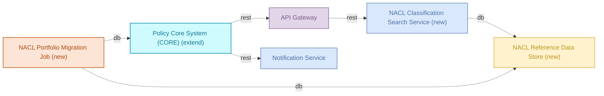
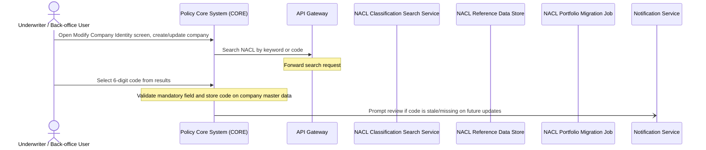

# Industry Classification Code — Detailed Solution Description

## Table of Contents
- 1. Document History
- 2. Document Purpose
- 3. Solution Context
- 4. Scope
- 5. Solution Architecture
- 6. Capability Mapping
- 7. Requirements & Traceability Matrix
- 8. Functional Requirements
- 9. Runtime Process Flow
- 10. Data Structures
- 11. Non-Functional Requirements
- 12. Business Rules
- 13. Risks & Assumptions
- 14. Implementation Roadmap
- 15. Appendix & References

## 1. Document History
| Version | Date | Changes applied | Author(s) | Contributor(s) |
|---------|------|-----------------|-----------|----------------|
| 1.0 | 2026-10-08 | Initial version | Analyst (Team Repository) | AI agent team |

## 2. Document Purpose

This document is written for three audiences: developers who build and maintain the NACL classification capability in CORE and its supporting services, testers who derive test cases from the functional and non-functional requirements, and reviewers or auditors who need to confirm that the implementation matches what was agreed with the business.

It describes what the solution does: it lets underwriters and back-office users search, browse, select, and store a mandatory 6-digit NACL industry-classification code on a company master data record in CORE, pre-populates that code for the existing portfolio from confirmed legacy classifications, and prompts users to review the code on later master data, contract, or renewal changes. It describes what the solution does not do: it does not change product-level data, it does not support multiple codes or secondary activities per partner, it does not alter risk labels or product/underwriting logic, and it does not introduce new API Gateway or Notification Service behaviour beyond reusing them as routing and prompting channels.

The solution is currently in draft status. This document covers the target state as agreed in the source requirements; it does not describe an already-delivered system except where components are explicitly marked production or implemented. It introduces no scope beyond what is stated in the source requirements — it does not add components, flows, or capabilities that are not traceable to that source.

### Reference documentation & data model

- Source requirement document: `bnr-example-2-industry-classification-code.md` — Business Needs & Requirements for NACL industry-classification code integration in CORE.
- Data model alignment: the partner/company master data model in CORE, specifically the partner table (holding the single 6-digit code per partner) and a separate NACL mapping table (holding code, description, and hierarchy levels: Section, Division, Group, Class, Category).

These are versioned independently of this document. Any change to the source requirements document or to the partner/NACL mapping data model must be re-assessed against this Detailed Solution Description before implementation proceeds.

## 3. Solution Context

### Upstream

CORE's "Modify Company > Identity" screen is the entry point: an underwriter or back-office user creates or updates a company record there, triggering a search for a NACL code. The NACL Reference Data Store is populated from the official NACL classification list issued by the national statistics authority (loaded via the NACL Portfolio Migration Job). The NACL Portfolio Migration Job also reads existing, confirmed portfolio classifications to feed the initial pre-population of CORE.

### Downstream

The API Gateway forwards CORE's search and autocomplete requests to the NACL Classification Search Service, which reads from the NACL Reference Data Store and returns matching 6-digit codes with their position in the hierarchy. The selected code is written back to CORE's company master data by the user action in CORE itself; the NACL Portfolio Migration Job also writes pre-populated codes directly to CORE for the existing portfolio. CORE calls the Notification Service asynchronously to deliver review prompts to users when a stored code is stale or missing.

### Responsibility Boundaries

This solution is responsible for: the NACL search-and-select user interaction in CORE, mandatory-field validation of the 6-digit code on the company master data record, storage and maintenance of the NACL reference and hierarchy data, bulk pre-population of codes for the existing portfolio, and triggering review prompts on subsequent master data, contract, or renewal changes.

This solution is not responsible for: authentication and session validation (handled by Identity & Access Management and Authentication Service, both external dependencies of the API Gateway), delivery mechanics of notifications such as email transport (handled by the Notification Service's own external dependencies, e.g. sendgrid-api), the API Gateway's own routing, rate-limiting, and data-residency rules for unrelated traffic (FR-01 through FR-06, which pre-exist and are reused, not introduced, by this solution), and any product-level or risk-label logic in CORE, which remains unchanged.

## 4. Scope

### In scope

- Policy Core System (CORE): the "Modify Company > Identity" screen, the new NACL field, its mandatory-field validation, and the triggering of review prompts on master data, contract, or renewal changes.
- API Gateway: routing of CORE's NACL classification search and autocomplete requests to the NACL Classification Search Service. No new gateway rules are introduced by this solution; the gateway is reused as-is.
- Notification Service: delivery of the "review NACL code" prompt to users. No new notification channels or templates are defined beyond this reuse.
- NACL Reference Data Store: holds the official NACL classification list and the hierarchy mapping (Section, Division, Group, Class, Category, 6-digit code).
- NACL Classification Search Service: serves keyword and code search, autocomplete, and hierarchy lookups against the NACL Reference Data Store.
- NACL Portfolio Migration Job: loads the official NACL list into the reference data store and pre-populates confirmed codes for the existing portfolio into CORE.

Together these six components cover the full capability: searching and selecting a NACL code, browsing its position in the classification hierarchy, validating it as a mandatory field, bulk pre-populating it for the existing portfolio, and prompting periodic review.

### Out of scope

Anything not listed among the six members above is out of scope for this solution. In particular, the source requirements explicitly exclude: changes to product-level data or product logic (the change applies exclusively at the partner/company level); storing more than one NACL code per partner or capturing secondary activities (exactly one code per partner is permitted); and any modification to existing risk labels or underwriting risk classification. External systems referenced only as dependencies of the API Gateway or Notification Service (for example Identity & Access Management, Authentication Service, Redis Cache Cluster, Session Cache, Enterprise Event Bus, sendgrid-api, notification-db, Customer Portal, Advisor Dashboard, Bloomberg Market Data, End-of-Day Reconciliation, AML Screening Job, Order Management Service, config-db, DMZ) are external to this solution and are not altered or extended by it.

## 5. Solution Architecture

The solution adds three new components to CORE's existing landscape and reuses two production components already in place.

| Component | Type | Disposition | Role in solution | Status | Owner |
|---|---|---|---|---|---|
| Policy Core System (CORE) | service | extend | Hosts the 'Modify Company' Identity screen; adds the NACL field, mandatory-field validation, and code-review prompts on master data/contract/renewal changes | draft | - |
| API Gateway | gateway | reuse | Routes CORE's classification search/autocomplete requests to the new NACL search service | production | platform-team |
| Notification Service | microservice | reuse | Delivers the 'review NACL code' prompt to users during master data/contract/renewal updates | production | platform-team |
| NACL Reference Data Store | database | new | - | draft | - |
| NACL Classification Search Service | microservice | new | - | draft | - |
| NACL Portfolio Migration Job | batch-job | new | - | draft | - |

CORE is extended with the new Identity screen behaviour, while the API Gateway and Notification Service are reused unchanged to carry search traffic and review prompts. The three new components — the search service, its reference data store, and the one-off migration job — form the self-contained NACL subsystem that CORE talks to through the gateway, and that is pre-loaded with portfolio data independently by the migration job.

## 6. Capability Mapping

Each of the five business capabilities required by this solution is delivered by the same set of three new components, working together as one subsystem:

| Capability | Delivered by |
|---|---|
| Industry activity classification (NACL) search and selection | NACL Reference Data Store (new), NACL Classification Search Service (new), NACL Portfolio Migration Job (new) |
| Hierarchical browsing of classification taxonomy | NACL Reference Data Store (new), NACL Classification Search Service (new), NACL Portfolio Migration Job (new) |
| Mandatory field validation on company master data | NACL Reference Data Store (new), NACL Classification Search Service (new), NACL Portfolio Migration Job (new) |
| Initial bulk pre-population from existing portfolio classifications | NACL Reference Data Store (new), NACL Classification Search Service (new), NACL Portfolio Migration Job (new) |
| Periodic code plausibility review prompts | NACL Reference Data Store (new), NACL Classification Search Service (new), NACL Portfolio Migration Job (new) |

No capability maps to an existing production component on its own — all five depend on the three new, currently-draft components. CORE, the API Gateway, and the Notification Service support these capabilities (hosting the UI, routing search calls, delivering prompts) but none of them independently implements search, hierarchy, pre-population, or validation logic; that logic lives entirely in the new NACL subsystem.

**GAP:** none of the five required capabilities is covered by an existing reused component alone. All three new components (NACL Reference Data Store, NACL Classification Search Service, NACL Portfolio Migration Job) are mandatory builds for this solution to function — there is no fallback capability already present in the landscape that could substitute for them.

## 7. Requirements & Traceability Matrix

| FR id | Satisfies (capability / process / BRD section) | Status |
|---|---|---|
| FR-01 | [API Gateway] Auto-route by policy version — business rules catalog | Implemented |
| FR-02 | [API Gateway] No anonymous policy access — business rules catalog | Implemented |
| FR-03 | [API Gateway] Per-tier rate limit — business rules catalog | Implemented |
| FR-04 | [API Gateway] PII data residency — business rules catalog, GDPR Article 44 | Implemented |
| FR-05 | [API Gateway] Request priority score — business rules catalog | Implemented |
| FR-06 | [API Gateway] Throttle policy-holders under fraud review — business rules catalog | Implemented |
| FR-07 | Process "NACL Code Selection and Maintenance"; capabilities "Industry activity classification (NACL) search and selection" and "Hierarchical browsing of classification taxonomy"; BRD §1.2.1 Target state: desired mapping of the NACL code in CORE | Draft |
| FR-08 | Capability "Mandatory field validation on company master data"; BRD §1.2.1 Mandatory field logic (new company, master data change, contract change) | Draft |
| FR-09 | Capability "Initial bulk pre-population from existing portfolio classifications"; BRD §1.2.1 Mandatory field logic, Existing portfolio | Draft |
| FR-10 | Capability "Periodic code plausibility review prompts"; BRD §1.2.1 Mandatory field logic (automatic check on update) | Draft |

## 8. Functional Requirements

The functional requirements below are derived from the requirement seeds and the attached source material; each cites its source.

### FR-01 — API Gateway auto-routes requests by policy version

The API Gateway inspects the authenticated caller's primary policy creation date and rewrites the request path accordingly.

**Given:** an authenticated request to `/api/policies` or `/api/claims`
**When:** the caller's primary policy was created on or after 2024-01-01
**Then:** the gateway rewrites the path to its `/v2` equivalent and forwards it to `claims-service-v2` instead of the legacy v1 service.

Policies created before 2024-01-01 are left on the v1 path and routed to the legacy service, unchanged. The rewrite is transparent to the caller — no separate client-side logic is needed to pick a version.

**Constraints:**
- Applies only to `/api/policies` and `/api/claims` paths.
- Routing decision is based solely on the primary policy's creation date.

**Status:** Implemented.

**Source:** [API Gateway] Auto-route by policy version (rule), business rules catalog.

---

### FR-02 — API Gateway blocks anonymous access to policy endpoints

Every request to any `/api/policies/*` endpoint must carry a valid authenticated session. The gateway rejects requests that lack one.

**Behaviour:**
- Request arrives at `/api/policies/*`.
- Gateway checks for an authenticated session (via Authentication Service / Identity & Access Management, both external dependencies of the gateway).
- If no valid session is present, the request is rejected before reaching any backend service.
- If a valid session is present, the request proceeds through normal routing (including FR-01 version routing where applicable).

**Constraints:**
- This is a hard constraint: no anonymous or unauthenticated call to `/api/policies/*` is permitted, with no exceptions listed.

**Status:** Implemented.

**Source:** [API Gateway] No anonymous policy access (constraint), business rules catalog.

---

### FR-03 — API Gateway computes per-tier rate limit

The gateway computes the allowed requests-per-second (RPS) for each tenant from a base rate and a multiplier tied to the tenant's commercial tier.

**Formula:** `allowed_rps = base_rps * tier_multiplier`

**Behaviour:**
- Gateway determines the tenant's commercial tier.
- Gateway applies the tier multiplier to the configured base RPS to get the allowed RPS for that tenant.
- Requests beyond the computed allowed RPS are subject to rate limiting.

**Worked example:**

| base_rps | tier_multiplier | allowed_rps |
|---|---|---|
| 10 | 1.0 (standard tier) | 10 |
| 10 | 2.0 (premium tier) | 20 |
| 10 | 0.5 (basic tier) | 5 |

**Constraints:**
- Both `base_rps` and `tier_multiplier` are configuration values; exact tier-to-multiplier mapping is not specified beyond the formula itself.

**Status:** Implemented.

**Source:** [API Gateway] Per-tier rate limit (formula), business rules catalog.

---

### FR-04 — API Gateway enforces EU-only processing of PII requests

Requests that carry customer PII must be processed only in EU regions.

**Behaviour:**
- Gateway identifies requests carrying customer PII.
- Such requests are processed only by EU-region infrastructure; processing outside the EU is not permitted.

**Rationale:** GDPR Article 44 (restrictions on transfer of personal data outside the EU).

**Constraints:**
- This is a hard data-residency constraint, not a routing preference.
- Applies specifically to requests carrying customer PII; non-PII requests are not subject to this constraint.

**Status:** Implemented.

**Source:** [API Gateway] PII data residency (constraint), business rules catalog, citing GDPR Article 44.

---

### FR-05 — API Gateway computes request priority score during overload

During overload conditions, the gateway computes a priority score per request to decide which requests are served first.

**Formula:** `priority = tier_weight + claim_urgency_factor - rate_used_ratio`

**Behaviour:**
- For each incoming request under overload conditions, the gateway computes `tier_weight` (from the caller's commercial tier), `claim_urgency_factor` (reflecting urgency of the underlying claim, where applicable), and `rate_used_ratio` (how much of the caller's quota is already consumed).
- Requests with a higher computed priority score are served ahead of requests with a lower score.

**Worked example:**

| tier_weight | claim_urgency_factor | rate_used_ratio | priority |
|---|---|---|---|
| 5 | 3 | 0.2 | 7.8 |
| 2 | 1 | 0.8 | 2.2 |

(Row 1 is served before row 2, as it has the higher priority score.)

**Constraints:**
- Applies specifically during overload; outside overload conditions requests are not reprioritized by this formula.
- Exact scales/ranges for `tier_weight` and `claim_urgency_factor` are not specified beyond the formula.

**Status:** Implemented.

**Source:** [API Gateway] Request priority score (formula), business rules catalog.

---

### FR-06 — API Gateway throttles claim requests for customers under fraud review

Customers with an open fraud investigation get a stricter rate limit specifically on claim endpoints.

**Given:** the customer has an open fraud investigation flag in identity-service
**When:** the request targets any `/api/claims/*` endpoint
**Then:** the gateway applies a 50% rate-limit reduction for that customer on claim endpoints; if the reduced quota is exceeded, the gateway returns HTTP 429 with header `X-Reason=review-pending`.

**Behaviour:**
- Gateway checks the fraud investigation flag for the customer (sourced from identity-service) on each `/api/claims/*` request.
- If the flag is set, the normal allowed RPS for that customer (per FR-03) is reduced by 50% for claim endpoints only.
- Requests exceeding this reduced quota are rejected with HTTP 429 and the `X-Reason=review-pending` header.

**Worked example:**

| allowed_rps (FR-03) | fraud flag | effective_rps on /api/claims/* | over-quota response |
|---|---|---|---|
| 20 | open | 10 | HTTP 429, X-Reason=review-pending |
| 20 | none | 20 | n/a |

**Constraints:**
- Applies only to `/api/claims/*` endpoints; other endpoints are unaffected by the fraud flag.

**Status:** Implemented.

**Source:** [API Gateway] Throttle policy-holders under fraud review (rule), business rules catalog.

---

### FR-07 — NACL code selection and maintenance in CORE

The system lets underwriters and back-office users search, select, store, and periodically revalidate a mandatory 6-digit NACL industry-classification code on a company's master data record.

**Participants:** Underwriter / Back-office User (trigger), Policy Core System (CORE) (owner), API Gateway, NACL Classification Search Service, NACL Reference Data Store, NACL Portfolio Migration Job, Notification Service (listener).

**Steps:**
1. The user opens the "Modify Company > Identity" screen in CORE and creates or updates a company record.
2. CORE sends a search request (by keyword or code) to the API Gateway.
3. The API Gateway forwards the search request to the NACL Classification Search Service.
4. The NACL Classification Search Service reads from the NACL Reference Data Store and returns matching 6-digit codes together with their position in the full hierarchy (Section, Division, Group, Class, Category → 6-digit code).
5. The user selects one 6-digit code from the results with a single click.
6. CORE validates that the code field is populated (mandatory field) and stores the selected code on the company master data record.
7. On subsequent master data, contract, or renewal changes, CORE calls the Notification Service asynchronously to prompt the user to review the code if it is stale or missing.

**Behaviour detail (from BRD):**
- The search bar supports keyword search (e.g. "restaurant", "IT", "carpentry") and code search (full or partial, e.g. a 4-digit class).
- An autocomplete/suggestion list returns matching codes with descriptions as the user types.
- The results table shows NACL Code (6 digits) and NACL Description only — no risk number, product, or traffic-light colour columns, since NACL carries no risk classes or product attributes.
- Only the 6-digit Category-level code is selectable and storable; the Section/Division/Group/Class levels are shown for orientation only, not for selection.
- The field replaces the existing "Type of Company" field and is positioned in CORE under "Modify Company > Identity".

**Mandatory field logic (from BRD):**
- Mandatory when creating a new company.
- Mandatory for master data changes if activities have changed.
- Mandatory for contract changes — the system shows an error message if no code is selected.

**Initial pre-population (from BRD):**
- The NACL Portfolio Migration Job reads confirmed codes from the existing portfolio list and writes them into CORE for existing corporate clients, where available, without requiring manual re-entry.

**Ongoing revalidation (from BRD):**
- On the next master data change, contract change, or renewal, CORE checks whether a code is present and still plausible.
- If no code is stored, the field is enforced as mandatory before the change can proceed.
- If the code may need updating, CORE triggers a Notification Service prompt asking the user to review and adjust the code if necessary; this does not block the ongoing process.

**Constraints:**
- Exactly one 6-digit code per partner/company; no multiple assignments or secondary activities.
- The code describes the company's primary economic activity and is captured at company level, not at product level.
- The hierarchical mapping table (Section/Division/Group/Class/Category + description) is maintained separately from the partner record, in the NACL Reference Data Store, to avoid redundancy and to support hierarchical aggregation for reporting.

**Status:** To be implemented.

Current situation (AS-IS): CORE has no standardized industry classification field. Only internal, product- and underwriting-driven risk labels are recorded at company level; there is no searchable code list, no hierarchy view, and no mandatory-field validation tied to an official classification.

Target situation (TO-BE): CORE provides a search-and-select NACL control (analogous to the existing "Type of Employment / Occupation" control) backed by the new NACL Classification Search Service and NACL Reference Data Store, routed through the API Gateway; an initial bulk load via the NACL Portfolio Migration Job pre-populates confirmed codes for the existing portfolio; and Notification Service prompts drive ongoing review on master data, contract, and renewal changes.

**Source:** Process "NACL Code Selection and Maintenance" (catalog); BRD section 1.2.1 "Target state: desired mapping of the NACL code in CORE" — "We would like to integrate a search and selection functionality for the NACL code... via a search field with a list of results and a structured display of relevant information," including the mandatory-field logic ("Mandatory when creating a new company... Mandatory for master data changes if activities have changed... Mandatory for contract changes → error message if no code is selected") and the pre-population/review requirement ("an initial pre-population of the code should be loaded into CORE from the existing portfolio list... the system should automatically check whether a code is present and whether it is still plausible").

## 9. Runtime Process Flow

1. **Underwriter / Back-office User → Policy Core System (CORE)** _(sync)_ — Open Modify Company > Identity screen, create/update company
2. **Policy Core System (CORE) → API Gateway** _(sync)_ — Search NACL by keyword or code
3. **API Gateway** — Forward search request
4. **Underwriter / Back-office User → Policy Core System (CORE)** _(sync)_ — Select 6-digit code from results
5. **Policy Core System (CORE)** — Validate mandatory field and store code on company master data
6. **Policy Core System (CORE) → Notification Service** _(async)_ — Prompt review if code is stale/missing on future updates

## 10. Data Structures

The data model for this solution is not yet linked in the facts. The entities below are the ones named in the source requirement document (NACL industry-classification code BRD) and in the component inventory. Field-level detail is limited to what the BRD states; the full physical schema will be added once the data model is connected to the NACL Reference Data Store.

### NACL Classification (hierarchy / mapping table)

Physical location: NACL Reference Data Store (new component, status: draft). Holds the national statistics authority's official classification list, including the full hierarchy, and is read by the NACL Classification Search Service.

| Field | Type | Description | Example |
|---|---|---|---|
| NACL Code | string (6 digits) | Primary key. Most granular level of the classification, the only level a user can select and store. | `[NN.NNN]` |
| Description | string | Business description of the 6-digit code, shown next to the code in search results and the selection field. | "computer consultancy activities" |
| Section | string | Highest level of the classification hierarchy, shown for orientation only (not selectable/storable). | — |
| Division | string | Second level of the hierarchy. | — |
| Group | string | Third level of the hierarchy. | — |
| Class | string | Fourth level of the hierarchy; also searchable as a partial code (e.g. a 4-digit class). | `[NN.NN]` |
| Category | string | Level immediately above the 6-digit code. | — |

Note: exact field names, data types and the physical table name are not specified in the verified facts beyond this conceptual breakdown; the BRD describes this as "a separate mapping table" distinct from the partner table.

### Company / Partner master data record (NACL attribute)

Physical location: Policy Core System (CORE), "Modify Company > Identity" screen (extend disposition).

| Field | Type | Description | Example |
|---|---|---|---|
| NACL Code | string (6 digits) | Mandatory field on the company/partner master data record. Exactly one code is permitted per partner; secondary activities are explicitly excluded. Replaces the existing "Type of Company" field. | `[NN.NNN]` |
| Code review status | not specified | Logical flag/state used to trigger the "review NACL code" prompt when a code is stale or missing on subsequent master data, contract, or renewal changes. Underlying field name and data type are not given in the facts. | stale / missing / current (illustrative only — exact values not specified) |

Note: the BRD states the partner table holds only the current, factually correct code (no historization of parallel or outdated codes at partner level) and that this code links to downstream tables, e.g. the policy table, for aggregated reporting (counts of partners and policies per code). No further field names for those downstream links are specified in the facts.

### Portfolio migration source (existing portfolio classifications)

Physical location: input to the NACL Portfolio Migration Job (new component, status: draft), which reads from the NACL Reference Data Store and writes to Policy Core System (CORE).

| Field | Type | Description | Example |
|---|---|---|---|
| Partner identifier | not specified | Identifies the existing corporate client whose code is being pre-populated. | — |
| NACL Code | string (6 digits) | Code already assigned to the client in the existing portfolio list. | `[NN.NNN]` |
| Confirmation status | not specified | Indicates whether the assigned code is marked as confirmed; only confirmed entries are pre-populated into CORE. | confirmed / unconfirmed (illustrative only — exact values not specified) |

Note: exact field names and types for this source list are not given in the facts; the BRD only confirms that such a list exists per-client and that only confirmed entries are loaded.

## 11. Non-Functional Requirements

NFR values in the facts are published only for the API Gateway component. No NFR figures are given in the facts for Policy Core System (CORE), Notification Service, NACL Reference Data Store, NACL Classification Search Service, or NACL Portfolio Migration Job; those targets are unset.

### Security & data protection

1. **NFR-01** — Data classification. Highest data classification across all solution members is **public**. No member in this solution is classified above public in the facts.

### Performance & scalability

2. **NFR-02** — Availability (API Gateway): target **99.99%**.
3. **NFR-03** — Maximum latency (API Gateway): target **200ms**.
4. **NFR-04** — Throughput (API Gateway): target **12 r/s**.
5. **NFR-05** — Scaling approach (API Gateway): **vertical** scaling.
6. **NFR-06** — Recovery Time Objective (API Gateway): target **4** (unit not specified in the facts).

### Data integrity

7. **NFR-07** — Recovery Point Objective (API Gateway): target **10 mins**, bounding acceptable data loss on recovery.

### Audit & governance

No audit or governance-specific NFR values are given in the facts for this solution. Beyond the data-residency and authentication constraints already captured as functional requirements (FR-02, FR-04), no separate audit-trail or governance targets (e.g. log retention, access review cadence) are specified; these targets are unset.

## 12. Business Rules

All captured business rules originate from the API Gateway and are shared platform rules the NACL solution reuses as-is. No new business rules are captured for CORE, Notification Service, or the new NACL components (Reference Data Store, Classification Search Service, Portfolio Migration Job) — their behaviour is described through functional requirements and process steps, not through standalone business rules.

- **[API Gateway] Auto-route by policy version** — *rule*. Requests on `/api/policies` or `/api/claims` are rewritten to `/v2` and sent to `claims-service-v2` when the caller's primary policy was created on or after 2024-01-01; older policies stay on v1. See FR-01.
- **[API Gateway] No anonymous policy access** — *constraint*. Every `/api/policies/*` call must carry a valid authenticated session; unauthenticated calls are rejected with no exceptions. See FR-02.
- **[API Gateway] Per-tier rate limit** — *formula*. `allowed_rps = base_rps * tier_multiplier`, computed per tenant from commercial tier. See FR-03.
- **[API Gateway] PII data residency** — *constraint*. Requests carrying customer PII are processed only in EU regions, per GDPR Article 44. See FR-04.
- **[API Gateway] Request priority score** — *formula*. `priority = tier_weight + claim_urgency_factor - rate_used_ratio`, used to order requests during overload. See FR-05.
- **[API Gateway] Throttle policy-holders under fraud review** — *rule*. Customers with an open fraud investigation flag get a 50% rate-limit reduction on `/api/claims/*`; over-quota requests get HTTP 429 with `X-Reason=review-pending`. See FR-06.

These rules govern traffic through the API Gateway in general. They apply to CORE's calls to the NACL Classification Search Service the same way they apply to any other gateway traffic — the NACL solution does not override or extend them.

## 13. Risks & Assumptions

### Risks (from verified facts)

**API Gateway**
- Single point of failure — a gateway outage is a full system outage. All CORE-to-NACL-search traffic goes through this gateway, so a gateway outage stops NACL code search entirely.
- High throughput requires regular load testing. The gateway's stated throughput capacity is 12 r/s; this is shared across all gateway traffic, not dedicated to NACL search.
- Routing rule configuration is complex and error-prone. A misconfiguration could affect how CORE's search/autocomplete calls are forwarded.

**Notification Service**
- Spam protection — misconfiguration can cause mass sending. Relevant because the service delivers the "review NACL code" prompt on master data, contract and renewal changes; a fault here could trigger prompt storms.
- Email deliverability depends on domain reputation and SPF/DKIM configuration. If the review prompt is delivered by email, this affects whether users actually see it.
- GDPR — must respect customer opt-out preferences. Applies to review-prompt notifications the same as any other notification sent by this service.

### Assumptions (analyst-stated, not in verified facts)

- **Assumption:** The NACL Reference Data Store, NACL Classification Search Service and NACL Portfolio Migration Job are new builds and carry no documented operational risk yet, because they have not been built or load-tested. This is a gap, not a clean bill of health.
- **Assumption:** The gateway's listed throughput (12 r/s) and availability (99.99%) figures are platform-wide values, not NACL-specific capacity. No NACL-specific performance target is stated in the facts; this should be confirmed before go-live.
- **Assumption:** The "review NACL code" prompt is delivered through the Notification Service's existing channels (the facts do not specify which channel — email, in-app, or other). If it is email-based, the deliverability risk above applies directly.
- **Assumption:** Since CORE, the Reference Data Store, the Search Service and the Migration Job are all marked draft, the NACL capability as a whole is not yet ready for production regardless of the API Gateway's and Notification Service's own production status.
- **Assumption:** No risk is documented for the Migration Job's one-time write into CORE (pre-population from the existing portfolio list). Given this writes to live partner master data, a review of this gap is recommended before execution.

## 14. Implementation Roadmap

Grouping is by disposition, as recorded in the member inventory. The sequence below is not stated in the verified facts — it is sequenced here on ordinary dependency logic (data store before service, service before consumer, migration after search is live) and should be read as the analyst's proposed order, not a fact.

### Reuse as-is
- **API Gateway** (production, owner: platform-team). No changes needed; it already routes requests and will carry CORE's new search/autocomplete calls to the NACL Classification Search Service. Its documented risks (SPOF, throughput, routing complexity) apply to this new traffic too.
- **Notification Service** (production, owner: platform-team). No changes needed; it already supports async calls from CORE and will carry the "review NACL code" prompt. Its documented risks (spam protection, deliverability, GDPR opt-out) apply to this new use.

### Extend
- **Policy Core System (CORE)** (draft). Needs the NACL field added to the "Modify Company > Identity" screen, mandatory-field validation, the search/autocomplete UI, and the logic to trigger review prompts on subsequent master data, contract or renewal changes. Status is draft — this is the component with the most build work among the three capability layers, since it is where users actually interact with the code.

### New to build
- **NACL Reference Data Store** (draft). Holds the official classification list (hierarchy: Section, Division, Group, Class, Category → 6-digit code) and the confirmed codes loaded from the existing portfolio. Must be built and populated before the Search Service can return results.
- **NACL Classification Search Service** (draft). Reads from the Reference Data Store and serves keyword/code search results with hierarchy position, behind the API Gateway. Depends on the Reference Data Store being populated.
- **NACL Portfolio Migration Job** (draft). Reads confirmed codes from the Reference Data Store and writes them into CORE for the existing portfolio. Depends on both the Reference Data Store being loaded and CORE having the new NACL field in place to write into.

### Proposed sequence (sequenced beyond the facts)
1. Build and load the NACL Reference Data Store with the official classification list.
2. Build the NACL Classification Search Service against the populated store; verify search and hierarchy display work end to end through the (reused) API Gateway.
3. Extend CORE with the NACL field, mandatory validation, and the search UI, wired to the Search Service.
4. Wire CORE's review-prompt trigger to the (reused) Notification Service.
5. Run the NACL Portfolio Migration Job to pre-populate confirmed codes for the existing portfolio into CORE.

Everything upstream of CORE's extension must be working before migration can run, since the job writes into the CORE field the extension creates.

## 15. Appendix & References

### Referenced documents
- `bnr-example-2-industry-classification-code.md` — Business Needs & Requirements document for "Implement NACL industry-classification code integration in CORE for all Commercial V2 and V3 products." Source for the business value, target-state description, mandatory-field logic, and reporting requirement used in this solution.

### Data models mentioned in the source BRD
- **Partner table** — holds the current, single, mandatory 6-digit NACL code per partner. Exactly one code per partner; no parallel or outdated codes are kept.
- **Mapping table** — separate from the partner table; holds the code hierarchy (Category/6-digit code as key, Description, Section, Division, Group, Class) for decoding and hierarchical aggregation without redundancy in the partner data model.
- **Policy table** — downstream of the partner table; linked so that policy-level and claims-level analyses can be aggregated by NACL code.

Note: these tables are described in the source BRD as the target data model for reporting. They are not separately listed as members in the verified component inventory; in this solution they are expected to be realized inside the NACL Reference Data Store (mapping table) and CORE's partner record (partner table/code field).

### External attribute / reference specifications
- **Official NACL classification list** — provided by the national statistics authority, the authoritative source for the full hierarchy and 6-digit codes, to be attached to the implementation ticket per the BRD.
- **Existing portfolio confirmed-codes list** — a prepared list of existing corporate clients already assigned a code, used as the source for initial pre-population, as described in the BRD. No external document is listed for this in the verified facts beyond its mention in the BRD.

### External tools referenced but out of scope for this solution's components
- The BRD mentions an external registry coding tool and an external company-register lookup link, both referenced for user guidance when selecting a code. Neither appears in the verified component inventory, so no flow, integration, or member is defined for them in this solution.
