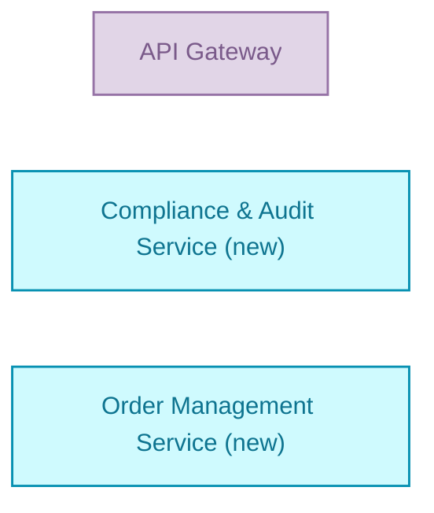

# test — Detailed Solution Description

## Table of Contents

1. [Version History](#1-version-history)
2. [Executive Summary](#2-executive-summary)
3. [Business Context](#3-business-context)
4. [Scope](#4-scope)
5. [Solution Architecture](#5-solution-architecture)
6. [Capability & Process Mapping](#6-capability--process-mapping)
7. [Non-Functional Requirements](#7-non-functional-requirements)
8. [Dependencies](#8-dependencies)
9. [Risks](#9-risks)
10. [Business Rules](#10-business-rules)
11. [Implementation Roadmap](#11-implementation-roadmap)

## 1. Version History

| Version | Date | Author | Changes |
|---------|------|--------|---------|
| 1.0 | 2024-12-19 | Auto-generated | Initial version |

## 2. Executive Summary

The test solution provides teste fgdsfgdgd fdsgfdfg functionality through three core components. The solution is currently in draft status and targets the test business goal.

This solution introduces two new services for compliance auditing and order management capabilities, while reusing the existing API Gateway infrastructure. All components work together to support process A operations.

## 3. Business Context

The solution delivers two key business capabilities: Compliance & Audit and Order Management. These capabilities enable the organization to maintain regulatory compliance while managing customer orders effectively.

The solution supports process A, which involves all three components working together. The compliance and audit capability ensures proper oversight and regulatory adherence across operations.

## 4. Scope

**In scope:**
- API Gateway (reuse existing)
- Compliance & Audit Service (new development)
- Order Management Service (new development)

Any components not listed above are explicitly out of scope for this solution.

## 5. Solution Architecture

| Component | Type | Disposition | Role in solution | Status | Owner |
|---|---|---|---|---|---|
| API Gateway | gateway | reuse | participant in process "process A" | production | platform-team |
| Compliance & Audit Service | service | new | Covers capability "Compliance & Audit" | draft | test |
| Order Management Service | service | new | Covers capability "Order Management" | draft | test |

The API Gateway serves as the entry point and orchestrates interactions with the two new services. The Compliance & Audit Service and Order Management Service work together to deliver the required business capabilities within process A.

## 6. Capability & Process Mapping

**Capability mapping:**
- Compliance & Audit → Compliance & Audit Service (new), Order Management Service (new)
- Order Management → Compliance & Audit Service (new), Order Management Service (new)

**Process mapping:**
- process A → API Gateway, Compliance & Audit Service (new), Order Management Service (new)

Both capabilities are supported by both new services, indicating shared responsibility and cross-functional requirements.

## 7. Non-Functional Requirements

**API Gateway targets:**
- Availability: 99.99%
- Maximum latency: 200ms
- Recovery time objective: 4 hours
- Throughput: 12 requests/second
- Scaling: vertical
- Recovery point objective: 10 minutes

**Data classification:** Public (highest across all solution members)

## 8. Dependencies

The solution has multiple external dependencies through the API Gateway:

- Identity & Access Management (calls/rest)
- Redis Cache Cluster (calls/db)
- gfdsgfdgfd (serves/db)
- Advisor Dashboard (serves/rest)
- Customer Portal (serves/rest)
- Bloomberg Market Data (serves/rest)
- config-db (calls/db)
- Session Cache (calls/db, serves/db)
- Authentication Service (calls/rest, serves/rest)
- DMZ (contains, writes-to/rest, part-of)

## 9. Risks

**Identified risks:**
- API Gateway: Single point of failure - gateway outage means full system outage
- API Gateway: High throughput requires regular load testing
- API Gateway: Routing rule configuration is complex and error-prone

## 10. Business Rules

**API Gateway rules:**
- Per-tier rate limit (formula) — Computes the allowed requests-per-second for each tenant based on their commercial tier
- Request priority score (formula) — Prioritises requests during overload so high-value or urgent traffic is served first
- Throttle policy-holders under fraud review (rule) — Customers with an open fraud investigation get a stricter rate limit on claim endpoints
- Auto-route by policy version (rule) — Legacy policies stay on v1, post-2024 policies are upgraded to v2 endpoints transparently
- PII data residency (constraint) — Requests carrying customer PII must be processed only in EU regions (GDPR Article 44)
- No anonymous policy access (constraint) — Authenticated session is required for every /api/policies/* endpoint

## 11. Implementation Roadmap

**Reuse (ready for integration):**
- API Gateway (production status)

**New development required:**
- Compliance & Audit Service (draft status)
- Order Management Service (draft status)

The API Gateway is production-ready and can be integrated immediately. Both new services are in draft status and require full development before the solution can be deployed. This sequencing suggests the new services should be prioritized for development to unblock the overall solution delivery.
