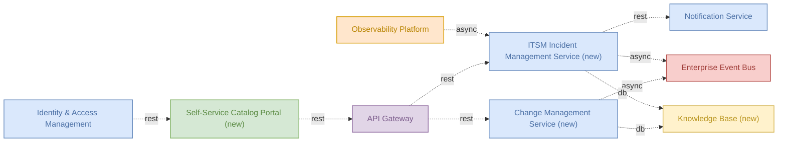
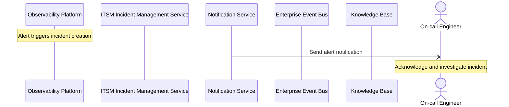

# Testovanie Aardwark — Detailed Solution Description

## Table of Contents
- 1. Document History
- 2. Document Purpose
- 3. Solution Context
- 4. Scope
- 5. Solution Architecture
- 6. Capability Mapping
- 7. Requirements & Traceability Matrix
- 8. Functional Requirements
- 9. Runtime Process Flow
- 10. Data Structures
- 11. Non-Functional Requirements
- 12. Business Rules
- 13. Risks & Assumptions
- 14. Implementation Roadmap
- 15. Appendix & References

## 1. Document History
| Version | Date | Changes applied | Author(s) | Contributor(s) |
|---------|------|-----------------|-----------|----------------|
| 1.0 | 2026-09-22 | Initial version | Analyst (Team Repository) | AI agent team |

## 2. Document Purpose

This document is written for three audiences: developers who build and maintain the four new components of this solution (ITSM Incident Management Service, Self-Service Catalog Portal, Change Management Service, Knowledge Base); testers who derive test cases from the functional and non-functional requirements stated here; and reviewers or auditors who need to confirm that the solution stays within its agreed boundaries.

The document describes what the solution does: it automates the incident lifecycle from alert detection through resolution, gives internal non-IT teams a self-service request catalog, runs a change-approval flow for production deployments, and provides a centralized, searchable knowledge base. It does this by combining four new components with five existing, reused platform components (Observability Platform, Notification Service, Enterprise Event Bus, API Gateway, Identity & Access Management).

The document does not describe a full ITIL implementation. It does not describe problem management, asset management, service-level reporting, or any capability beyond incident management, change management, self-service catalog, and knowledge management. It does not redefine or re-document the internal behavior of the reused platform components beyond the role each plays in this solution's flows.

The solution is currently in draft status. The four new components are also in draft status, and all flows in the architecture are marked as proposed. This document therefore describes a target state, not a system that is fully built and running end to end — with the exception of the API Gateway business rules (FR-01 through FR-06), which are marked Implemented because they exist in the reused API Gateway component today.

This document introduces no scope beyond what is stated in the source requirements. Every component, flow, and requirement traces

## 3. Solution Context

_(not generated)_

## 4. Scope

_(not generated)_

## 5. Solution Architecture

| Component | Type | Disposition | Role in solution | Status | Owner |
|---|---|---|---|---|---|
| Observability Platform | platform | reuse | Detects alerts and feeds them into the incident workflow | production | sre-team |
| Notification Service | microservice | reuse | Delivers incident and change notifications to on-call staff and requesters | production | platform-team |
| Enterprise Event Bus | queue | reuse | Carries incident and change lifecycle events between services | production | platform-team |
| API Gateway | gateway | reuse | Single entry point for the self-service catalog portal and ITSM APIs | production | platform-team |
| Identity & Access Management | microservice | reuse | Authenticates and authorizes ITSM portal users across teams | production | security-team |
| ITSM Incident Management Service | microservice | new | - | draft | - |
| Self-Service Catalog Portal | frontend | new | - | draft | - |
| Change Management Service | microservice | new | - | draft | - |
| Knowledge Base | database | new | - | draft | - |

Four reused, production components (Observability Platform, Notification Service, Enterprise Event Bus, API Gateway, Identity & Access Management) provide the existing platform backbone. Four new components (ITSM Incident Management Service, Self-Service Catalog Portal, Change Management Service, Knowledge Base) implement the ITSM-specific logic and are currently in draft status. The new components sit behind the API Gateway and Identity & Access Management for access control, consume alerts from the Observability Platform, publish lifecycle events onto the Enterprise Event Bus, and route notifications through the Notification Service.

## 6. Capability Mapping

| Capability | Mapped components |
|---|---|
| Incident Management | ITSM Incident Management Service (new), Self-Service Catalog Portal (new), Change Management Service (new), Knowledge Base (new) |
| Change Management | ITSM Incident Management Service (new), Self-Service Catalog Portal (new), Change Management Service (new), Knowledge Base (new) |
| Self-Service Catalog | ITSM Incident Management Service (new), Self-Service Catalog Portal (new), Change Management Service (new), Knowledge Base (new) |
| Knowledge Management | ITSM Incident Management Service (new), Self-Service Catalog Portal (new), Change Management Service (new), Knowledge Base (new) |

All four capabilities map to the same set of four new components. Each capability is fully covered by a component already present in the inventory (Section 5); no capability is left without a mapped component. No GAP is identified — the solution does not require any additional component beyond the nine listed in the inventory to deliver Incident Management, Change Management, Self-Service Catalog, or Knowledge Management. The five reused, production components (Observability Platform, Notification Service, Enterprise Event Bus, API Gateway, Identity &

## 7. Requirements & Traceability Matrix

_(not generated)_

## 8. Functional Requirements

The functional requirements below are derived from the requirement seeds and the attached source material; each cites its source.

### FR-01 — Auto-route API requests by policy version

The API Gateway inspects the policy identifier (or policy metadata) on each inbound request under `/api/policies/*` and routes it to the correct backend endpoint version without requiring the caller to specify a version.

Behaviour:
- Legacy policies (issued before 2024) are routed to the v1 endpoint set.
- Policies created from 2024 onward are routed to the v2 endpoint set.
- The routing decision is made transparently — the caller does not choose the version; the gateway determines it from the policy record.
- If the policy's creation date/version marker is missing or unreadable, the request must be rejected or routed to a default version per gateway configuration (exact fallback behaviour not detailed in the available facts).

Constraints:
- Routing must not change the request/response contract seen by the client beyond the version-specific endpoint behaviour itself.
- This rule applies only within the API Gateway component; it does not alter how downstream services process the request once routed.

Status: Implemented.

**Source:** Business rule catalog — [API Gateway] "Auto-route by policy version (rule) — Legacy policies stay on v1, post-2024 policies are upgraded to v2 endpoints transparently."

---

### FR-02 — Require authenticated session for policy endpoints

Every request to any endpoint under `/api/policies/*` must carry a valid, authenticated session. Anonymous or unauthenticated requests are rejected before reaching backend services.

Behaviour / steps:
1. Gateway receives a request to `/api/policies/*`.
2. Gateway checks for a valid session/authentication token.
3. If valid, request is forwarded to the appropriate backend (per FR-01 routing).
4. If missing or invalid, the gateway rejects the request (no anonymous access is permitted) rather than forwarding it.

Constraints:
- This applies to the entire `/api/policies/*` path space, with no exceptions for read-only or low-sensitivity sub-paths, per the rule as stated.
- Authentication verification is a gateway-level control, ahead of any authorization decision performed downstream.

Status: Implemented.

**Source:** Business rule catalog — [API Gateway] "No anonymous policy access (constraint) — Authenticated session is required for every /api/policies/* endpoint."

---

### FR-03 — Compute per-tier rate limit

The API Gateway computes the maximum allowed requests-per-second (RPS) for a tenant based on that tenant's commercial tier, and enforces this as a hard ceiling on incoming traffic from that tenant.

Behaviour:
- Each request is associated with a tenant.
- The gateway looks up the tenant's commercial tier.
- A formula (tier-to-rate mapping) converts the tier into an allowed RPS value.
- Requests exceeding the computed RPS for that tenant are throttled or rejected.

Constraints:
- The overall API Gateway throughput ceiling is 12 r/s (per the gateway's non-functional requirements), which bounds what any per-tier formula can allocate in aggregate.
- The exact tier-to-rate mapping values (e.g., specific numeric allocation per tier) are not defined in the available facts; only the existence of the rule and its purpose are confirmed.

Worked example (illustrative only — exact tier coefficients not specified in verified facts):

| Input: Tenant tier | Output: Allowed RPS (relative) |
|---|---|
| Higher commercial tier | Larger share of the gateway's throughput ceiling |
| Lower commercial tier | Smaller share of the gateway's throughput ceiling |

Status: Implemented.

**Source:** Business rule catalog — [API Gateway] "Per-tier rate limit (formula) — Computes the allowed requests-per-second for each tenant based on their commercial tier." Gateway throughput ceiling from API Gateway non-functional requirements (`throughput: 12r/s`).

---

### FR-04 — Enforce EU-only processing for PII-bearing requests

Any request through the API Gateway that carries customer personally identifiable information (PII) must be processed only within EU regions.

Behaviour / constraints:
- The gateway (or its routing layer) identifies requests carrying PII.
- Such requests are constrained to EU-region processing paths only; they must not be rout

## 9. Runtime Process Flow

1. **Observability Platform** — Alert triggers incident creation
2. **Notification Service → On-call Engineer** _(async)_ — Send alert notification
3. **On-call Engineer** — Acknowledge and investigate incident

## 10. Data Structures

_(not generated)_

## 11. Non-Functional Requirements

_(not generated)_

## 12. Business Rules

All captured business rules originate from the API Gateway component. Six rules are recorded; four map to implemented functional requirements already detailed in Chapter 8 (FR-01 through FR-04). Two additional rules exist in the catalog and map to FR-05 and FR-06.

| Rule | Kind | Summary |
|---|---|---|
| Per-tier rate limit | Formula | Computes the allowed requests-per-second for each tenant based on the tenant's commercial tier. See FR-03. |
| Request priority score | Formula | Prioritizes requests during overload conditions so high-value or urgent traffic is served first. See FR-05. |
| Throttle policy-holders under fraud review | Rule | Customers with an open fraud investigation receive a stricter rate limit on claim endpoints. See FR-06. |
| Auto-route by policy version | Rule | Legacy policies (pre-2024) stay on v1 endpoints; policies created from 2024 onward are transparently routed to v2 endpoints. See FR-01. |
| PII data residency | Constraint | Requests carrying customer PII must be processed only in EU regions, per GDPR Article 44. See FR-04. |
| No anonymous policy access | Constraint | An authenticated session is required for every `/api/policies/*` endpoint. See FR-02. |

All six rules are enforced at the API Gateway layer only. None of the rules currently reference the new ITSM members (ITSM Incident Management Service, Self-Service Catalog Portal, Change Management Service, Knowledge Base) — no business rules have been captured yet for those components, since they are draft and their internal logic has not been documented.

## 13. Risks & Assumptions

## 14. Implementation Roadmap

The roadmap below groups work strictly by the disposition recorded for each member. Sequencing across groups is not stated in the verified facts; where a sequence is proposed below, it is called out explicitly as sequencing added beyond the data.

## 15. Appendix & References

_(not generated)_
