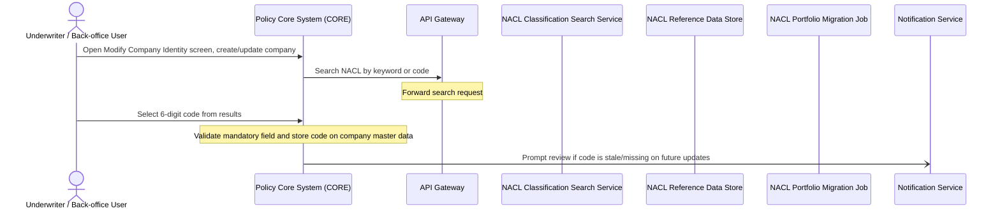

# Industry Classification Code — Functional Specification

## Table of Contents
- 1. Document Control
- 2. Introduction
- 3. Scope
- 4. Actors, Stakeholders & Glossary
- 5. Use Cases
- 6. Management Rules & Calculations
- 7. Data Requirements
- 8. Interfaces, Batches & Notifications
- 9. Non-Functional Requirements
- 10. Acceptance Criteria
- 11. Assumptions, Decisions & Open Points
- 12. Appendix & References

## 1. Document Control
**Reference:** industry-classification-code · **Status:** draft · **Department / owner:** —

| | |
|---|---|
| Template version | Functional Specification template 1.0 (Team Repository) |
| Date issued | 2026-09-22 |
| Owner | — |

**Modifications**

| Version | Date | Author | Description |
|---------|------|--------|-------------|
| 1.0 | 2026-09-22 | Analyst (Team Repository) | Initial version — generated with the AI agent team |

> **WARNING** — The commitments contained within this document, or changes to them, must be reviewed, agreed and signed off by all affected groups and individuals.

**Referred documents**

| N° | Document | Version | Date |
|----|----------|---------|------|
| 1 | bnr-example-2-industry-classification-code.md (source requirements document) | — | — |

**Distribution**

| Name | Department | Role |
|------|------------|------|
| — | — | Solution owner |
| — | — | Business owner |
| — | — | Development |
| — | — | Test |

**Sign-off**

| Role | Name | Date | Signature |
|------|------|------|-----------|
| Business owner | | | |
| Solution architect | | | |
| Development lead | | | |
| Test lead | | | |

## 2. Introduction

## 2. Introduction

## 3. Scope

**In scope**

- Policy Core System (CORE) — Modify Company > Identity screen changes, NACL field, mandatory-field validation, review prompts (UC-01).
- API Gateway — routing of CORE's NACL search/autocomplete requests to the NACL Classification Search Service (UC-01).
- Notification Service — delivery of the NACL code review prompt (UC-01).
- NACL Reference Data Store — storage of the official NACL classification hierarchy (UC-01).
- NACL Classification Search Service — keyword and code search over the classification hierarchy (UC-01).
- NACL Portfolio Migration Job — initial load of the classification list and pre-population of confirmed codes for the existing portfolio (UC-01).

**Out of scope**

- Identity & Access Management — external system called by the API Gateway.
- Redis Cache Cluster — external system called by the API Gateway.
- gfdsgfdgfd — external system served by the API Gateway.
- Advisor Dashboard — external system served by the API Gateway.
- Customer Portal — external system served by the API Gateway.
- Bloomberg Market Data — external system served by the API Gateway.
- config-db — external system called by the API Gateway.
- Session Cache — external system called by and serving the API Gateway.
- Authentication Service — external system called by and serving the API Gateway.
- DMZ — external network zone associated with the API Gateway.
- Enterprise Event Bus — external system called by the Notification Service.
- sendgrid-api — external system called by the Notification Service.
- notification-db — external system called by the Notification Service.
- End-of-Day Reconciliation — external system called by and served by the Notification Service.
- AML Screening Job — external system served by the Notification Service.
- Order Management Service — external system served by the Notification Service.
- Changes to Commercial product definitions or product-level attributes — the source requirements state the change applies exclusively at the partner/company level, not at the product level.
- Secondary or multiple NACL codes per partner — the source requirements state exactly one unique code is permitted per partner; multiple assignments or secondary activities are explicitly excluded.
- Risk number, product, and colour-coding (traffic light) columns in the NACL search results — the source requirements state these are not applicable, since NACL is not a risk-based classification.

Anything not listed above is out of scope.

**Constraints**

- The change applies to all Commercial products on both product versions V2 and V3, as stated in the source requirements document.
- The desired release is not specified in the available facts (left as a placeholder in the source requirements document).
- The API Gateway requires an authenticated session for every /api/policies/* endpoint (RG-02) and must process requests carrying customer PII only in EU regions (RG-04); these constraints apply to traffic routed through the API Gateway as part of UC-01.
- Highest data classification across the solution's member components is "public".

## 4. Actors, Stakeholders & Glossary

**Actors**

| Actor | Type | Role in the solution |
|---|---|---|
| Underwriter / Back-office User | user role | Opens the Modify Company > Identity screen in CORE, searches for and selects the NACL code, and responds to review prompts. |
| Policy Core System (CORE) | member system | Hosts the Identity screen, sends search requests, validates and stores the NACL code, triggers review prompts. |
| API Gateway | member system | Routes CORE's NACL search/autocomplete requests to the NACL Classification Search Service. |
| NACL Classification Search Service | member system | Executes keyword/code searches against the NACL Reference Data Store and returns results to CORE via the API Gateway. |
| NACL Reference Data Store | member system | Stores the official hierarchical NACL classification data. |
| NACL Portfolio Migration Job | member system | Loads the official classification list into the NACL Reference Data Store and writes confirmed codes for the existing portfolio into CORE. |
| Notification Service | member system | Delivers the code-review prompt to users on later master data, contract, or renewal changes. |
| Identity & Access Management | external system | Dependency of the API Gateway; not part of the NACL flow. |
| Redis Cache Cluster | external system | Dependency of the API Gateway; not part of the NACL flow. |
| gfdsgfdgfd | external system | Dependency of the API Gateway; not part of the NACL flow. |
| Advisor Dashboard | external system | Dependency of the API Gateway; not part of the NACL flow. |
| Customer Portal | external system | Dependency of the API Gateway; not part of the NACL flow. |
| Bloomberg Market Data | external system | Dependency of the API Gateway; not part of the NACL flow. |
| config-db | external system | Dependency of the API Gateway; not part of the NACL flow. |
| Session Cache | external system | Dependency of the API Gateway; not part of the NACL flow. |
| Authentication Service | external system | Dependency of the API Gateway; not part of the NACL flow. |
| DMZ | external system | Network zone associated with the API Gateway; not part of the NACL flow. |
| Enterprise Event Bus | external system | Dependency of the Notification Service; not part of the NACL flow. |
| sendgrid-api | external system | Dependency of the Notification Service; not part of the NACL flow. |
| notification-db | external system | Dependency of the Notification Service; not part of the NACL flow. |
| End-of-Day Reconciliation | external system | Dependency of the Notification Service; not part of the NACL flow. |
| AML Screening Job | external system | Dependency of the Notification Service; not part of the NACL flow. |
| Order Management Service | external system | Dependency of the Notification Service; not part of the NACL flow. |

**Stakeholders**

| Role | Responsibility |
|---|---|
| Solution owner | Not named in the available facts; to be supplied by the business/project sponsor. |
| Platform team | Owns the API Gateway and the Notification Service, both reused in this solution. |

**Glossary**

| Term | Definition |
|---|---|
| NACL | The nationally standardized classification of economic activities, maintained by the national statistics authority; hierarchical, with a 6-digit activity code as its most granular level. |
| CORE | Policy Core System — the insurance policy administration system extended by this solution. |
| Section / Division / Group / Class / Category | The five hierarchical levels of the NACL classification, from broadest (Section) to most granular (Category, which maps to the 6-digit activity code). |
| Modify Company > Identity | The screen in CORE where a company's identity master data, including the NACL code, is created or updated. |
| Mandatory field | A data field that must be filled before the record can be saved; applies to the NACL code on company master data. |
| Stale code | A NACL code on a company record that may no longer reflect the company's current economic activity and needs review. |
| Review prompt | A not

## 5. Use Cases

The use cases below are derived from the modelled processes and the management rules of the components that take part in them; their ids are stable across regenerations.

### UC-01 — NACL Code Selection and Maintenance

| Field | Value |
|---|---|
| Use case ID | UC-01 |
| Name | NACL Code Selection and Maintenance |
| Principal actor | Underwriter / Back-office User |
| Components involved | Policy Core System (CORE), API Gateway, NACL Classification Search Service, NACL Reference Data Store, NACL Portfolio Migration Job, Notification Service |
| Description | The user opens the Modify Company > Identity screen in CORE to create or update a company. CORE sends a keyword or code search request through the API Gateway to the NACL Classification Search Service, which reads the hierarchical classification data from the NACL Reference Data Store. The user selects a 6-digit activity code from the returned results. CORE validates the code as a mandatory field and stores it on the company master data record. On subsequent master data, contract or renewal changes, CORE triggers the Notification Service to prompt the user to review the code if it is stale or missing. |
| Trigger | Underwriter or Back-office User opens the Modify Company > Identity screen to create or update a company record. |
| Pre-conditions | 1. The user has an authenticated session in CORE (RG-02). 2. The NACL Reference Data Store holds the official classification list, initially loaded via the NACL Portfolio Migration Job for the existing portfolio, to be confirmed by business. |
| Post-conditions | 1. A valid 6-digit NACL activity code is stored on the company master data record. 2. The mandatory-field validation has passed. 3. A review prompt has been sent via the Notification Service if the code was found stale or missing on a later update. |
| Status | draft |

**Process flow**

1. **Underwriter / Back-office User → Policy Core System (CORE)** _(sync)_ — Open Modify Company > Identity screen, create/update company
2. **Policy Core System (CORE) → API Gateway** _(sync)_ — Search NACL by keyword or code
3. **API Gateway** — Forward search request
4. **Underwriter / Back-office User → Policy Core System (CORE)** _(sync)_ — Select 6-digit code from results
5. **Policy Core System (CORE)** — Validate mandatory field and store code on company master data
6. **Policy Core System (CORE) → Notification Service** _(async)_ — Prompt review if code is stale/missing on future updates

**Management rules**

| N° | Rule | Source |
|---|---|---|
| RG-01 | The API Gateway auto-routes requests for policies created on or after 2024-01-01 to the v2 endpoints, keeping legacy policies on v1. | [API Gateway] Auto-route by policy version |
| RG-02 | The API Gateway requires an authenticated session for every /api/policies/* endpoint. | [API Gateway] No anonymous policy access |
| RG-03 | The API Gateway computes the allowed requests-per-second for each tenant from a formula based on the tenant's commercial tier. | [API Gateway] Per-tier rate limit |
| RG-04 | The API Gateway processes requests carrying customer PII only in EU regions. | [API Gateway] PII data residency |
| RG-05 | The API Gateway computes a request priority score to serve high-value or urgent traffic first during overload. | [API Gateway] Request priority score |
| RG-06 | The API Gateway applies a stricter rate limit on claim endpoints for customers with an open fraud investigation. | [API Gateway] Throttle policy-holders under fraud review |

**User interface & messages**

*Screens*

| Screen | Change |
|---|---|
| Modify Company > Identity | Adds a NACL code search-and-select control, replacing the existing "Type of Company" field. |

*Fields*

| Field | Type | Mandatory | Default | Allowed values | Editable by |
|---|---|---|---|---|---|
| NACL Code | 6-digit code with description | Yes | none | 6-digit activity codes from the NACL Reference Data Store hierarchy | Underwriter / Back-office User |

## 6. Management Rules & Calculations

### RG-01 — Auto-route by policy version
- Kind: rule
- Owning component: API Gateway
- Applies in: UC-01
- Statement:
  - Given: an authenticated request to `/api/policies` or `/api/claims`.
  - When: the caller's primary policy was created on or after 2024-01-01.
  - Then: the API Gateway rewrites the path to its `/v2` equivalent and forwards it to `claims-service-v2` instead of the legacy v1 service. Requests for policies created before that date stay on v1.
- Status: Implemented

### RG-02 — No anonymous policy access
- Kind: constraint
- Owning component: API Gateway
- Applies in: UC-01
- Statement: Invariant — every request to a `/api/policies/*` endpoint must carry an authenticated session; anonymous access to this endpoint family is not permitted. Enforced by the API Gateway on each inbound request, including the requests CORE issues on behalf of the Underwriter / Back-office User during NACL code selection.
- Status: Implemented

### RG-03 — Per-tier rate limit
- Kind: formula
- Owning component: API Gateway
- Applies in: UC-01
- Statement: `allowed_rps = base_rps * tier_multiplier`

  | Input | Value |
  |---|---|
  | base_rps | value to be provided by business |
  | tier_multiplier | value to be provided by business |
  | allowed_rps (output) | base_rps × tier_multiplier |

  The per-tenant `base_rps` and the `tier_multiplier` per commercial tier are not given in the facts.
- Status: Implemented

### RG-04 — PII data residency
- Kind: constraint
- Owning component: API Gateway
- Applies in: UC-01
- Statement: Invariant — requests carrying customer PII must be processed only in E

## 7. Data Requirements

### Company / Partner Master Data Record

Held and mastered in the Policy Core System (CORE). This object already exists; the change adds one property and removes another.

| Property | Type | Mandatory | Size / allowed values | Mastered in |
|---|---|---|---|---|
| NACL Code | Numeric code | Yes | 6 digits, must exist in the NACL Reference Data Store hierarchy | Policy Core System (CORE) — **new property** |
| Type of Company | Text / code | — | — | Policy Core System (CORE) — **removed**, replaced by NACL Code |

Notes: exactly one NACL Code is permitted per company/partner record. Secondary or multiple activity codes are not supported. The record does not keep parallel or historic codes — only the current, factually correct code is stored (per source document, section 1.2.2). The detailed schema of the Company / Partner Master Data Record beyond this field is not covered by the verified facts and is to be added.

### NACL Classification (reference / mapping data)

Mastered in the NACL Reference Data Store (new). Loaded and read by the NACL Classification Search Service; loaded and read by the NACL Portfolio Migration Job.

| Property | Type | Mandatory | Size / allowed values | Mastered in |
|---|---|---|---|---|
| Category (6-digit code) | Numeric code | Yes | 6 digits, key of the mapping table | NACL Reference Data Store — new |
| Description | Text | Yes | — | NACL Reference Data Store — new |
| Section | Code / text | Yes | Top level of the hierarchy | NACL Reference Data Store — new |
| Division | Code / text | Yes | Second level of the hierarchy | NACL Reference Data Store — new |
| Group | Code / text | Yes | Third level of the hierarchy | NACL Reference Data Store — new |
| Class | Code / text | Yes | Fourth level of the hierarchy | NACL Reference Data Store — new |

Only the Category (6-digit code) is selectable and storable on the Company / Partner Master Data Record. Section, Division, Group and Class are for hierarchical display/orientation only.

### NACL Portfolio Migration Source (existing portfolio list)

Referenced by the NACL Portfolio Migration Job as input. The detailed schema is not given in the verified facts; the object and its known content are listed below, to be completed once the data model is linked.

| Property | Type | Mandatory | Size / allowed values | Mastered in |
|---|---|---|---|---|
| Client identifier | — | Yes | — | Source list external to this solution's members — detailed schema to be added |
| NACL Code (existing portfolio) | 6-digit code | Yes | 6 digits | Source list external to this solution's members — detailed schema to be added |
| Confirmation status | — | Yes | Marked as "confirmed" or not | Source list external to this solution's members — detailed schema to be added |

Only entries marked as confirmed are loaded by the NACL Portfolio Migration Job into CORE.

**Field mapping**

| Field | Origin (component / entity) | Type | Rule |
|---|---|---|---|
| NACL Code | NACL Classification Search Service (user selects from search/autocomplete results) | 6-digit code | Stored on the Company / Partner Master Data Record; validated as mandatory before save (UC-01) |
| NACL Code | NACL Portfolio Migration Job (initial load) | 6-digit code | Pre-populates the Company / Partner Master Data Record for existing portfolio clients, only from confirmed entries in the migration source |
| NACL Code (review flag / staleness check) | Policy Core System (CORE), evaluated on master data, contract or renewal change | boolean / derived | If missing, blocks the update (mandatory field); if present but potentially outdated, triggers a review prompt via the Notification Service |
| NACL Code hierarchy (Section/Division/Group/Class) | NACL Reference Data Store, via NACL Classification Search Service | code / text | Displayed for orientation during search; not stored on the Company / Partner Master Data Record |

## 8. Interfaces, Batches & Notifications

**Interfaces**

| Transfer (business object) | From → To | Direction | Transfer mode / protocol | Frequency | Trigger | Status |
|---|---|---|---|---|---|---|
| NACL search request (keyword or code) | Policy Core System (CORE) → API Gateway | one-way request | REST, synchronous | On demand | User searches NACL code on Modify Company > Identity screen | proposed |
| NACL search request (forwarded) | API Gateway → NACL Classification Search Service | one-way request | REST, synchronous | On demand | Forwarding of the CORE search request | proposed |
| NACL classification data (read) | NACL Classification Search Service → NACL Reference Data Store | read | DB read | On demand | Search/autocomplete processing | proposed |
| NACL classification data (read) | NACL Portfolio Migration Job → NACL Reference Data Store | read | DB read | Batch run (schedule not specified) | Migration job execution | proposed |
| NACL Code pre-population (write) | NACL Portfolio Migration Job → Policy Core System (CORE) | write | DB write | Batch run (schedule not specified) | Migration job execution, loading confirmed codes for existing portfolio | proposed |
| NACL code review prompt | Policy Core System (CORE) → Notification Service | one-way request | REST, asynchronous | On demand | CORE detects a stale or missing NACL code during a master data, contract or renewal change | proposed |

No integration protocol alternatives are left open in the facts for this solution; the modes above (REST, DB read/write) are as stated in the verified flows.

**Batches**

| Name | Schedule | Input | Output |
|---|---|---|---|
| NACL Portfolio Migration Job | Not specified in the facts — described as an initial/one-off load for the existing portfolio; exact recurrence to be confirmed by business (per UC-01 pre-conditions) | Existing portfolio list of client NACL codes, confirmed entries only; official NACL classification list from the national statistics authority | Loads the NACL Reference Data Store with the classification list; writes pre-populated confirmed NACL Codes onto Company / Partner Master Data Records in Policy Core System (CORE) |

**Notifications**

| Event | Message | Recipient | Channel |
|---|---|---|---|
| NACL Code missing or stale on a master data, contract or renewal change | Prompt to review and, if necessary, update the NACL Code | Underwriter / Back-office User | Notification Service |

**Print & reports**

None specified. The source document describes a reporting objective (counts of partners per NACL code, counts of policies per NACL code, and additional aggregated key figures at partner and policy level, using the mapping table for hierarchical aggregation), but no report, list, print document or reporting component is defined among the verified members or flows of this solution. Detailed report specification (filters, columns, author groups) is to be added once such a component is scoped.

## 9. Non-Functional Requirements

### Performance

- **NFR-02** — The API Gateway serves requests it routes for this solution (NACL search and autocomplete calls from CORE) within a maximum latency of 200ms, per the API Gateway's stated performance profile.
- **NFR-03** — The API Gateway sustains a throughput of 12 requests per second for routed traffic, including NACL search requests forwarded from CORE. No throughput target is set for the NACL Classification Search Service or the NACL Reference Data Store; these are new, draft-status components and their performance targets are unset, to be provided by business.

### Availability

- **NFR-04** — The API Gateway provides 99.99% availability for the routes it serves, including the NACL search route used in UC-01.
- **NFR-05** — The API Gateway has a Recovery Time Objective (RTO) of 4 and a Recovery Point Objective (RPO) of 10 minutes (unit of the RTO value is not specified in the facts). The API Gateway scales vertically.
- **NFR-06** — No availability, RTO or RPO target is defined for the NACL Classification Search Service, the NACL Reference Data Store, or the NACL Portfolio Migration Job. All three are new components in draft status; targets are unset, to be provided by business.

### Security & Data Protection

- **NFR-01** — All data handled by the members of this solution is classified no higher than "public"; this is the highest data classification recorded across the member inventory. No component in this solution processes data above the public classification.
- **NFR-07** — No anonymous access is permitted to CORE's `/api/policies/*` endpoints; every request requires an authenticated session (RG-02). This applies to any policy-related call CORE makes while a user is working the NACL Code Selection and Maintenance flow.
- **NFR-08** — Requests carrying customer PII through the API Gateway are processed only in EU regions (RG-04).
- **NFR-09** — The NACL Code field on the Modify Company > Identity screen is editable only by the Underwriter / Back-office User role. No other role is defined in the facts as having read or write access to this field, and no separate read-only role is specified.
- **NFR-10** — The Notification Service, as reused in this solution to send NACL code review prompts, is expected to respect customer opt-out preferences, consistent with its existing GDPR obligation as a reused component. No solution-specific opt-out rule for the NACL review prompt is defined in the facts.

### Audit Trail & History

- **NFR-11** — CORE stores only the current NACL code per partner. No historical or parallel codes are retained at partner level; a code update replaces the previous value without keeping a version history, per the source requirement document's data-currency principle.
- **NFR-12** — No audit log requirement (who changed the code, when, from what value) is stated in the facts for NACL code changes. This is unset, to be provided by business if required for compliance or traceability.

### Data Integrity

- **NFR-13** — Exactly one NACL code is permitted per partner. Multiple assignments or secondary-activity codes are not allowed, per the source requirement document.
- **NFR-14** — Every stored NACL code must be a valid 6-digit activity code present in the NACL Reference Data Store's classification hierarchy; codes outside this list cannot be stored (mandatory-field validation, UC-01).
- **NFR-15** — The NACL code is captured and validated only at company/partner level, not at the product or policy level, per the source requirement document.

### Data Retention

- **NFR-16** — No retention period is defined in the facts for NACL code data held on the company master record, nor for the classification list held in the NACL Reference Data Store. This is unset, to be provided by business. Given the "public" data classification (NFR-01), no elevated retention control is currently indicated, but this has not been confirmed.

## 10. Acceptance Criteria

| Id | Use case | Given / When / Then | Verifies (RG / NFR) | Status |
|---|---|---|---|---|
| AC-01 | UC-01 | Given an authenticated Underwriter / Back-office User has opened Modify Company > Identity for a new or existing company, when they enter a keyword or code in the NACL search field, then CORE sends the search request through the API Gateway to the NACL Classification Search Service and displays matching 6-digit codes with descriptions returned from the NACL Reference Data Store. | UC-01 | Draft |
| AC-02 | UC-01 | Given search results are displayed, when the user clicks a single result row, then CORE stores the selected 6-digit NACL code on the company master data record. | UC-01 | Draft |
| AC-03 | UC-01 | Given a company record with no NACL code, when the user attempts to save the company as new business, then CORE blocks the save and requires a code to be selected (mandatory field). | UC-01 | Draft |
| AC-04 | UC-01 | Given an existing company whose economic activity has changed, when the user submits a master data change without updating the NACL code, then CORE requires a valid code before the change can be saved. | UC-01 | Draft |
| AC-05 | UC-01 | Given a contract change is submitted for a company with no NACL code, when the user attempts to save the contract change, then CORE displays an error message and blocks the save until a code is selected. | UC-01 | Draft |
| AC-06 | UC-01 | Given a company record is being updated (master data, contract, or renewal) and its stored NACL code is stale or missing, when the update is processed, then CORE triggers the Notification Service to send a review prompt to the user. | UC-01 | Draft |
| AC-07 | UC-01 | Given a company record is being updated and its stored NACL code is current and valid, when the update is processed, then no review prompt is sent. | UC-01 | Draft |
| AC-08 | UC-01 | Given a user without an authenticated CORE session, when a request is made to any `/api/policies/*` endpoint, then the API Gateway rejects the request. | RG-02, NFR-07 | Draft |
| AC-09 | UC-01 | Given a caller's primary policy was created on or after 2024-01-01, when a request is sent to `/api/policies` or `/api/claims`, then the API Gateway rewrites the path to its v2 equivalent and forwards it to the v2 service. | RG-01 | Draft |
| AC-10 | UC-01 | Given a caller's primary policy was created before 2024-01-01, when a request is sent to `/api/policies` or `/api/claims`, then the API Gateway forwards it to the legacy v1 service without rewriting the path. | RG-01 | Draft |
| AC-11 | UC-01 | Given a tenant's commercial tier and base RPS, when requests are received from that tenant, then the API Gateway allows a request rate no greater than `base_rps * tier_multiplier`. | RG-03 | Draft |
| AC-12 | UC-01 | Given a request carries customer PII, when the API Gateway processes it, then processing occurs only in an EU region. | RG-04, NFR-08 | Draft |
| AC-13 | UC-01 | Given the API Gateway is under overload, when multiple requests compete for capacity, then requests are served in order of the comput

## 11. Assumptions, Decisions & Open Points

### Decisions

| Decision | Rationale | Decided by |
|---|---|---|
| Replace the existing "Type of Company" field with a NACL code search-and-select control on the Modify Company > Identity screen | The existing field does not support a standardized, hierarchical industry classification | Business (source requirement document) |
| Only the 6-digit activity code is selectable and stored; the Section/Division/Group/Class levels are displayed for orientation only, not for selection | NACL has no risk classes, colour coding or product-specific attributes to select at the higher hierarchy levels | Business (source requirement document) |
| Exactly one NACL code is permitted per partner; secondary activities are excluded | Reporting requires a single, clear primary-activity classification per partner | Business (source requirement document) |
| The NACL code is positioned under "Modify Company" > "Identity" | The code describes the company's primary economic activity, which is a company-level (not product-level) master data attribute | Business (source requirement document) |
| API Gateway is reused as-is to route CORE's classification search requests | The API Gateway is already in production and already routes and authenticates CORE traffic | Solution architecture (component inventory: disposition "reuse") |
| Notification Service is reused as-is to deliver the code-review prompt | The Notification Service is already in production and already serves this kind of asynchronous prompt to CORE | Solution architecture (component inventory: disposition "reuse") |
| NACL Reference Data Store, NACL Classification Search Service and NACL Portfolio Migration Job are built as new components | No existing member provides hierarchical classification storage, keyword/code search, or bulk pre-population of the existing portfolio | Solution architecture (component inventory: disposition "new") |
| Policy Core System (CORE) is extended, not replaced | The company master data model and the Modify Company > Identity screen already exist in CORE | Solution architecture (component inventory: disposition "extend") |

### Open points

| N° | Open point | Needed for (UC / RG) | Owner | Needed by | Status |
|---|---|---|---|---|---|
| 1 | Confirm whether the NACL Reference Data Store's initial load is exclusively performed by the NACL Portfolio Migration Job for the existing portfolio | UC-01 | Business | before go-live | open |
| 2 | If "Modify Company > Identity" turns out not technically suitable for the NACL field, an alternative placement proposal is required | UC-01 | Business / CORE team | before build | open |
| 3 | Scope decision on integrating a link to the external registry coding tool inside CORE (mentioned in the source document, not part of the current component inventory) | UC-01 | Business / Solution architecture | before build | open |
| 4 | Language version(s) of the official NACL classification list to be loaded into the NACL Reference Data Store | UC-01 | Business | before migration job build | open |
| 5 | Exact wording of the notification message shown to the user by the Notification Service when a NACL code is stale or missing | UC-01 | Business | before build | open |
| 6 | Exact wording of the mandatory-field error message shown when no code is selected on a contract change | UC-01 | Business | before build | open |
| 7 | Definition of what makes a stored NACL code "stale" (e.g. age threshold, classification-system revision, company activity change) | UC-01 | Business | before build | open |
| 8 | Detection logic for "activities have changed", which triggers the mandatory-field check on master data change | UC-01 | Business | before build | open |
| 9 | Non-functional requirements (availability, latency, throughput, RTO/RPO) for the new components: NACL Reference Data Store, NACL Classification Search Service, NACL Portfolio Migration Job | UC-01 | Business / Solution architecture | before build | open |
| 10 | Ownership assignment for Policy Core System (CORE), NACL Reference Data Store, NACL Classification Search Service and NACL Portfolio Migration Job (currently "-" in the component inventory) | UC-01 | Business | before build | open |
| 11 | Confirmation of the exact format and content of the mapping table (Section/Division/Group/Class/Category) used for hierarchical display and reporting, and which component (NACL Reference Data Store) hosts it | UC-01 | Business / Solution architecture | before build | open |
| 12 | Historization approach: confirm that no historical/parallel codes are kept at partner level and define how the "current and factually correct code" rule is enforced technically | UC-01 | Business / Solution architecture | before build | open |
| 13 | The source document's own "Is something not ready yet?" register lists two open points (P1, P2) with no description, owner or date filled in | UC-01 | Business | not specified | open |
| 14 | Release, change reference, dates and named contacts/testers in the source document are placeholders and not yet filled in | UC-01 | Business | not specified | open |

### Assumptions

- The NACL Portfolio Migration Job runs once, ahead of go-live, to pre-populate confirmed codes for the existing portfolio; recurring or incremental runs are not described in the facts.
- The "writes-to/db" flow from the NACL Portfolio Migration Job to Policy Core System (CORE) is a direct database write to the company master data record, separate from the API Gateway path used for search.
- The NACL Reference Data Store holds both the flat list of 6-digit activity codes and the hierarchical mapping data (Section/Division/Group/Class) needed for the tree display, since no separate store is listed in the component inventory.
- The Notification Service's existing prompt mechanism (already used for other CORE notifications) is reused unchanged for the NACL code-review prompt; no new notification channel is introduced.
- The Underwriter / Back-office User role covers all CORE users referred to in the source document's user stories (e.g. sales representative, claim handler), since the component inventory names a single actor for this process.

### Risks

- API Gateway is a single point of failure: an outage of the gateway blocks the NACL search call in UC-01 along with all other gateway-routed traffic.
- API Gateway throughput and latency depend on regular load testing; NACL search adds load to an already shared component.
- API Gateway routing rule configuration is complex and error-prone; misconfiguration could misroute or block the NACL search request.
- Notification Service misconfiguration can cause mass or unintended sending of the code-review prompt.
- Notification Service email deliverability depends on domain reputation and SPF/DKIM configuration; the review prompt may not reach the user reliably.
- Notification Service must respect customer opt-out pre

## 12. Appendix & References

_(not generated)_
