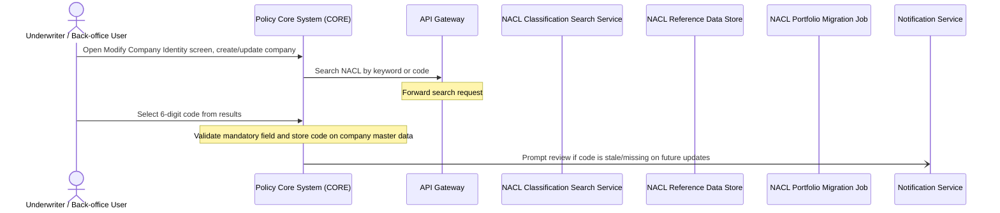
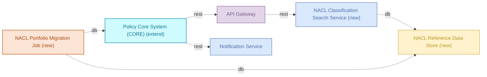

# Industry Classification Code — Functional Specification

## Table of Contents
- 1. Document Control
- 2. Introduction
- 3. Scope
- 4. Actors, Stakeholders & Glossary
- 5. Use Cases
- 6. Management Rules & Calculations
- 7. Data Requirements
- 8. Interfaces, Batches & Notifications
- 9. Non-Functional Requirements
- 10. Acceptance Criteria
- 11. Assumptions, Decisions & Open Points
- 12. Appendix & References

## 1. Document Control
**Reference:** industry-classification-code · **Status:** draft · **Department / owner:** —

| | |
|---|---|
| Template version | Functional Specification template 1.0 (Team Repository) |
| Date issued | 2026-09-27 |
| Owner | — |

**Modifications**

| Version | Date | Author | Description |
|---------|------|--------|-------------|
| 1.0 | 2026-09-27 | Analyst (Team Repository) | Initial version — generated with the AI agent team |

> **WARNING** — The commitments contained within this document, or changes to them, must be reviewed, agreed and signed off by all affected groups and individuals.

**Referred documents**

| N° | Document | Version | Date |
|----|----------|---------|------|
| 1 | bnr-example-2-industry-classification-code.md (source requirements document) | — | — |

**Distribution**

| Name | Department | Role |
|------|------------|------|
| — | — | Solution owner |
| — | — | Business owner |
| — | — | Development |
| — | — | Test |

**Sign-off**

| Role | Name | Date | Signature |
|------|------|------|-----------|
| Business owner | | | |
| Solution architect | | | |
| Development lead | | | |
| Test lead | | | |

## 2. Introduction

## 2. Introduction

## 3. Scope

**In scope**

- Policy Core System (CORE) — the "Modify Company" > "Identity" screen change, the NACL field, mandatory-field validation, and the review-prompt trigger (UC-01).
- API Gateway — routing of CORE's NACL search/autocomplete requests to the NACL Classification Search Service, under its existing authentication, rate-limit, and region rules (UC-01, RG-01 to RG-06).
- Notification Service — delivery of the NACL code review prompt (UC-01).
- NACL Reference Data Store — storage of the official NACL classification list and its hierarchy (UC-01).
- NACL Classification Search Service — keyword/code search against the reference data store, returning matches with full hierarchy (UC-01).
- NACL Portfolio Migration Job — one-time pre-population of confirmed NACL codes into CORE for the existing portfolio (UC-01).

**Out of scope**

- Identity & Access Management — external system used by API Gateway and Notification Service.
- Redis Cache Cluster — external system used by API Gateway and Notification Service.
- gfdsgfdgfd — external system used by API Gateway.
- Advisor Dashboard — external system served by API Gateway.
- Customer Portal — external system served by API Gateway.
- Bloomberg Market Data — external system served by API Gateway.
- config-db — external system used by API Gateway.
- Session Cache — external system used by and serving API Gateway.
- Authentication Service — external system used by and serving API Gateway.
- DMZ — external network zone associated with API Gateway.
- Enterprise Event Bus — external system used by Notification Service.
- sendgrid-api — external system used by Notification Service.
- notification-db — external system used by Notification Service.
- Order Management Service — external system served by Notification Service.
- End-of-Day Reconciliation — external system used by and serving Notification Service.
- AML Screening Job — external system served by Notification Service.
- Secondary or multiple NACL codes per partner — explicitly excluded; exactly one code per partner is permitted.
- Changes to Commercial products themselves — explicitly excluded; the change applies only at the partner/company level.

Anything not listed above is out of scope.

**Constraints**

- The NACL code applies to all Commercial products in CORE V2 and V3.
- Requests carrying customer PII, including NACL search and selection requests, must be processed only in EU regions (RG-04).
- Every request to /api/policies/* endpoints, including NACL search requests routed through CORE, must come from an authenticated session (RG-02).
- Exactly one NACL code is permitted per partner; the partner record must not carry parallel or outdated codes.

## 4. Actors, Stakeholders & Glossary

**Actors**

| Actor | Type | Role in the solution |
|---|---|---|
| Underwriter / Back-office User | user role | Opens the Modify Company > Identity screen, searches for a NACL code, and selects the 6-digit code to store on the company record |
| Policy Core System (CORE) | member system | Hosts the Identity screen, calls the API Gateway for NACL search, validates the mandatory NACL field, stores the code, and triggers review prompts |
| API Gateway | member system | Routes CORE's NACL search requests to the NACL Classification Search Service, applying authentication, rate-limit, and region rules |
| NACL Classification Search Service | member system | Searches the NACL Reference Data Store by keyword or code and returns matching codes with hierarchy |
| NACL Reference Data Store | member system | Holds the official NACL classification list and hierarchy |
| NACL Portfolio Migration Job | member system | Reads confirmed codes from the NACL Reference Data Store and writes an initial pre-population into CORE |
| Notification Service | member system | Delivers the NACL code review prompt to users |
| Identity & Access Management | external system | Authentication dependency of API Gateway and Notification Service |
| Redis Cache Cluster | external system | Caching dependency of API Gateway and Notification Service |
| gfdsgfdgfd | external system | Dependency of API Gateway |
| Advisor Dashboard | external system | Consumer served by API Gateway |
| Customer Portal | external system | Consumer served by API Gateway |
| Bloomberg Market Data | external system | Consumer served by API Gateway |
| config-db | external system | Configuration dependency of API Gateway |
| Session Cache | external system | Session dependency of API Gateway |
| Authentication Service | external system | Authentication dependency of API Gateway |
| DMZ | external system | Network zone associated with API Gateway |
| Enterprise Event Bus | external system | Event dependency of Notification Service |
| sendgrid-api | external system | Email delivery dependency of Notification Service |
| notification-db | external system | Data store dependency of Notification Service |
| Order Management Service | external system | Consumer served by Notification Service |
| End-of-Day Reconciliation | external system | Dependency of and consumer served by Notification Service |
| AML Screening Job | external system | Consumer served by Notification Service |

**Stakeholders**

| Role | Responsibility |
|---|---|
| Solution Owner | Owns the Industry Classification Code solution; the facts do not name an individual or team, this must be supplied by the business. |
| platform-team | Owns API Gateway and Notification Service, both reused in production for this change. |

**Glossary**

| Term | Definition |
|---|---|
| NACL | National activity classification: a hierarchical, officially maintained classification of economic activities, with section, division, group, class, category, and a 6-digit activity code as its most granular level. |
| CORE | Policy Core System, the component hosting company master data and the Modify Company screen. |
| 6-digit activity code | The most granular NACL level; the only level that can be selected and stored on a company record. |
| Modify Company > Identity | The CORE screen where the NACL field is added, replacing the "Type of Company" field. |
| NACL Reference Data Store | The new database holding the official NACL classification list and hierarchy. |
| NACL Classification Search Service | The new service that searches the NACL Reference Data Store by keyword or code. |
| NACL Portfolio Migration Job | The new batch job that pre-populates confirmed NACL codes into CORE for the existing portfolio. |
| Stale code | A stored NACL code that may no longer reflect the company's current economic activity and needs review. |
| RG-01 to RG-06 | Management rules of the API Gateway that apply to NACL search and selection traffic (routing, authentication, rate limiting, PII residency, overload prioritization, fraud-review throttling). |
| UC-01 | The single use case in this specification, NACL Code Selection and Maintenance. |

## 5. Use Cases

The use cases below are derived from the modelled processes and the management rules of the components that take part in them; their ids are stable across regenerations.

### UC-01 — NACL Code Selection and Maintenance

| Field | Value |
|---|---|
| Use case ID | UC-01 |
| Name | NACL Code Selection and Maintenance |
| Principal actor | Underwriter / Back-office User |
| Components involved | Policy Core System (CORE), API Gateway, NACL Classification Search Service, NACL Reference Data Store, NACL Portfolio Migration Job, Notification Service |
| Description | The Underwriter or Back-office User opens the "Modify Company" > "Identity" screen in CORE to create or update a company. CORE calls the API Gateway to search the NACL classification by keyword or code. The Gateway forwards the request to the NACL Classification Search Service, which reads from the NACL Reference Data Store and returns matching codes with their hierarchy (section, division, group, class, category, 6-digit activity code). The user selects a 6-digit code from the results. CORE validates the field as mandatory and stores the code on the company master data. On later master data, contract, or renewal changes, CORE triggers the Notification Service to prompt the user to review the code if it is stale or missing. The NACL Portfolio Migration Job separately reads confirmed codes from the NACL Reference Data Store and writes an initial pre-population of codes into CORE for the existing portfolio. |
| Trigger | Underwriter / Back-office User opens the Modify Company > Identity screen to create or update a company |
| Pre-conditions | 1. The user has an authenticated session in CORE (RG-02). 2. The NACL Reference Data Store holds the official classification list. 3. For existing companies, the NACL Portfolio Migration Job may already have pre-populated a confirmed code, to be confirmed by business. |
| Post-conditions | 1. A single 6-digit NACL code is stored on the company/partner master data record. 2. The mandatory-field validation has passed. 3. A review prompt has been sent via the Notification Service if the code was stale or missing at the time of a subsequent update. |
| Status | draft |

**Process flow**

1. **Underwriter / Back-office User → Policy Core System (CORE)** _(sync)_ — Open Modify Company > Identity screen, create/update company
2. **Policy Core System (CORE) → API Gateway** _(sync)_ — Search NACL by keyword or code
3. **API Gateway** — Forward search request
4. **Underwriter / Back-office User → Policy Core System (CORE)** _(sync)_ — Select 6-digit code from results
5. **Policy Core System (CORE)** — Validate mandatory field and store code on company master data
6. **Policy Core System (CORE) → Notification Service** _(async)_ — Prompt review if code is stale/missing on future updates

**Management rules**

| N° | Rule | Source |
|---|---|---|
| RG-01 | The API Gateway auto-routes authenticated requests to /api/policies or /api/claims to /v2 endpoints when the caller's primary policy was created on or after 2024-01-01, otherwise it stays on v1. | API Gateway rule |
| RG-02 | Every request to /api/policies/* endpoints, including NACL search requests routed through CORE, must come from an authenticated session. | API Gateway constraint |
| RG-03 | The API Gateway computes the allowed requests-per-second for the tenant's NACL search traffic from a base rate and a commercial-tier multiplier. | API Gateway formula |
| RG-04 | Requests carrying customer PII, including NACL search and selection requests, must be processed only in EU regions. | API Gateway constraint |
| RG-05 | During overload, the API Gateway prioritizes requests using a score based on tier weight, claim urgency factor, and rate used ratio. | API Gateway formula |
| RG-06 | Customers with an open fraud investigation get a 50% rate-limit reduction on /api/claims/* endpoints, with HTTP 429 and header X-Reason=review-pending returned if the quota is exceeded. | API Gateway rule |

**User interface & messages**

*Screens*

| Screen | Change |
|---|---|
| Modify Company > Identity | Adds a NACL search-and-select field, replacing the existing "Type of Company" field |

*Fields*

| Field | Type | Mandatory | Default | Allowed values | Editable by |
|---|---|---|---|---|---|
| NACL Code | 6-digit code with description, selected via search | Yes | none | Codes from the official NACL classification list held in the NACL Reference Data Store | Underwriter / Back-office User |

*Labels & messages*

| Key | Text | Shown when |
|---|---|---|
| nacl.review.prompt | Prompt indicating the NACL code needs to be reviewed and adjusted if necessary | On master data, contract, or renewal change where the stored code is stale or missing |
| nacl.mandatory.error | Error message shown when no code is selected | On contract change or master data change where the NACL code field is left empty |

## 6. Management Rules & Calculations

### RG-01 — Auto-route by policy version
- Kind: rule
- Owning component: API Gateway
- Applies in: UC-01
- Statement:
  - Given: an authenticated request to /api/policies or /api/claims (including NACL search requests routed through CORE).
  - When: the caller's primary policy was created on or after 2024-01-01.
  - Then: the API Gateway rewrites the path to its /v2 equivalent and forwards it to claims-service-v2 instead of the legacy v1 service.
- Status: Implemented

### RG-02 — No anonymous policy access
- Kind: constraint
- Owning component: API Gateway
- Applies in: UC-01
- Statement: Invariant — every request to /api/policies/* endpoints, including NACL search requests routed through CORE, must come from an authenticated session. Enforced by: API Gateway, at the point of request intake.
- Status: Implemented

### RG-03 — Per-tier rate limit
- Kind: formula
- Owning component: API Gateway
- Applies in: UC-01
- Statement: `allowed_rps = base_rps * tier_multiplier`, computed for the tenant's NACL search traffic (and other API traffic) based on commercial tier.
- Worked example: not computable from the facts. `base_rps` and `tier_multiplier` values per commercial tier are not specified — value to be provided by business (open point).

| base_rps | tier_multiplier | allowed_rps |
|---|---|---|
| value to be provided by business | value to be provided by business | base_rps × tier_multiplier |

- Status: Implemented

### RG-04 — PII data residency
- Kind: constraint
- Owning component: API Gateway
- Applies in: UC-01
- Statement: Invariant — requests carrying customer PII, including NACL search and selection requests, must be processed only in EU regions (GDPR Article 44). Enforced by: API Gateway, at request routing.
- Status: Implemented

### RG-05 — Request priority score
- Kind: formula
- Owning component: API Gateway
- Applies in: UC-01
- Statement: `priority = tier_weight + claim_urgency_factor - rate_used_ratio`, used to prioritize requests during overload.
- Worked example: not computable from the facts. Values for `tier_weight` and `claim_urgency_factor` per tier/claim type are not specified — value to be provided by business (open point). `rate_used_ratio` is a runtime measure with no fixed value.

| tier_weight | claim_urgency_factor | rate_used_ratio | priority |
|---|---|---|---|
| value to be provided by business | value to be provided by business | runtime value | tier_weight + claim_urgency_factor − rate_used_ratio |

- Status: Implemented

### RG-06 — Throttle policy-holders under fraud review
- Kind: rule
- Owning component: API Gateway
- Applies in: UC-01
- Statement:
  - Given: the customer has an open fraud investigation flag in identity-service.
  - When: the request targets any /api/claims/* endpoint.
  - Then: apply a 50% rate-limit reduction; if the reduced quota is exceeded, return HTTP 429 with header X-Reason=review-pending.
- Status: Implemented

### RG-07 — NACL code mandatory field logic
- Kind: rule
- Owning component: Policy Core System (CORE)
- Applies in: UC-01
- Statement:
  - Given: a company/partner record is being created or updated.
  - When: the action is (a) creation of a new company, (b) a master data change where the company's activities have changed, or (c) a contract change.
  - Then: the NACL Code field must be completed; on a contract change, if no code is selected, CORE displays the error message (nacl.mandatory.error).
  - Source: "The NACL code is: Mandatory when creating a new company / Mandatory for master data changes if activities have changed / Mandatory for contract changes → error message if no code is selected" (§1.2.1, Mandatory field logic).
- Status: To be implemented

### RG-08 — Single primary NACL code per partner
- Kind: constraint
- Owning component: Policy Core System (CORE)
- Applies in: UC-01
- Statement: Invariant — exactly one unique NACL code is permitted per partner; multiple assignments or secondary activities are explicitly excluded. Enforced by: CORE, on the partner/company master data record.
  - Source: "Exactly one unique code is permitted per partner / Multiple assignments or secondary activities are explicitly excluded" (§1.2.2, Reporting requirement).
- Status: To be implemented

### RG-09 — Code currency, no historization at partner level
- Kind: constraint
- Owning component: Policy Core System (CORE)
- Applies in: UC-01
- Statement: Invariant — the partner table always holds the current and factually correct NACL code; the system does not maintain parallel or outdated codes at partner level; a change in the partner's main economic activity, or a revision of the classification system, updates the stored code in place. Enforced by: CORE, on the partner table.
  - Source: "The partner table always contains the current and factually correct code of the partner ... The system does not maintain parallel or outdated codes at partner level" (§1.2.2, Historization and principle of data currency).
- Status: To be implemented

### RG-10 — Portfolio pre-population from confirmed codes only
- Kind: rule
- Owning component: NACL Portfolio Migration Job
- Applies in: UC-01
- Statement:
  - Given: the existing portfolio list holds a NACL code assignment for a corporate client.
  - When: that client's code is marked as confirmed and the information is available.
  - Then: the NACL Portfolio Migration Job loads it as the initial pre-population of the NACL code into CORE.
  - Source: "an initial pre-population of the code should be loaded into CORE from the existing portfolio list (only those marked as confirmed), provided the information is already available" (§1.2.1, Mandatory field logic — Existing portfolio).
- Status: To be implemented

### RG-11 — Code review prompt on subsequent update
- Kind: rule
- Owning component: Policy Core System (CORE)
- Applies in: UC-01
- Statement:
  - Given: a company record already has a stored NACL code.
  - When: the company undergoes a subsequent master data change, contract change, or renewal.
  - Then: CORE checks whether the code is present and still plausible; if it may need updating, CORE triggers the Notification Service to display the review prompt (nacl.review.prompt) so the user can adjust the code if necessary. If no code is stored at all, RG-07 applies and the field is mandatory.
  - Source: "during the next update of the company ... the system should automatically check whether a code is present and whether it is still plausible ... the system should display a prompt indicating that the code needs to be reviewed and adjusted if necessary" (§1.2.1, Mandatory field logic).
- Status: To be implemented

## 7. Data Requirements

### Company / Partner (Master Data Record)

| Property | Type | Mandatory | Size / allowed values | Mastered in |
|---|---|---|---|---|
| NACL Code (new) | 6-digit numeric activity code | Yes (RG-07) | One of the codes from the official NACL classification list held in the NACL Reference Data Store | Policy Core System (CORE) |
| NACL Description | Text, derived from the selected code | No (display only) | Description text linked to the 6-digit code | NACL Reference Data Store |
| Type of Company (removed) | — | — | Field replaced by NACL Code on the Modify Company >

## 8. Interfaces, Batches & Notifications

### Interfaces

| Transfer (business object) | From → To | Direction | Transfer mode / protocol | Frequency | Trigger | Status |
|---|---|---|---|---|---|---|
| NACL search request (keyword or code) | Policy Core System (CORE) → API Gateway | Outbound | REST, synchronous | On demand | User enters a keyword or code in the NACL search field on Modify Company > Identity | Proposed |
| NACL search request (forwarded) | API Gateway → NACL Classification Search Service | Outbound | REST, synchronous | On demand | API Gateway forwards the request received from CORE | Proposed |
| NACL classification data (hierarchy: section, division, group, class, category, 6-digit code) | NACL Classification Search Service → NACL Reference Data Store | Read | Database read | On demand | Search request received from API Gateway | Proposed |
| NACL classification data (confirmed codes only) | NACL Portfolio Migration Job → NACL Reference Data Store | Read | Database read | One-time, at job execution | Job run for initial portfolio pre-population | Proposed |
| NACL code (pre-populated) | NACL Portfolio Migration Job → Policy Core System (CORE) | Write | Database write | One-time, at job execution | Job run for initial portfolio pre-population | Proposed |
| NACL code review prompt | Policy Core System (CORE) → Notification Service | Outbound | REST, asynchronous | On master data, contract, or renewal change | CORE detects the stored NACL code is stale or missing during a subsequent update | Proposed |

The following dependencies are pre-existing and belong to the reused components (API Gateway, Notification Service). They are not created or changed by this solution and are listed here for completeness because they are part of the verified facts:

| Trans

## 9. Non-Functional Requirements

## 9. Non-Functional Requirements

## 10. Acceptance Criteria

| Id | Use case | Given / When / Then | Verifies (RG / NFR ids) | Status |
|---|---|---|---|---|
| AC-01 | UC-01 | Given an Underwriter / Back-office User has an authenticated CORE session, when they open Modify Company > Identity and search the NACL classification by keyword, then CORE calls the API Gateway which forwards the request to the NACL Classification Search Service and matching codes are returned. | UC-01, RG-02, NFR-08 | Planned |
| AC-02 | UC-01 | Given the user enters a full or partial 6-digit code instead of a keyword, when the search is executed, then matching codes are returned together with their full hierarchy (section, division, group, class, category, 6-digit activity code). | UC-01 | Planned |
| AC-03 | UC-01 | Given a results list is displayed, when the user selects one entry with a single click, then the 6-digit code and its description are entered into the NACL Code field on the company/partner master data record. | UC-01, NFR-15 | Planned |
| AC-04 | UC-01 | Given the NACL Code field is empty, when the user attempts to save a company creation, a master data change with activity change, or a contract change, then the save is blocked and the nacl.mandatory.error message is shown. | UC-01, NFR-14 | Planned |
| AC-05 | UC-01 | Given a company record has a stale or missing NACL code, when a master data, contract, or renewal change occurs, then CORE triggers the Notification Service to send the nacl.review.prompt message to the user. | UC-01 | Planned |
| AC-06 | UC-01 | Given the NACL Portfolio Migration Job runs against the NACL Reference Data Store, when a company in the existing portfolio has a confirmed code, then that code is written into CORE as an initial pre-population on the company master data. | UC-01 | Planned |
| AC-07 | UC-01 | Given an authenticated request to /api/policies or /api/claims (including a NACL search request routed through CORE), when the caller's primary policy was created on or after 2024-01-01, then the API Gateway rewrites the path to its /v2 equivalent and forwards it to claims-service-v2. | UC-01, RG-01 | Planned |
| AC-08 | UC-01 | Given a request to /api/policies/* is received without an authenticated session, when the API Gateway processes it, then the request is rejected and not forwarded to the NACL Classification Search Service. | UC-01, RG-02, NFR-08 | Planned |
| AC-09 | UC-01 | Given a tenant's base rate and commercial-tier multiplier for NACL search traffic, when the API Gateway computes the allowed request rate, then allowed_rps equals base_rps multiplied by tier_multiplier. | UC-01, RG-03, NFR-03 | Planned |
| AC-10 | UC-01 | Given a NACL search or selection request carries customer PII, when the API Gateway processes it, then processing occurs only in EU regions. | UC-01, RG-04, NFR-09 | Planned |
| AC-11 | UC-01 | Given the API Gateway is in overload, when multiple requests (including NACL search traffic) compete for capacity, then requests are ordered using priority = tier_weight + claim_urgency_factor − rate_used_ratio. | UC-01, RG-05 | Planned |
| AC-12 | UC-01 | Given a customer has an open fraud investigation flag, when a request targets any /api/claims/* endpoint, then a 50% rate-limit reduction is applied, and HTTP 429 with header X-Reason=review-pending is returned once the quota is exceeded. | UC-01, RG-06, NFR-11 | Planned |

## 11. Assumptions, Decisions & Open Points

### Decisions

| Decision | Rationale | Decided by |
|---|---|---|
| The existing "Type of Company" field in Modify Company > Identity is replaced by the NACL search-and-select field. | The NACL code provides a standardized, official classification; the old field only carried an internal risk label. | Business (source requirements document) |
| Only the 6-digit activity code is selectable and stored on the company/partner record; the section/division/group/class/category hierarchy is shown for orientation only. | The hierarchy is needed to help users find the right code, but the reporting model requires a single granular value per partner. | Business (source requirements document) |
| Exactly one NACL code is permitted per partner; secondary activities or multiple assignments are excluded. | Reporting quality depends on a clear, unique definition of primary economic activity. | Business (source requirements document) |
| The partner table holds only the current NACL code; no parallel or historical codes are kept at partner level. | Matches the stated "principle of data currency" for the classification. | Business (source requirements document) |
| The business decoding (description) and hierarchy levels of the NACL code are held in a separate mapping table, not in the partner table. | Avoids redundancy in the partner data model while still enabling hierarchical aggregation for reporting. | Business (source requirements document) |
| The NACL Portfolio Migration Job pre-

## 12. Appendix & References

### Referred documents

| N° | Document | Version | Date |
|---|---|---|---|
| 1 | bnr-example-2-industry-classification-code.md — "Implement NACL industry-classification code integration in CORE for all Commercial V2 and V3 products" (source business needs / business requirements document) | 1.0 (Final Version; a 0.9 Draft Version preceded it) | Not specified in the source document (placeholder date in the original version-history table) |
| 2 | Official NACL classification list (dataset from the national statistics authority, authoritative data source for the NACL Reference Data Store) | Not specified | Not specified — the source document states the dataset is attached to the change ticket referenced above |

No other external specifications, data models, or reference documents are named in the verified facts.

### System context

This diagram shows all six components in scope for this solution and the six data/control flows between them: CORE's call to the API Gateway, the Gateway's routing to the NACL Classification Search Service, the Search Service's read from the NACL Reference Data Store, the Migration Job's read from the same store and its write into CORE, and CORE's call to the Notification Service.
