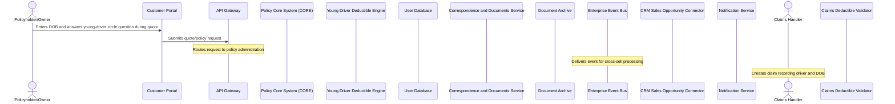

# Young Driver Deductible — Functional Specification

## Table of Contents
- 1. Document Control
- 2. Introduction
- 3. Scope
- 4. Actors, Stakeholders & Glossary
- 5. Use Cases
- 6. Management Rules & Calculations
- 7. Data Requirements
- 8. Interfaces, Batches & Notifications
- 9. Non-Functional Requirements
- 10. Acceptance Criteria
- 11. Assumptions, Decisions & Open Points
- 12. Appendix & References

## 1. Document Control
**Modifications**

| Version | Date | Author | Description |
|---------|------|--------|-------------|
| 1.0 | 2026-09-22 | Analyst (Team Repository) | Initial version — generated with the AI agent team |

**Referred documents**

| N° | Document | Version | Date |
|----|----------|---------|------|
| 1 | bnr-example-1-motor-young-driver-deductible.md (source requirements document) | — | — |

**People involved**

| Name | Department | Role |
|------|------------|------|
| — | — | Solution owner |

**Sign-off** — the commitments in this document must be reviewed, agreed and signed off by all affected groups.

| Role | Name | Date | Signature |
|------|------|------|-----------|
| Business owner | | | |
| Solution architect | | | |
| Development lead | | | |
| Test lead | | | |

## 2. Introduction

_(not generated)_

## 3. Scope

_(not generated)_

## 4. Actors, Stakeholders & Glossary

_(not generated)_

## 5. Use Cases

The use cases below are derived from the modelled processes and the management rules of the components that take part in them; their ids are stable across regenerations.

### UC-01 — Young driver deductible determination and application

| Field | Value |
|---|---|
| Use case ID | UC-01 |
| Name | Young driver deductible determination and application |
| Principal actor | Policyholder/Owner |
| Components involved | Customer Portal, API Gateway, Policy Core System (CORE), Young Driver Deductible Engine, User Database, Correspondence & Documents Service, Document Archive, Enterprise Event Bus, CRM Sales Opportunity Connector, Notification Service, Claims Handler, Claims Deductible Validator |
| Description | The Policyholder/Owner enters their date of birth and answers the young-driver circle question while quoting on the Customer Portal. The request is routed through the API Gateway to the Policy Core System (CORE), which calls the Young Driver Deductible Engine to read the relevant dates of birth from the User Database and determine whether the standard deductible or the young-driver deductible applies for liability and collision. CORE triggers document generation via the Correspondence & Documents Service (archived in Document Archive) and publishes an event on the Enterprise Event Bus, which the CRM Sales Opportunity Connector consumes to create a cross-sell opportunity and notify the agent via the Notification Service. Separately, when a Claims Handler creates a claim, the Claims Deductible Validator reads the policy data from CORE to automatically resolve and apply the correct deductible based on the recorded driver's date of birth. |
| Trigger | The Policyholder/Owner submits a quote or policy request containing a date of birth and an answer to the young-driver circle question; or a Claims Handler creates a claim recording the driver and their date of birth. |
| Pre-conditions | 1. The Policyholder/Owner or Claims Handler holds an authenticated session (RG-02). 2. The request targets an existing or in-progress policy or claim record in Policy Core System (CORE). 3. The policyholder's date of birth is available or captured on the quoting screen. 4. For the claims flow, the driver and their date of birth are already recorded on the claim, per the source document. |
| Post-conditions | 1. The applicable deductible (standard or young-driver) for liability and collision is determined and stored in Policy Core System (CORE) without being displayed on contract documents. 2. The offer, provisional policy, policy or GPC document is generated by the Correspondence & Documents Service and archived in Document Archive. 3. A young-driver-declared event is published on the Enterprise Event Bus and consumed by the CRM Sales Opportunity Connector. 4. A cross-sell notification is sent to the agent via the Notification Service, if an opportunity was created. 5. For claims, the Claims Deductible Validator has resolved and applied a single, non-cumulative deductible per guarantee. |
| Status | draft |

**Process flow**

1. **Policyholder/Owner → Customer Portal** _(sync)_ — Enters DOB and answers young-driver circle question during quote
2. **Customer Portal → API Gateway** _(sync)_ — Submits quote/policy request
3. **API Gateway** — Routes request to policy administration
4. **Enterprise Event Bus** — Delivers event for cross-sell processing
5. **Claims Handler** — Creates claim recording driver and DOB

**Management rules**

| N° | Rule | Source |
|---|---|---|
| RG-01 | The API Gateway auto-routes requests to /v1 or /v2 policy endpoints depending on the policy's creation date. | [API Gateway] Auto-route by policy version |
| RG-02 | The API Gateway rejects any unauthenticated request to a /api/policies/* endpoint. | [API Gateway] No anonymous policy access |
| RG-03 | The API Gateway computes the allowed requests-per-second for the tenant from its commercial tier. | [API Gateway] Per-tier rate limit |
| RG-04 | The API Gateway processes requests carrying customer PII only in EU regions. | [API Gateway] PII data residency |
| RG-05 | The API Gateway computes a request priority score to serve high-value or urgent traffic first during overload. | [API Gateway] Request priority score |
| RG-06 | The API Gateway applies a stricter rate limit on /api/claims/* endpoints for policyholders under an open fraud investigation. | [API Gateway] Throttle policy-holders under fraud review |

**User interface & messages**

Customer Portal (WEB), CORE and SEC-ADMIN screens display the new question "Are any drivers under the age of [AGE THRESHOLD]?" with a Yes/No answer, and an info-box/tooltip: "Do drivers under the age of [AGE THRESHOLD] drive the vehicle regularly or occasionally?". When answered "Yes", an additional date-of-birth field is shown with the tooltip "Please enter the date of birth of the most frequent young driver." (in WEB, and as info text in CORE/SEC-ADMIN); the young-driver deductible dropdown for liability and collision becomes selectable, constrained to be at least equal to the regular deductible. When answered "No", the young-driver deductible fields are shown greyed out and not selectable. In WEB, the deductible selection cap is extended from the standard cap to the higher young-driver cap for this field. The offer document shows "Young driver deductible per event [CURRENCY] X" on page 1 and "Young drivers up to the completed [AGE THRESHOLD] year of age — Yes / No" on page 2 or 3; the policy offer and policy documents show the young-driver Yes/No line under "General data" and the young-driver deductible per event line under "TPL" and "Casco". The GPC receives a new paragraph, under the deductible article, defining when the young-driver deductible is owed. The driver's date of birth is stored but never shown on any contract document. OPS-VIEW displays the "Yes" and "No" variants of the young-driver mask. Validation reuses the existing driver's-circle input block from the prior tariff generation, with adapted questions; specific error message text is not defined in the source document (to be confirmed by business).

## 6. Management Rules & Calculations

_(not generated)_

## 7. Data Requirements

_(not generated)_

## 8. Interfaces, Batches & Notifications

_(not generated)_

## 9. Non-Functional Requirements

_(not generated)_

## 10. Acceptance Criteria

_(not generated)_

## 11. Assumptions, Decisions & Open Points

_(not generated)_

## 12. Appendix & References

_(not generated)_
