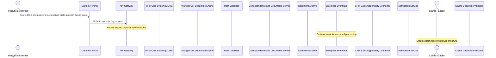

# Young Driver Deductible — Functional Specification

## Table of Contents
- 1. Document Control
- 2. Introduction
- 3. Scope
- 4. Actors, Stakeholders & Glossary
- 5. Use Cases
- 6. Management Rules & Calculations
- 7. Data Requirements
- 8. Interfaces, Batches & Notifications
- 9. Non-Functional Requirements
- 10. Acceptance Criteria
- 11. Assumptions, Decisions & Open Points
- 12. Appendix & References

## 1. Document Control
**Reference:** young-driver-deductible · **Status:** draft · **Department / owner:** —

| | |
|---|---|
| Template version | Functional Specification template 1.0 (Team Repository) |
| Date issued | 2026-09-22 |
| Owner | — |

**Modifications**

| Version | Date | Author | Description |
|---------|------|--------|-------------|
| 1.0 | 2026-09-22 | Analyst (Team Repository) | Initial version — generated with the AI agent team |

> **WARNING** — The commitments contained within this document, or changes to them, must be reviewed, agreed and signed off by all affected groups and individuals.

**Referred documents**

| N° | Document | Version | Date |
|----|----------|---------|------|
| 1 | bnr-example-1-motor-young-driver-deductible.md (source requirements document) | — | — |

**Distribution**

| Name | Department | Role |
|------|------------|------|
| — | — | Solution owner |
| — | — | Business owner |
| — | — | Development |
| — | — | Test |

**Sign-off**

| Role | Name | Date | Signature |
|------|------|------|-----------|
| Business owner | | | |
| Solution architect | | | |
| Development lead | | | |
| Test lead | | | |

## 2. Introduction

## 2. Introduction

## 3. Scope

**In scope**

- **Customer Portal** — young-driver question capture, DOB input field, extended deductible cap on public WEB quoting (UC-01).
- **Policy Core System (CORE)** — orchestration of the young-driver check at offer, provisional policy and policy issuance; serves SEC-ADMIN Screen and OPS-VIEW Screen; publishes the young-driver-declared event (UC-01).
- **Young Driver Deductible Engine** — determination of the young-driver deductible for liability and collision (UC-01).
- **User Database** — storage of policyholder and young-driver dates of birth (UC-01).
- **Correspondence & Documents Service** — generation of offer, provisional policy, policy and GPC documents without exposing driver DOB (UC-01).
- **Document Archive** — archiving of generated documents (UC-01).
- **Enterprise Event Bus** — propagation of the young-driver-declared event (UC-01).
- **CRM Sales Opportunity Connector** — cross-sell opportunity generation from the young-driver-declared event (UC-01).
- **Notification Service** — agent notification of new cross-sell opportunities (UC-01).
- **Claims Deductible Validator** — automatic resolution of standard vs. young-driver deductible at claims creation (UC-01).
- **API Gateway** — routing of quote, policy and claims requests, including the routing, authentication, rate-limiting and PII-residency rules (RG-01 to RG-06) (UC-01).
- **Identity & Access Management** — authentication of policyholders and agents for portal and admin screen access (UC-01).
- **SEC-ADMIN Screen** — internal capture/administration of the young-driver declaration (UC-01).
- **OPS-VIEW Screen** — internal operational view of young-driver data (UC-01).

**Out of scope**

- cdn-service and DMZ, used by Customer Portal.
- Redis Cache Cluster, gfdsgfdgfd, Advisor Dashboard, Bloomberg Market Data, config-db, Session Cache, Authentication Service, and DMZ, used by API Gateway.
- Redis Cache Cluster, Advisor Dashboard, Fraud Detection Service, and Internal Zone, used by Identity & Access Management.
- Customer Data Pipeline, Authentication Service, Enterprise Data Lake, Fraud Detection Service, and Credit Scoring Module, used by User Database.
- Regulatory Reporting Pipeline and End-of-Day Reconciliation, used by Document Archive.
- Fraud Detection Service, Enterprise Data Lake, Contract Configuration Service, Cashflow Event Store, Calculation Service, Order Management Service, Payment Processing Service, Rates Service, Risk Adjustment Processor, SWIFT Gateway, Trade Settlement Queue, SICS Booking Gateway, Transaction Ledger, and Customer Data Pipeline, used by Enterprise Event Bus.
- sendgrid-api, Redis Cache Cluster, Order Management Service, notification-db, End-of-Day Reconciliation, and AML Screening Job, used by Notification Service.
- Changes to access rights: the source requirements explicitly state this change does not impact or require new access rights.
- The default young-driver deductible values, the deductible band matrix, and the floor rules linking standard and young-driver deductible bands: the source requirements state these values are still subject to agreement and are not specified.
- Anything not listed above is out of scope.

**Constraints**

- Requests carrying customer PII must be processed only in EU regions (

## 4. Actors, Stakeholders & Glossary

### Actors

| Actor | Type | Role in the solution |
|---|---|---|
| Policyholder/Owner | User role | Enters date of birth and answers the young-driver circle question in Customer Portal at quote time; date of birth drives the deductible determination |
| Claims Handler | User role | Creates a claim, recording the driver and the driver's date of birth; consumes the deductible resolved by Claims Deductible Validator |
| Sales Agent | User role | Receives cross-sell notifications generated from a young-driver declaration and follows up on the opportunity |
| Underwriter | User role | Uses the policy administration screens (SEC-ADMIN Screen) to view or manage young-driver deductible data on offers and policies |
| Customer Portal | Member system (frontend) | Public WEB quoting UI; captures the young-driver question and date of birth, and displays the extended deductible cap for young drivers |
| API Gateway | Member system (gateway) | Routes quote and policy requests from Customer Portal and other channels to Policy Core System (CORE); enforces authentication, rate limiting and routing rules |
| Identity & Access Management | Member system (microservice) | Authenticates policyholders and agents accessing Customer Portal and admin screens |
| User Database | Member system (database) | Stores the policyholder's and young driver's dates of birth used to determine the applicable deductible |
| Document Archive | Member system (storage) | Archives generated offers, provisional policies, policies and GPC editions |
| Enterprise Event Bus | Member system (queue) | Propagates young-driver-declared events from Policy Core System (CORE) to CRM Sales Opportunity Connector |
| Notification Service | Member system (microservice) | Notifies agents of new cross-sell opportunities generated from the young-driver query |
| Policy Core System (CORE) | Member system (service) | Policy administration core; captures the young-driver declaration at quote/policy issuance, calls the Young Driver Deductible Engine, triggers document generation and event publication, and serves SEC-ADMIN and OPS-VIEW screens |
| Young Driver Deductible Engine | Member system (microservice) | Determines whether the standard deductible or the young-driver deductible applies for liability and collision, based on data read from User Database |
| Claims Deductible Validator | Member system (microservice) | At claims creation, reads the policy from Policy Core System (CORE) and resolves automatically whether the standard or the young-driver deductible applies |
| Correspondence & Documents Service | Member system (service) | Generates offer, provisional policy, policy and GPC documents without exposing the young driver's date of birth, and sends them to Document Archive |
| CRM Sales Opportunity Connector | Member system (microservice) | Receives young-driver-declared events from Enterprise Event Bus and triggers a Notification Service alert for cross-sell follow-up |
| SEC-ADMIN Screen | Member system (frontend) | Internal administration screen served by Policy Core System (CORE) for entering and viewing the young-driver declaration on offers and policies |
| OPS-VIEW Screen | Member system (frontend) | Internal operational screen served by Policy Core System (CORE) showing the young-driver query outcome |

### Stakeholders

| Role | Responsibility |
|---|---|
| frontend-team | Owns Customer Portal; responsible for the young-driver query and the extended deductible cap on the public web quoting UI |
| platform-team | Owns API Gateway, Enterprise Event Bus and Notification Service; responsible for routing, event propagation and agent notifications |
| security-team | Owns Identity & Access Management; responsible for authentication of policyholders and agents |
| dba-team | Owns User Database; responsible for storage of policyholder and young driver dates of birth |
| enterprise-architecture-team | Owns Document Archive; responsible for archiving of offers, provisional policies, policies and GPC editions |

*Note: the facts do not name a single solution owner or owners for the new components (Policy Core System (CORE), Young Driver Deductible Engine, Claims Deductible Validator, Correspondence & Documents Service, CRM Sales Opportunity Connector, SEC-ADMIN Screen, OPS-VIEW Screen); their owner field is unspecified in the facts.*

### Glossary

| Term | Definition |
|---|---|
| CORE | Policy Core System (CORE) — the policy administration service that captures the young-driver declaration, orchestrates deductible determination, document generation and event publication |
| WEB | Public web quoting channel, delivered through Customer Portal, where the young-driver query and deductible cap extension apply |
| SEC-ADMIN | Internal administration screen (SEC-ADMIN Screen) used to enter and view the young-driver declaration on offers and policies |
| OPS-VIEW | Internal operational screen (OPS-VIEW Screen) showing the outcome of the young-driver query |
| GPC | General Policy Conditions — the policy wording document that must define the young-driver deductible without exposing the driver's date of birth |
| CRM | Customer Relationship Management system that receives young-driver-declared events for cross-sell opportunity creation |
| Young-driver deductible | A separate deductible for liability and collision, applied when the policyholder/owner or recorded driver is under the age threshold and declared |
| Young-driver circle question | The question asked at quote/policy issuance about whether a driver under the age threshold will use the insured vehicle (Yes/No) |
| Age threshold | The age below which a driver is considered a young driver for deductible purposes; value not specified in the facts |
| Standard deductible | The regular deductible that applies when no young-driver deductible is triggered |
| Young-driver-declared event | The event published on Enterprise Event Bus when a young driver is declared, used to trigger cross-sell follow-up |
| Cross-sell opportunity | A sales opportunity created in CRM Sales Opportunity Connector following a young-driver declaration, surfaced to the agent via Notification Service |
| Deductible cap | The maximum selectable deductible value on Customer Portal; extended for the young-driver deductible compared to the standard deductible cap |
| Tariff generation | The policy generation classification (new tariff generation and newer, versus older) used by Claims Deductible Validator to decide whether automatic deductible resolution applies |
| RG | Management rule identifier used in this specification (e.g. RG-01 to RG-06) |
| UC | Use case identifier used in this specification (e.g. UC-01) |
| NFR | Non-functional requirement identifier used in this specification (e.g. NFR-01) |

## 5. Use Cases

The use cases below are derived from the modelled processes and the management rules of the components that take part in them; their ids are stable across regenerations.

### UC-01 — Young driver deductible determination and application

| Field | Value |
|---|---|
| Use case ID | UC-01 |
| Name | Young driver deductible determination and application |
| Principal actor | Policyholder/Owner (quote/policy path); Claims Handler (claims path) |
| Components involved | Customer Portal, API Gateway, Policy Core System (CORE), Young Driver Deductible Engine, User Database, Correspondence & Documents Service, Document Archive, Enterprise Event Bus, CRM Sales Opportunity Connector, Notification Service, Claims Deductible Validator |
| Description | Validates the policyholder's/owner's date of birth and, when relevant, the recorded driver's date of birth, to determine whether the standard deductible or a separate young-driver deductible applies for liability and collision on passenger cars, motorcycles and delivery trucks. The young-driver declaration is captured at quote/policy issuance through Customer Portal, CORE and SEC-ADMIN screens, stored in User Database, and never displayed on the offer, policy or GPC documents. A young-driver-declared event is propagated via Enterprise Event Bus to CRM Sales Opportunity Connector for cross-sell follow-up. At claims creation, Claims Deductible Validator reads the policy from Policy Core System (CORE) to resolve automatically whether the standard or the young-driver deductible applies. |
| Trigger | Policyholder/Owner enters date of birth and answers the young-driver circle question during a quote in Customer Portal; or Claims Handler creates a claim recording the driver and their date of birth |
| Pre-conditions | 1. Policyholder/Owner has an authenticated session on Customer Portal (RG-02). 2. A quote, offer, provisional policy or policy is being created for a passenger car, motorcycle or delivery truck. 3. Policyholder's/Owner's date of birth is available to the system. 4. For the claims path, the policy is of the new tariff generation or newer and the driver recorded on the claim, including date of birth, is available in the system. |
| Post-conditions | 1. If the policyholder/owner is under the age threshold, the regular deductible applies unchanged and no young-driver deductible is stored (status quo). 2. If the policyholder/owner is over the age threshold, a young-driver deductible for liability and for collision is determined by the Young Driver Deductible Engine and stored in User Database — selectable (equal to or higher than the regular deductible) if the young-driver question is answered Yes, or fixed and greyed out if answered No. 3. Offer, provisional policy, policy and GPC documents are generated by Correspondence & Documents Service and archived in Document Archive without exposing the young driver's date of birth. 4. A young-driver-declared event is published on Enterprise Event Bus, delivered to CRM Sales Opportunity Connector, and may trigger a Notification Service alert to the agent about a cross-sell opportunity. 5. At claims creation, Claims Deductible Validator resolves, from data read via Policy Core System (CORE), whether the standard or the young-driver deductible applies, applying the deductible once per guarantee. |
| Status | draft |

**Process flow**

1. **Policyholder/Owner → Customer Portal** _(sync)_ — Enters DOB and answers young-driver circle question during quote
2. **Customer Portal → API Gateway** _(sync)_ — Submits quote/policy request
3. **API Gateway** — Routes request to policy administration
4. **Enterprise Event Bus** — Delivers event for cross-sell processing
5. **Claims Handler** — Creates claim recording driver and DOB

**Management rules**

| N° | Rule | Source |
|---|---|---|
| RG-01 | API Gateway routes requests for policies created before 2024-01-01 to the legacy (v1) service and transparently upgrades requests for policies created on or after 2024-01-01 to the /v2 endpoints. | [API Gateway] Auto-route by policy version |
| RG-02 | Every request to an /api/policies/* endpoint must carry an authenticated session; anonymous access is rejected. | [API Gateway] No anonymous policy access |
| RG-03 | API Gateway computes the allowed requests-per-second for each tenant from its commercial tier. | [API Gateway] Per-tier rate limit |
| RG-04 | Any request carrying customer PII must be processed only in EU regions. | [API Gateway] PII data residency |
| RG-05 | API Gateway computes a request priority score to decide which requests are served first during overload. | [API Gateway] Request priority score |
| RG-06 | A customer with an open fraud investigation gets a stricter rate limit when calling any /api/claims/* endpoint. | [API Gateway] Throttle policy-holders under fraud review |

**User interface & messages**

*Screens*

| Screen | Change

## 6. Management Rules & Calculations

_(not generated)_

## 7. Data Requirements

_(not generated)_

## 8. Interfaces, Batches & Notifications

_(not generated)_

## 9. Non-Functional Requirements

### Performance

- **NFR-02** — API Gateway must serve requests to `/api/policies/*` and `/api/claims/*` (including the young-driver quote/policy and claims-resolution calls of UC-01) within a maximum latency of 200ms. Percentile of measurement (p50/p95/p99) is not specified in the facts — target left unset for that detail.
- **NFR-03** — API Gateway must sustain a throughput of 12 requests per second. The actual allowed rate per tenant is computed by the per-tier formula in RG-03 (`allowed_rps = base_rps * tier_multiplier`); the values of `base_rps` and `tier_multiplier` per tier are not specified in the facts.

### Availability

- **NFR-04** — API Gateway must be available 99.99% of the time. Measurement window (monthly/annual) is not specified.
- **NFR-05** — API Gateway Recovery Time Objective (RTO) is 4. Unit of measure (hours/minutes) is not specified in the facts — target left unset for that detail.
- **NFR-06** — API Gateway Recovery Point Objective (RPO) is 10 minutes.
- **NFR-07** — API Gateway scales vertically only; no horizontal auto-scaling capability is defined. Scaling thresholds are not specified.

### Security & Data Protection

- **NFR-01** — The highest data classification recorded across all members of this solution is "public". This is the value carried in the component inventory; it is flagged as inconsistent with the fact that the solution stores policyholder and young-driver dates of birth (see open point in chapter 11).
- **NFR-08** — Every request to an `/api/policies/*` endpoint must carry an authenticated session (RG-02); an anonymous request is rejected. Exact rejection code/message is not specified in the facts.
- **NFR-09** — Any request carrying customer PII, including the policyholder's or the young driver's date of birth, must be processed only in EU regions (RG-04).
- **NFR-10** — The young driver's date of birth, once captured and stored in User Database, must never be displayed on the offer, provisional policy, policy or GPC documents generated by Correspondence & Documents Service. Only the Yes/No young-driver declaration and the resulting deductible amount may appear on these documents.
- **NFR-11** — Entry of the young-driver declaration and date of birth in Customer Portal, CORE screens and SEC-ADMIN Screen requires an authenticated session via Identity & Access Management. No new access rights are introduced by this solution beyond existing ro

## 10. Acceptance Criteria

| Id | Use case | Given / When / Then | Verifies (RG / NFR ids) | Status |
|---|---|---|---|---|
| AC-01 | UC-01 | Given a policyholder/owner whose date of birth is under the age threshold, when a quote, offer, provisional policy or policy is created for a passenger car, motorcycle or delivery truck, then the regular deductible applies unchanged, the screen and mask stay unchanged, and no young-driver deductible is stored. | UC-01 | Draft |
| AC-02 | UC-01 | Given a policyholder/owner over the age threshold, when the young-driver circle question is answered "Yes", then a date-of-birth input field for the young driver is displayed, the regular deductible still applies, and a young-driver deductible is stored for both liability and collision. | UC-01 | Draft |
| AC-03 | UC-01 | Given the young-driver circle question is answered "Yes", when the policyholder/owner selects a young-driver deductible from the dropdown, then only values equal to or higher than the regular deductible are selectable. | UC-01 | Draft |
| AC-04 | UC-01 | Given a policyholder/owner over the age threshold, when the young-driver circle question is answered "No", then the young-driver deductible for liability and collision is stored automatically, shown greyed out, and not selectable. | UC-01 | Draft |
| AC-05 | UC-01 | Given a young-driver deductible has been determined (Yes or No path), when the offer, provisional policy, policy or GPC document is generated by Correspondence & Documents Service, then the young driver's date of birth does not appear anywhere on the document. | UC-01 | Draft |
| AC-06 | UC-01 | Given a young-driver deductible has been declared at quote/policy issuance, when the declaration is saved in Policy Core System (CORE), then a young-driver-declared event is published on Enterprise Event Bus and delivered to CRM Sales Opportunity Connector. | UC-01 | Draft |
| AC-07 | UC-01 | Given CRM Sales Opportunity Connector receives a young-driver-declared event, when a cross-sell opportunity is created, then Notification Service may send an alert to the agent about the opportunity. | UC-01 | Draft |
| AC-08 | UC-01 | Given a claim is created on a policy of the new tariff generation or newer, when the policyholder is under the age threshold, then Claims Deductible Validator applies the standard deductible regardless of the recorded driver's age. | UC-01 | Draft |
| AC-09 | UC-01 | Given a claim is created on a policy of the new tariff generation or newer, when the policyholder is over the age threshold and the recorded driver is also over the age threshold, then Claims Deductible Validator applies the standard deductible. | UC-01 | Draft |
| AC-10 | UC-01 | Given a claim is created on a policy of the new tariff generation or newer, when the policyholder is over the age threshold and the recorded driver is under the age threshold, then Claims Deductible Validator applies the young-driver deductible. | UC-01 | Draft |
| AC-11 | UC-01 | Given a deductible (standard or young-driver) has been resolved for a claim, when the claim involves multiple loss events or lines under the same guarantee, then the deductible is applied once per guarantee and is not added up. | UC-01 | Draft |
| AC-12 | UC-01 | Given a claim is created on a policy older than the new tariff generation, when Claims Deductible Validator is invoked, then automatic deductible resolution does not apply (out of scope for this policy generation). | UC-01 | Draft |
| AC-13 | UC-01 | Given a policyholder quotes through Customer Portal (WEB) and declares a young driver, when selecting the young-driver deductible, then the selectable range is capped at the extended (higher) cap value, while the standard deductible selection remains capped at the existing (unchanged) value. | UC-01 | Draft |
| AC-14 | UC-01 | Given any document referencing the applied deductible (e.g. an invoice), when the document text is generated, then the designation "contractual deductible" is used unchanged, regardless of whether the standard or young-driver deductible applies. | UC-01 | Draft |
| AC-15 | UC-01 | Given an authenticated request to /api/policies or /api/claims, when the caller's primary policy was created on or after 2024-01-01, then API Gateway rewrites the path to its /v2 equivalent and forwards it to the v2 service. | RG-01 | Draft |
| AC-16 | UC-01 | Given a request to any /api/policies/* endpoint, when the request carries no authenticated session, then API Gateway rejects the request. | RG-02 | Draft |
| AC-17 | UC-01 | Given a tenant with a defined commercial tier, when API Gateway receives requests from that tenant, then the allowed requests-per-second is computed as base_rps multiplied by the tier multiplier. | RG-03 | Draft |
| AC-18 | UC-01 | Given a request carrying customer PII (e.g. policyholder or young-driver date of birth), when API Gateway routes the request, then processing occurs only in EU regions. | RG-04 | Draft |
| AC-19 | UC-01 | Given the system is under overload, when API Gateway queues incoming requests, then each request is assigned a priority score computed as tier_weight + claim_urgency_factor − rate_used_ratio, and higher-scored requests are served first. | RG-05 | Draft |
| AC-20 | UC-01 | Given a customer has an open fraud investigation flag, when that customer calls any /api/claims/* endpoint and exceeds the reduced quota, then API Gateway applies a 50% rate-limit reduction and returns HTTP 429 with header X-Reason=review-pending. | RG-06 | Draft |
| AC-21 | UC-01 | Given the young-driver deductible feature is deployed, when existing user roles and permissions on Customer Portal, SEC-ADMIN Screen and OPS-VIEW Screen are reviewed, then no new access right or role is required beyond what already exists. | UC-01 | Draft |
| AC-22 | UC-01 | Given the highest data classification recorded across all solution members is "public", when the young-driver date of birth (a PII field) is stored in User Database, then storage and transmission controls in place for existing PII in User Database continue to apply unchanged (no new classification tier introduced by this change). | NFR-01 | Draft |

## 11. Assumptions, Decisions & Open Points

### Decisions

| Decision | Rationale | Decided by |
|---|---|---|
| The young driver's date of birth is stored in User Database but never displayed on the offer, policy, provisional policy or GPC documents. | Agreed during the exchange meeting with Legal and Legal Claims. | Legal / Legal Claims |
| The young-driver deductible is calculated once per guarantee and is not cumulative across multiple applicable circumstances. | Avoids over-charging the deductible at claims settlement. | Business (Claims) |
| Automatic deductible resolution at claims creation applies only to policies of the new tariff generation or newer. | Keeps claims settlement simple; older policies are not retrofitted. | Business (Claims) |
| The existing document wording "contractual deductible" is kept unchanged in customer-facing texts (e.g. invoices), regardless of which deductible (standard or young-driver) applies. | Simplicity; avoids reworking existing document templates. | Business |
| The deductible selection cap on Customer Portal (WEB) is extended for the young-driver deductible while the standard deductible cap remains unchanged. | Allows the young-driver default values to be stored consistently with CORE / SEC-ADMIN. | Business |
| The change does not introduce or modify any access rights. | Confirmed answer "No" in the source business requirement. | Business |
| The input block previously used for the driver's-circle question (up to the older tariff generation) is reused, with adapted questions, rather than building a new input mechanism. | Reduces build effort and reuses validated UI logic. | Business / delivery team |
| A young-driver-declared event is propagated to CRM via Enterprise Event Bus rather than a direct call from Policy Core System (CORE) to CRM. | Matches the existing event-driven integration pattern already used for CRM cross-sell processing. | Platform team (architecture) |

### Open Points

| N° | Open point | Needed for (UC / RG) | Owner | Needed by | Status |
|---|---|---|---|---|---|
| 1 | Exact numeric age threshold that distinguishes a "young driver" is not defined. | UC-01 | Business (to be provided by business) | Before build | Open |
| 2 | Default young-driver deductible values for liability and collision (12-row matrix: 6 standard-deductible bands × declared/not-declared) are not defined. | UC-01 | Business / Actuarial (to be provided by business) | Before build | Open |
| 3 | The two "floor" rules (raise young-driver deductible to band X when the standard deductible is raised to band X) — exact bands not defined, for both the declared and not-declared cases. | UC-01 | Business / Actuarial (to be provided by business) | Before build | Open |
| 4 | Current WEB deductible selection cap value, and the higher cap value it is extended to, are not defined. | UC-01 | Business (to be provided by business) | Before build | Open |
| 5 | Definition of "new tariff generation" (the cut-off used by Claims Deductible Validator to decide whether automatic resolution applies) is not specified. | UC-01 | Business / Claims (to be provided by business) | Before build | Open |
| 6 | Final label and tooltip texts for the young-driver question, the date-of-birth field, the offer/policy document sections and the online calculator are drafts only, not yet edited or translated by marketing. | UC-01 | Marketing / Business (to be provided by business) | Before release | Open |
| 7 | New GPC paragraph defining the young driver and when the young-driver deductible is owed is not finalised or translated. | UC-01 | Legal (to be provided by business) | Before release | Open |
| 8 | Error messages for the reused driver's-circle input block may need adaptation; exact wording not specified. | UC-01 | Business (to be provided by business) | Before build |

## 12. Appendix & References

_(not generated)_
